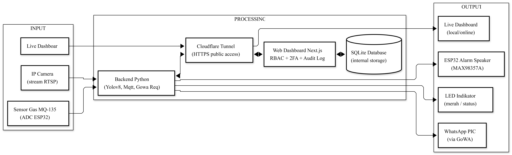

# SafeGuard APD



**Sistem Monitoring Kepatuhan Alat Pelindung Diri Pekerja Berbasis YOLO**

Sistem ini memantau kepatuhan penggunaan helm dan rompi keselamatan di area industri secara real-time. Kamera IP menangkap video, YOLOv8 mendeteksi pelanggaran, alarm fisik berbunyi via ESP32, notifikasi WhatsApp dikirim ke penanggung jawab, dan seluruh data tercatat di dashboard web yang aman.

> **Proyek Berbasis Lapangan (PBL) — Politeknik Negeri Malang**
> Menggabungkan tiga mata kuliah: Pengolahan Citra Digital, Keamanan Jaringan Cyber, dan IoT/WSN.

---

## Tampilan Singkat

| Komponen | Status |
|---|---|
| Backend Python (YOLOv8 + MQTT) | Production |
| Web Dashboard (Next.js + Prisma + SQLite) | Production |
| Firmware ESP32 (alarm + sensor gas) | Production |
| Cloudflare Tunnel (akses internet) | Production |
| Property Tests | 227+ pass |

```
[Kamera IP]  →  [YOLOv8]  →  [Pelanggaran terdeteksi]  →  [Alarm ESP32 + WA + Dashboard]
[Sensor Gas] →  [MQ-135]  →  [Threshold breach]        →  [LED merah + Alarm + WA]
```

Block diagram lengkap (4 layer arsitektur, sequence flow APD/gas) tersedia di [`docs/BLOCK-DIAGRAM.md`](docs/BLOCK-DIAGRAM.md).

---

## Quick Start

```bash
# 1. Clone
git clone https://github.com/sitaurs/pbl-ppe.git
cd pbl-ppe

# 2. Buka TUI manager
python tui.py
```

TUI akan otomatis cek prasyarat (Python, Node.js, env vars). Jika ada yang kurang, ikuti panduan di Setup Wizard (tekan `W`).

Setup pertama kali butuh ~10 menit. Detail lengkap di [`docs/SETUP.md`](docs/SETUP.md).

---

## Dokumentasi

### Untuk Operasional
- [`docs/SETUP.md`](docs/SETUP.md) — Cara install + konfigurasi dari nol (dev maupun demo machine)
- [`docs/USAGE.md`](docs/USAGE.md) — Cara menjalankan sistem sehari-hari, demo, troubleshoot
- [`docs/BLOCK-DIAGRAM.md`](docs/BLOCK-DIAGRAM.md) — Diagram arsitektur (mermaid)

### Untuk Presentasi PBL (per matkul)
- [`docs/PBL-PENGOLAHAN-CITRA.md`](docs/PBL-PENGOLAHAN-CITRA.md) — Bagian deteksi YOLOv8
- [`docs/PBL-KEAMANAN-JARINGAN.md`](docs/PBL-KEAMANAN-JARINGAN.md) — Bagian Argon2id, AES, TLS, RBAC, Cloudflare
- [`docs/PBL-IOT-WSN.md`](docs/PBL-IOT-WSN.md) — Bagian ESP32, MQ-135, MQTT, alarm

### Referensi Teknis
- [`ARSITEKTUR.md`](ARSITEKTUR.md) — Arsitektur teks lengkap + pemetaan ke file/baris
- [`docs/security-talking-points.md`](docs/security-talking-points.md) — Skrip untuk demo keamanan
- [`docs/demo-script.md`](docs/demo-script.md) — Skrip demo lengkap 8 langkah
- [`docs/smoke-test.md`](docs/smoke-test.md) — Skenario E2E test
- [`docs/PRESENTATION_READINESS.md`](docs/PRESENTATION_READINESS.md) — Checklist hari-H

---

## Stack Teknologi

| Layer | Teknologi |
|---|---|
| **Frontend** | Next.js 16, React 19, TailwindCSS |
| **Backend Web** | Next.js API Routes + Prisma ORM + SQLite |
| **Backend AI** | Python 3.10+, Ultralytics YOLOv8, OpenCV |
| **Auth** | Argon2id, TOTP (RFC 6238), Recovery Codes, RBAC sector-scoped |
| **Komunikasi** | MQTT TLS (HiveMQ Cloud), AES-128-CBC + random IV |
| **IoT** | ESP32 + MAX98357A I2S + MQ-135, mbedtls untuk AES |
| **Edge** | Cloudflare Tunnel (HTTPS, no port forward) |
| **Testing** | Vitest + fast-check (property-based testing) |

---

## Struktur Repo

```
pbl-ppe/
├── alarm_apd/           Firmware ESP32 (production)
├── docs/                Semua dokumentasi
├── infra/               Konfigurasi infrastructure (Mosquitto)
├── legacy/              Iterasi pengembangan sebelumnya
├── models/              YOLO weights (yolov8n + ppe_best)
├── other/               Parking lot non-essential
├── scripts/             Demo + utility scripts
├── tests/               Python unit + property tests
├── training/            ML pipeline (download, prepare, train)
├── web-dashboard/       Next.js dashboard
│
├── ServiceAPDBackend.py Backend deteksi (entry point Python)
├── trigger_alarm.py     CLI MQTT trigger untuk demo
├── tui.py               TUI manager (control center)
├── config.py            Konfigurasi global Python
└── requirements.txt     Python dependencies
```

Detail per folder lihat README di masing-masing folder.

---

## Komponen Hardware

| Komponen | Spesifikasi | Fungsi |
|---|---|---|
| ESP32 DevKit | 240 MHz dual-core, WiFi+BT | Mikrokontroler utama |
| MAX98357A | I2S audio amplifier | Output suara alarm |
| Speaker 3W 4Ω | Mono | Pengeras suara |
| MQ-135 | Sensor gas (CO2, NH3, asap) | Deteksi gas berbahaya |
| LED merah + R 220Ω | Indikator visual | Status alarm/gas alert |

Wiring detail + estimasi harga (~Rp 163.000) di [`docs/PBL-IOT-WSN.md`](docs/PBL-IOT-WSN.md).

---

## Lisensi

Proyek akademik untuk Proyek Berbasis Lapangan, Politeknik Negeri Malang. Tidak untuk komersial tanpa izin.

---

## Analisis & Arsitektur Sistem

*Bagian ini merangkum dekonstruksi sistem untuk keperluan pelaporan atau presentasi Project Based Learning (PBL).*

### 1. Overview & Konteks Proyek
**SafeGuard APD** adalah sistem pintar berbasis kecerdasan buatan (AI) dan Internet of Things (IoT) yang dirancang untuk memantau "Access Point" (pintu masuk atau area kritis kerja proyek/pabrik).
Sistem ini secara otomatis memantau dua hal utama secara *real-time*:
1. **Kepatuhan APD (Alat Pelindung Diri):** Memastikan pekerja memakai helm dan rompi (vest) menggunakan kamera (CCTV/Webcam).
2. **Keamanan Lingkungan:** Memantau indikasi bahaya polusi/kebocoran gas menggunakan sensor hardware di lokasi.

Sistem terdiri dari 3 arsitektur utama: **Edge/End Node** (ESP32 hardware), **Core Backend** (Python AI & MQTT Handler), dan **Frontend** (Next.js Web Dashboard).

---

### 2. Kaitan dengan Mata Kuliah: IoT & WSN (Wireless Sensor Network)
Aspek *Internet of Things* dan jaringan sensor nirkabel sangat kental pada node perangkat keras yang dideploy di lapangan:

- **Mikrokontroler & Sensor (Perception Layer):** Menggunakan ESP32 sebagai *edge node* yang terhubung tanpa kabel (Wi-Fi/WSN) ke jaringan. ESP32 secara terus-menerus melakukan *sampling* (pembacaan) analog dari sensor gas MQ-135.
- **Aktuator & I2S Audio Streaming:** Tidak sekadar membunyikan *buzzer* pasif, IoT node ini mampu memutar suara *human-voice* (peringatan verbal) secara real-time. ESP32 men-download file MP3 dari VPS (HTTP Audio Streaming) dan di-decode secara digital ke I2S Amplifier (MAX98357A) yang terhubung ke speaker.
- **Protokol Standar Industri (MQTT):** Komunikasi data tidak menggunakan HTTP biasa yang lambat, melainkan **MQTT (Message Queuing Telemetry Transport)** melalui *HiveMQ Cloud Broker*. Konsep *Pub-Sub* (Publish-Subscribe) digunakan di mana ESP32 bertugas mem-*publish* data telemetri gas secara berkala, dan men-*subscribe* topik alarm yang dikirim oleh backend AI.

### 3. Kaitan dengan Mata Kuliah: Keamanan Jaringan (Cyber / Network Security)
Karena perangkat IoT sangat rentan diretas dan dieksploitasi, proyek ini mengimplementasikan konsep keamanan berlapis:

- **End-to-End Payload Encryption (Kriptografi):** Perintah *trigger alarm* yang dikirim dari Backend via MQTT tidak dikirim dalam bentuk teks telanjang (*plain-text*). Payload tersebut dienkripsi dengan algoritma **AES-128/256 mode CBC** di sisi server (Python), dan didekripsi di sisi *hardware* (ESP32) menggunakan Pre-Shared Key (`AES_KEY`). Ini memitigasi serangan intersepsi (*Sniffing*) dan pemalsuan perintah (*Replay/Injection Attack*).
- **Secure Tunneling (Cloudflare Zero Trust):** Mengakses dashboard lokal dari internet biasanya memaksa kita membuka Port di router (Port Forwarding), yang sangat berbahaya karena membuka celah serangan DDoS/Bruteforce ke IP publik. Sistem ini menggunakan arsitektur *Outbound Tunnel* (Cloudflared), di mana server laptop yang "menghubungi" Cloudflare. Konfigurasi ini menjamin *firewall inbound* tetap tertutup rapat, tapi aplikasi tetap bisa diakses publik menggunakan HTTPS yang terenkripsi SSL/TLS.
- **Service Authorization:** Backend API dilindungi oleh Service Token (JWT/Secret keys), sehingga data *dashboard* tidak bisa dimanipulasi oleh *request* liar.

### 4. Kaitan dengan Mata Kuliah: Pengolahan Citra (Image Processing / Computer Vision)
Sistem ini memproses jutaan piksel per detik untuk memahami situasi dunia nyata, menerapkan ilmu pengolahan citra dan kecerdasan buatan:

- **Object Detection (Deep Learning):** Menggunakan arsitektur jaringan saraf tiruan (CNN) berbasis **YOLO (You Only Look Once)**. Python backend mengambil *frame* gambar dari kamera (RTSP CCTV/Webcam) satu-per-satu, mengekstrak fitur visual, dan mencari kelas spesifik: `person` (manusia), `helmet` (helm), dan `vest` (rompi keselamatan).
- **Spatial Relationship Analysis (Logika Geometri):** Deteksi tidak berhenti di mengenali benda. Sistem melakukan perhitungan *Bounding Box* (kotak kordinat objek). Sistem mengekstrak relasi spasial, mengecek apakah koordinat *bounding box* `helmet`/`vest` berada secara geometris "di dalam" ruang lingkup koordinat `person`. Jika irisan areanya cocok, sistem menyimpulkan "Orang ini aman". Jika ada `person` yang koordinatnya *tidak* tumpang-tindih dengan helm/vest, statusnya berubah menjadi "Pelanggaran".
- **Real-time Video Annotation:** Frame mentah yang diproses kemudian dimodifikasi (di-*drawing* menggunakan pustaka *OpenCV*). Sistem menggambar kotak pembatas (merah untuk pelanggar, hijau untuk yang patuh), menambahkan teks label, mengkonversinya ke format standar (JPEG byte array), dan di-*stream* kembali ke Dashboard via WebSocket.

---

### 5. Alur Flow Sistem (System Flow)

1. **Fase Persepsi (Input):**
   - **Kamera** menangkap *video feed* dari pintu akses masuk dan dikirim ke Python Backend.
   - **ESP32 + MQ135** membaca kadar gas secara independen tiap 2 detik. Jika lebih dari *threshold*, indikator LED lokal menyala. Data tetap di-publish ke MQTT.
2. **Fase Pemrosesan (Core Backend):**
   - Model **YOLO** memproses frame kamera. Menemukan ada "Person". Lalu mencari "Helmet/Vest" pada area person tersebut.
   - **Keputusan:** Jika ditemukan `person` *tanpa* APD, Backend menetapkan status *VIOLATION* (Pelanggaran).
3. **Fase Pencatatan & Eksekusi (Output):**
   - **Database:** Backend memotong (mencuplik) foto kejadian dan menyimpannya sebagai barang bukti, mencatatnya ke Database (SQLite via Prisma).
   - **Hardware Alarm:** Backend merakit JSON Payload "Start Alarm", mengenkripsinya dengan AES, dan me-lemparnya ke MQTT Broker. ESP32 menerima payload, mendekripsinya, lalu mengunduh audio "Peringatan APD" via *HTTP Streaming* untuk dibunyikan ke speaker.
   - **Notifikasi:** Backend mengirim HTTP Request ke *Gateway WhatsApp* (GoWA) untuk mengirim pesan instan ke Admin (berisi lokasi kamera, waktu, dan jenis pelanggaran).

### 6. Alur Flow Pengguna (User Flow)

Terdapat 2 sisi pengguna, yaitu **Pekerja di Lapangan** (Pasif) dan **Petugas K3/Admin** (Aktif):

#### A. Pekerja di Lapangan (User Pasif)
1. Pekerja berjalan melewati area akses (*Access Point*) proyek.
2. Kamera menyorot ke arah pekerja.
3. *Skenario Aman:* Pekerja memakai Helm dan Vest lengkap. Tidak terjadi apa-apa, pekerja lanjut lewat.
4. *Skenario Pelanggaran:* Pekerja lupa memakai Helm. Tiba-tiba di atas kepala terdengar suara dari *speaker* *"Tolong gunakan Alat Pelindung Diri Anda!"*. Pekerja sadar dan memakai APD-nya. (Laporan telah terkirim ke Admin).

#### B. Petugas K3 / Admin (User Aktif)
1. Admin (bisa dari jarak jauh/luar kota) membuka URL *Dashboard* dari browser HP/Laptop.
2. Admin melihat antarmuka *Login*. Memasukkan kredensial keamanan.
3. Di halaman utama (**Overview**), Admin bisa melihat:
   - *Video Live Streaming* (melihat kondisi gerbang pintu akses saat itu juga) lengkap dengan *bounding box* pendeteksian AI.
   - Total angka statistik pelanggaran hari itu.
   - Status terkini kadar Gas (Normal/Awas) hasil kiriman ESP32.
   - Status Sensor Node (apakah modul ESP32 sedang *Online* atau mati/baterai habis).
4. Admin mengeklik tab **Logs / Riwayat**, dan dapat melihat daftar siapa saja pekerja (waktu kejadian & tangkapan foto bukti) yang melanggar APD tadi pagi.
5. Sambil bekerja mengecek laporan lain, *Handphone* admin bergetar mendapat *WhatsApp*. Isinya: *"⚠️ ALERT DETEKSI APD | Lokasi: Pintu Depan, Terdapat pekerja tidak memakai atribut keamanan"*. Admin segera bertindak atau menghubungi mandor lapangan.
