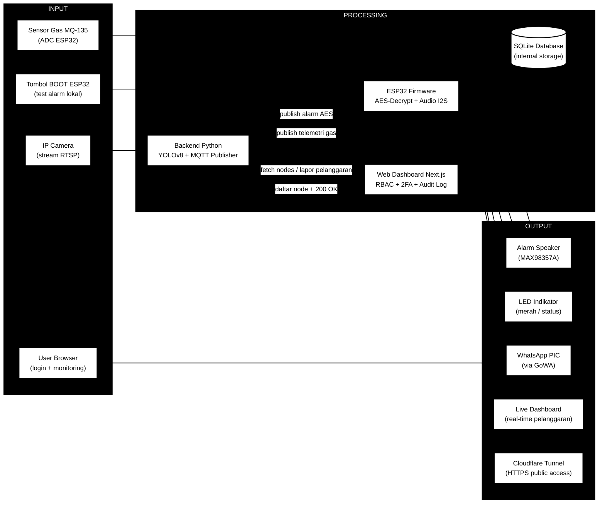
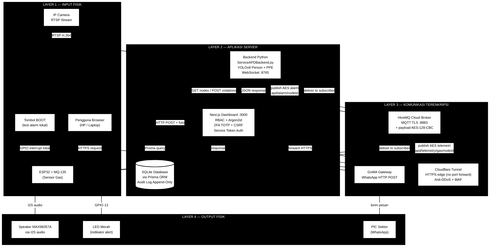
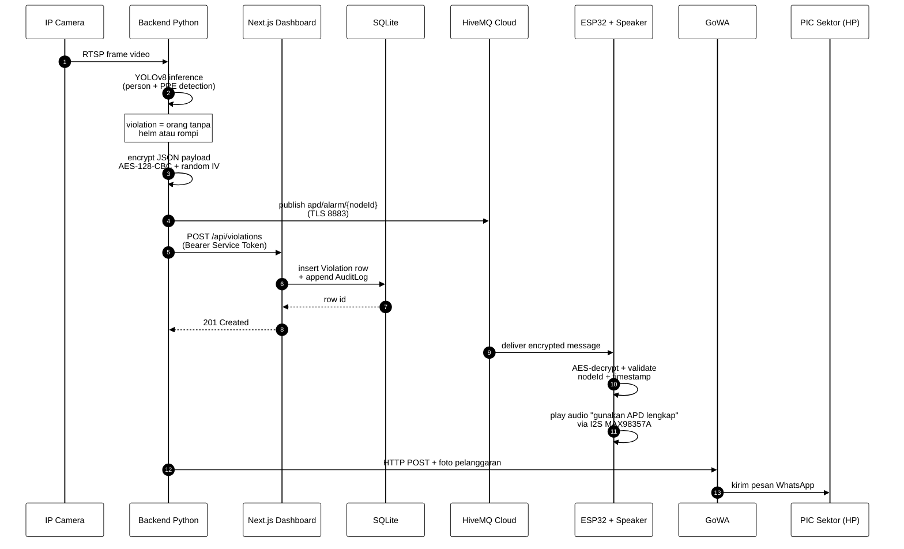
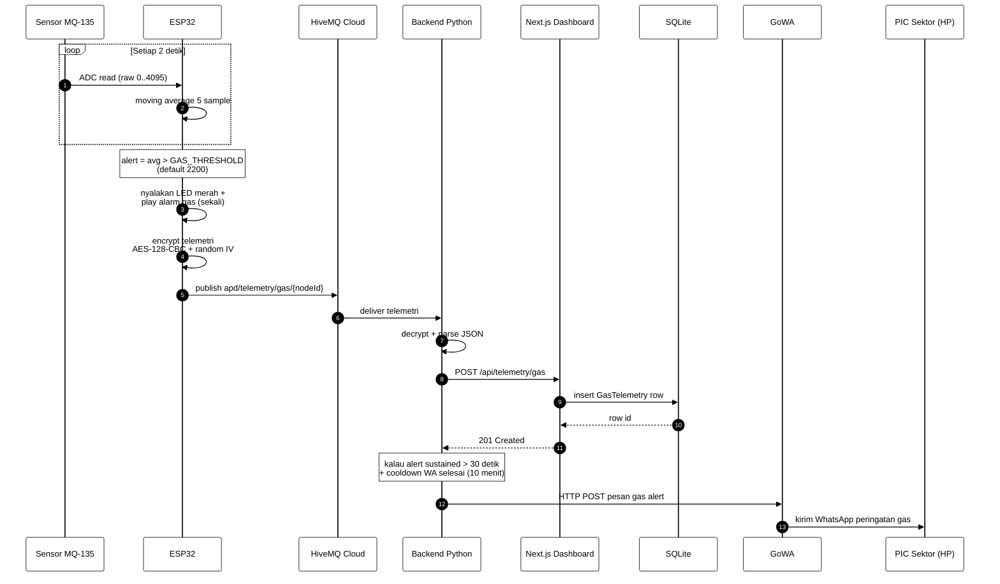

# Block Diagram — SafeGuard APD

Diagram berformat Mermaid: kode di bawah dapat di-render langsung di GitHub, di VS Code (extension *Markdown Preview Mermaid Support*), atau di [mermaid.live](https://mermaid.live).

> **Catatan teknis:** Mermaid tidak punya panah "1 garis 2 pucuk" secara native. Kami pakai dua pendekatan:
> 1. Untuk **flowchart**: pakai sintaks `<-->` (Mermaid render dengan kepala panah di kedua ujung) atau pakai **2 panah arah berlawanan** dengan label `req` dan `resp`.
> 2. Untuk **sequence diagram**: panah dua arah otomatis tergambar karena tiap baris sudah eksplisit arahnya.

---

## 1. Diagram Generik (Input → Processing → Output)

Tampilan high-level untuk presentasi awal. SQLite tidak masuk OUTPUT — itu **storage internal** (fase processing). Cloudflare Tunnel masuk OUTPUT karena posisinya di antara user internet dan dashboard.

**Cara baca:**
- 3 cluster hitam = 3 fase aliran data (kiri ke kanan).
- Kotak putih = komponen sistem.
- Cylinder `[(...)]` = penyimpanan data (database) — di **PROCESSING**, bukan OUTPUT.
- Panah satu arah = data path satu arah.
- Panah dua arah (`<-->`) atau **dua panah berlawanan dengan label `req`/`resp`** = komunikasi bolak-balik.

---

## 2. Diagram Detail (Per Komponen + 4 Layer)

Tampilan untuk presentasi mendalam. Tunjukkan teknologi yang dipakai, protokol komunikasi, dan koneksi antar komponen.

**Cara baca:**
- 4 layer hitam = arsitektur 4 lapis dari atas (input fisik) ke bawah (output fisik).
- Komunikasi **bolak-balik** (req/resp) digambarkan dengan **dua panah berlawanan** atau notasi `<-->` (yang Mermaid render dengan kepala panah di kedua ujung).
- Panah putus-putus (`-.->`) = trigger event lokal, bukan data path utama (misal tombol fisik BOOT).
- Cylinder `[(SQLite Database)]` = database internal, hanya diakses oleh Next.js melalui Prisma (read + write bolak-balik).

### Catatan Posisi Komponen

| Komponen | Layer | Alasan |
|---|---|---|
| **SQLite** | Layer 2 (Aplikasi Server) | Storage internal Next.js. Read + write. Tidak pernah diakses langsung dari user / device IoT. |
| **Cloudflare Tunnel** | Layer 3 (Komunikasi) | Bridge antara user internet ↔ dashboard di laptop. Bidirectional. |
| **MQTT Broker** | Layer 3 (Komunikasi) | Bridge antara Python ↔ ESP32. Bidirectional (publish + subscribe oleh kedua sisi). |
| **WhatsApp Gateway** | Layer 3 (Komunikasi) | Satu arah: Python → GoWA → user. Tidak ada response data balik ke Python. |
| **Speaker, LED** | Layer 4 (Output Fisik) | Hanya output, tidak punya feedback loop ke ESP32. |

---

## 3. Diagram Aliran Pelanggaran APD (Sequence)

Skenario: deteksi pelanggaran helm/rompi → alarm + WA + audit log.

**Cara baca:**
- Setiap kolom = satu komponen.
- Panah solid `->>` = pesan request.
- Panah dashed `-->>` = response.
- Note kotak = catatan logika internal yang penting.
- Nomor di kiri = urutan kejadian (autonumber).

---

## 4. Diagram Alur Gas Alert (Sequence)

Skenario terpisah karena flow gas berbeda dengan APD violation: **trigger dari sensor fisik di ESP32**, bukan dari kamera.

---

## 5. Cara Render

| Cara | Detail |
|---|---|
| GitHub native | Buka file `.md` di [github.com/sitaurs/pbl-ppe](https://github.com/sitaurs/pbl-ppe), Mermaid otomatis render |
| VS Code preview | Pasang ekstensi *Markdown Preview Mermaid Support*, lalu `Ctrl+Shift+V` |
| Online editor | Copy code mermaid ke [mermaid.live](https://mermaid.live), bisa export PNG/SVG untuk slide presentasi |

## Convention Warna & Bentuk

| Element | Tampilan | Arti |
|---|---|---|
| Cluster `subgraph` | Hitam dengan teks putih | Layer/fase arsitektur |
| `[Box]` | Putih dengan border hitam | Komponen sistem |
| `[(Cylinder)]` | Putih, simbol database | Penyimpanan data |
| `-->`  panah solid | Hitam tegas | Aliran data satu arah |
| `<-->` atau pasangan `-->` `<--` | Hitam, dua arah | Komunikasi request/response |
| `-.->`  panah putus-putus | Hitam | Event/trigger lokal (bukan data path utama) |

Simpel, hitam-putih, formal, mudah dibaca saat dicetak hitam-putih maupun di proyektor.
