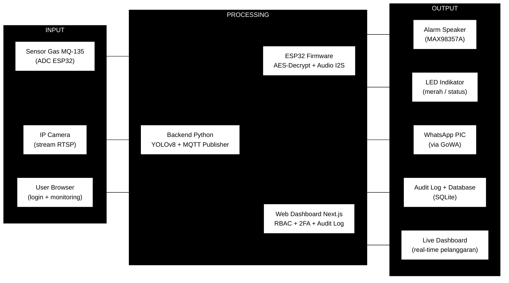
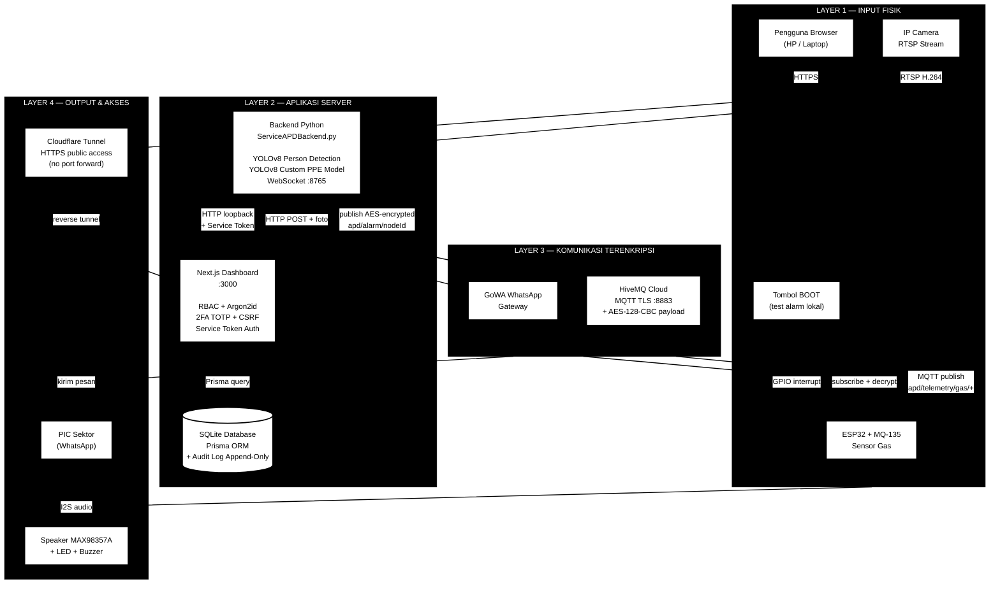
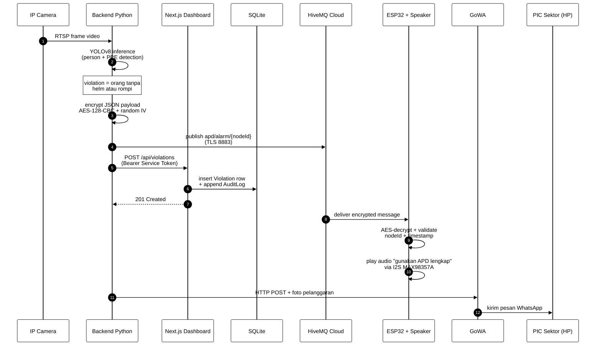
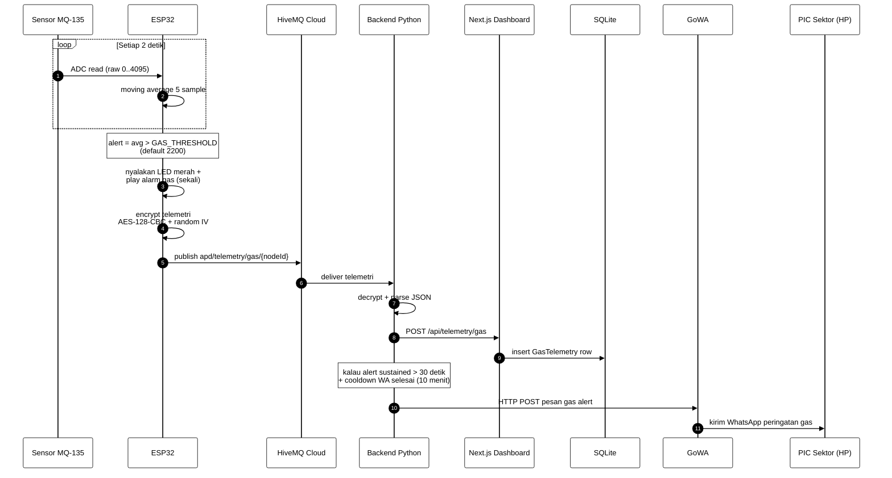

# Block Diagram — SafeGuard APD

Dua diagram berformat Mermaid: satu generik (Input → Processing → Output) dan satu detail per komponen. Kode Mermaid di bawah ini bisa di-copy ke [mermaid.live](https://mermaid.live) atau di-render langsung di GitHub.

---

## 1. Diagram Generik (Input → Processing → Output)

Tampilan high-level untuk presentasi awal. Tunjukkan alur paling sederhana ke dosen sebelum masuk ke detail.

**Cara baca:**
- 3 kotak hitam besar = 3 fase aliran data (kiri ke kanan).
- Kotak putih di dalam = komponen sistem.
- Panah hitam = arah data.

---

## 2. Diagram Detail (Per Komponen)

Tampilan untuk presentasi mendalam. Tunjukkan teknologi yang dipakai, protokol komunikasi, dan koneksi antar komponen.

**Cara baca:**
- 4 layer hitam = arsitektur 4 lapis (atas ke bawah: input fisik → server → komunikasi → output).
- `==>` panah tebal hitam = aliran data utama (data path).
- `<==>` panah dua arah = komunikasi bolak-balik (request/response).
- `-.->`  panah putus-putus = trigger event lokal (bukan data path utama).
- Cylinder `[(...)]` = database.

---

## 3. Diagram Aliran Pelanggaran APD (Sequence)

Khusus skenario "deteksi pelanggaran helm/rompi → alarm + WA + audit log". Cocok untuk presentasi *use case* spesifik.

**Cara baca:**
- Setiap kolom = satu komponen.
- Panah horizontal = pesan (request/response).
- Note kotak = catatan logika internal yang penting.
- Nomor di kiri panah = urutan kejadian (autonumber).

---

## 4. Diagram Alur Gas Alert (Sequence)

Skenario terpisah karena flow gas berbeda dengan APD violation.

---

## 5. Cara Render

Tiga opsi:

1. **GitHub native** — buka file ini di GitHub, Mermaid otomatis ter-render.
2. **VS Code preview** — pasang ekstensi *Markdown Preview Mermaid Support* lalu `Ctrl+Shift+V`.
3. **Online editor** — copy kode mermaid ke [mermaid.live](https://mermaid.live), bisa export PNG/SVG.

## Convention Warna & Bentuk

| Element | Tampilan | Arti |
|---|---|---|
| Cluster `subgraph` (kotak besar) | Hitam dengan teks putih | Layer/fase arsitektur |
| `[Box]` | Putih dengan border hitam | Komponen/sistem |
| `[(Cylinder)]` | Putih, simbol database | Penyimpanan data |
| `==>` | Panah tebal hitam | Data path utama |
| `<==>` | Panah dua arah, hitam | Komunikasi bidirectional |
| `-.->`  | Panah putus-putus hitam | Event/trigger lokal |

Simpel, hitam-putih, formal, mudah dibaca saat dicetak.
