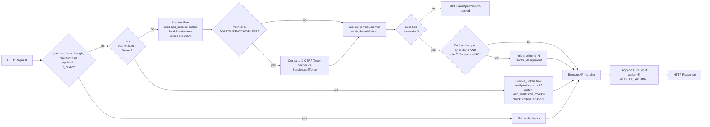
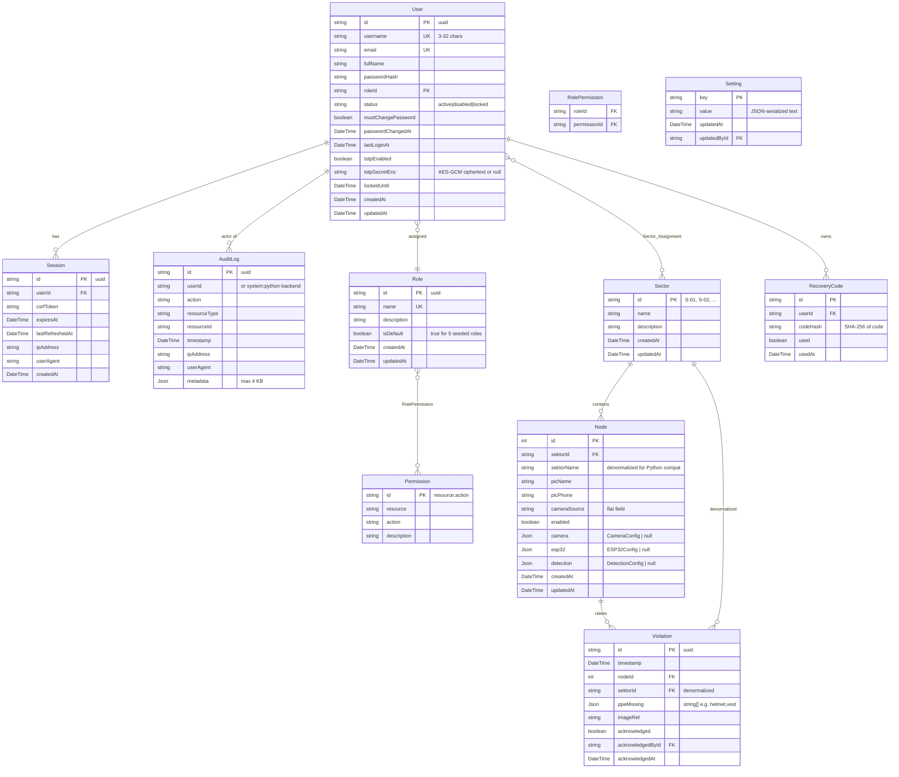
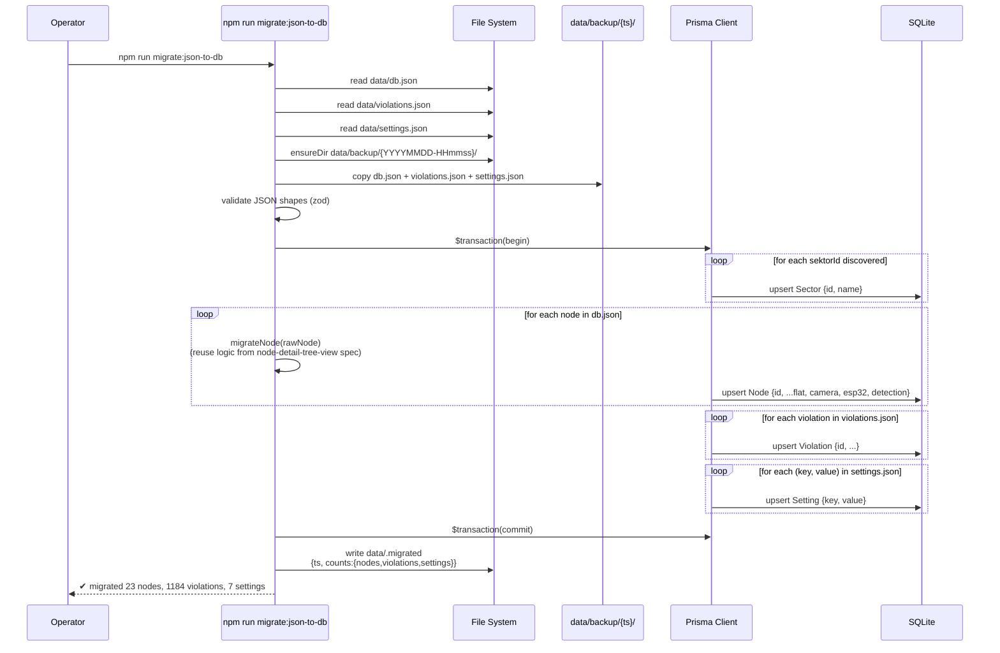
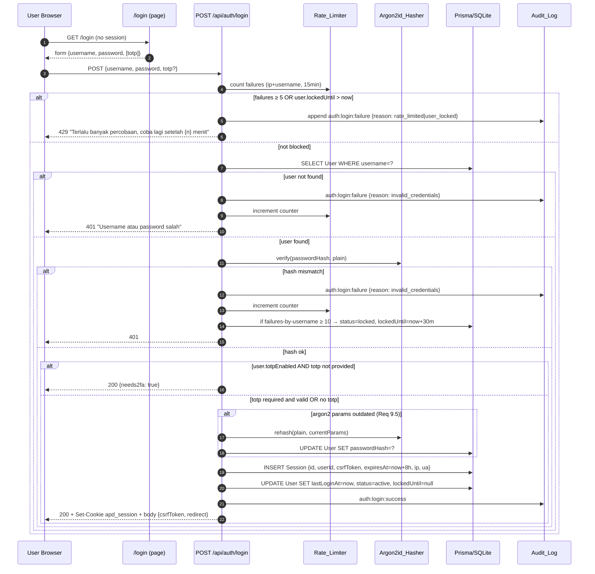
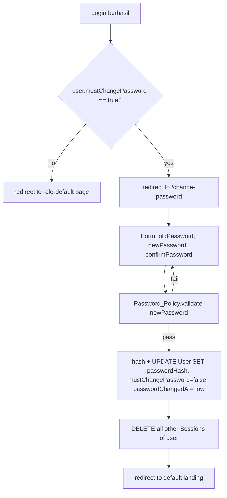
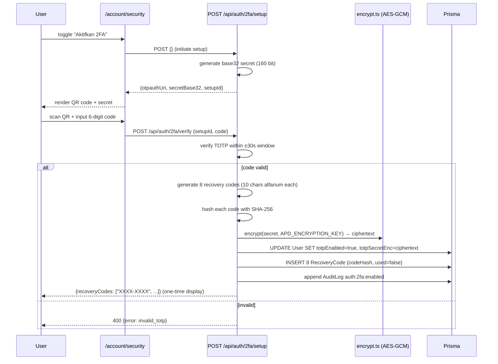
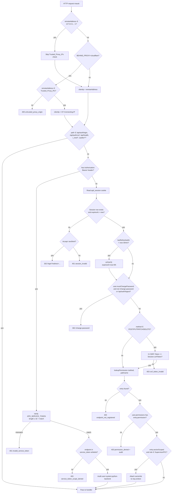
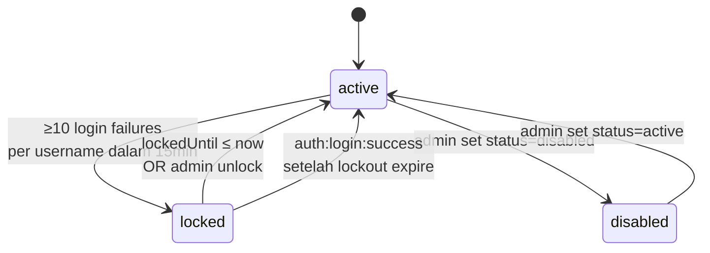
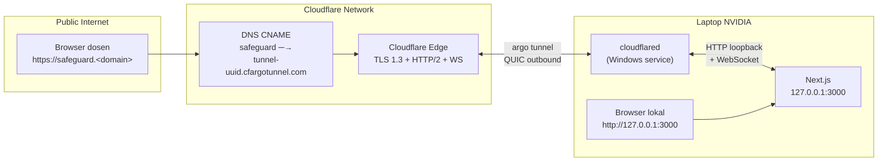

# Design Document: Auth + RBAC System

## Overview

Spec ini menambahkan tiga pilar baru ke SafeGuard APD Web Dashboard tanpa membuang fitur dan data yang sudah ada:

1. **Database Persisten** — pemindahan tiga file JSON (`data/db.json`, `data/violations.json`, `data/settings.json`) ke SQLite via Prisma ORM, lengkap dengan skrip migrasi idempotent yang membackup file asli ke `data/backup/{timestamp}/`. Mengacu pada Requirements 1, 2, dan 3.
2. **Auth + RBAC** — halaman login + manajemen sesi, lima Role default (Super_Admin, Admin_K3, Supervisor, PIC_Sektor, Auditor) dengan 34 Permission granular, isolasi data per Sektor untuk Supervisor/PIC, dan service token untuk `ServiceAPDBackend.py`. Mengacu pada Requirements 4, 5, 6, 7, 8, dan 14.
3. **Security Hardening + Deployment** — hashing Argon2id, password policy + HIBP top-10k, rate limiter + account lockout, CSRF double-submit, security headers, 2FA TOTP opsional, audit log immutable, dan deployment laptop tunggal di belakang Cloudflare Tunnel (named tunnel, BUKAN WARP, BUKAN Cloudflare Access). Mengacu pada Requirements 9, 10, 11, 12, 13, dan 15.

### Design Goals

1. **Backward compatible terhadap data lama** — seluruh node, pelanggaran, dan setting yang sudah ada di JSON WAJIB tetap dapat diakses setelah migrasi tanpa perubahan kontrak ke `ServiceAPDBackend.py`.
2. **Backward compatible terhadap spec node-detail-tree-view** — model Node mempertahankan flat fields (`cameraSource`, `sektorId`, `sektorName`, `picName`, `picPhone`, `enabled`) DAN nested objects (`camera`, `esp32`, `detection`) yang sudah dibuat di spec sebelumnya. Skema tabel hanya membungkus, bukan mengubah, kontrak data tersebut.
3. **Single laptop friendly** — keputusan teknis (in-memory rate limiter, SQLite + WAL, polling vs queue, Cloudflare Tunnel ketimbang reverse proxy + LE) dipilih agar seluruh stack jalan di satu laptop ber-NVIDIA tanpa server tambahan.
4. **Demonstrable jarak jauh** — dosen penguji dapat login lewat hostname Cloudflare Tunnel dari rumah, tanpa basis kode berbeda dengan mode lab.
5. **Deny-by-default** — setiap route `/api/*` baru WAJIB diregistrasikan di `permission-map.ts`; endpoint yang tidak ter-mapping otomatis ditolak.

### Key Design Decisions

| Decision | Choice | Rationale |
|----------|--------|-----------|
| ORM | Prisma 5.x | Query builder type-safe, generator client otomatis, migrasi reversible. Sesuai Req 1.1 |
| DB Engine | SQLite + WAL | Cukup untuk 50 concurrent reads (Req 1.1) di satu laptop, future-friendly ke Postgres karena Prisma menyembunyikan dialect |
| Hash | Argon2id (`@node-rs/argon2`) | OWASP 2023 recommended; native binding cepat di Windows. Sesuai Req 9.1 |
| Rate limiter | In-memory `Map<string, RateLimitEntry>` + cleanup interval | Single-laptop deploy; tidak butuh Redis. Counter di-derive dari `Audit_Log` untuk recovery setelah restart |
| 2FA library | `otpauth` (TOTP RFC 6238) | Tidak butuh OS-level dependency, bekerja di Next.js edge runtime |
| HIBP check | Offline `pwned-top-10k.txt` (SHA-1 hex prefix) | Tidak ada panggilan jaringan saat login, sesuai Req 9.3 |
| Reverse proxy | Cloudflare Tunnel (named tunnel) | Tanpa membuka port di router/firewall lab, TLS terminasi di edge Cloudflare. Bukan WARP, bukan CF Access — auth tetap di aplikasi. Sesuai Req 15 |
| Cache permission | In-memory LRU per User (TTL 60s) | Sesuai Req 6.5 dan Req 8.5 ("tidak di-cache lebih dari 60 detik") |
| Encryption (TOTP secret) | AES-256-GCM dengan kunci dari `APD_ENCRYPTION_KEY` | Sesuai Req 12.2 dan 12.7 |

---

## Architecture

### Topology Diagram

```mermaid
graph TB
    subgraph Internet["Internet"]
        Browser["Browser Remote<br/>(dosen penguji)"]
    end

    subgraph CFEdge["Cloudflare Edge"]
        CFEdgeNode["edge.cloudflare.com<br/>TLS termination<br/>+ WebSocket pass-through"]
    end

    subgraph LAN["LAN Lab"]
        BrowserLocal["Browser Lokal<br/>(127.0.0.1:3000)"]
    end

    subgraph Laptop["Laptop NVIDIA (deployment)"]
        cloudflared["cloudflared daemon<br/>(named tunnel)<br/>safeguard-apd"]

        subgraph NextJS["Next.js (bind 127.0.0.1:3000)"]
            MW["API Middleware<br/>session • CSRF • RBAC •<br/>Trusted_Proxy_IPs"]
            Routes["API Routes<br/>/api/auth/* /api/users/*<br/>/api/nodes/* /api/violations/*<br/>/api/sectors/* /api/audit-log<br/>WebSocket /ws/live"]
            Prisma["Prisma Client<br/>(singleton)"]
            JobScheduler["Background Jobs<br/>session cleanup • rehash<br/>permission cache invalidation"]
        end

        SQLite[("SQLite WAL<br/>data/safeguard.db")]
        Backup[("data/backup/<br/>{timestamp}/<br/>db.json+violations.json+<br/>settings.json")]
        EnvFile[(".env.local<br/>APD_SERVICE_TOKEN<br/>APD_ENCRYPTION_KEY<br/>BEHIND_PROXY")]

        Python["ServiceAPDBackend.py<br/>YOLO detection"]
        ESPBridge["ESP32 alarm bridge<br/>(MQTT publisher)"]
    end

    subgraph External["External Services (UNCHANGED)"]
        HiveMQ["HiveMQ Cloud<br/>MQTT broker TLS"]
        ESP32["ESP32 alarm node"]
        GoWA["GoWA VPS<br/>WhatsApp gateway"]
    end

    Browser -->|"HTTPS<br/>safeguard.&lt;domain&gt;"| CFEdgeNode
    CFEdgeNode -.->|"argo tunnel<br/>QUIC/HTTP2"| cloudflared
    cloudflared -->|"http://127.0.0.1:3000<br/>+ CF-Connecting-IP header"| MW
    BrowserLocal -.->|"loopback<br/>(no tunnel)"| MW

    Python -->|"loopback<br/>+ Bearer Service_Token"| MW
    MW --> Routes
    Routes --> Prisma
    Prisma --> SQLite
    JobScheduler --> Prisma
    Routes -.reads.-> EnvFile

    Python --> ESPBridge
    ESPBridge -->|MQTT publish| HiveMQ
    HiveMQ -->|MQTT subscribe| ESP32
    Python -->|HTTP POST /violations| MW
    Routes -->|HTTP POST<br/>(notification fanout)| GoWA

    Backup -.created by.-> Routes
```

Catatan arsitektural penting:

- **Next.js bind hanya ke `127.0.0.1:3000`** (Req 15.1). Port tidak terbuka di NIC LAN.
- **`cloudflared`** dijalankan sebagai service Windows (lihat bagian Deployment) sehingga hidup setelah laptop reboot.
- **Loopback tetap berfungsi normal** ketika tunnel offline (Req 15.7); detect-and-react: tunnel offline TIDAK mematikan deteksi YOLO atau MQTT alarm.
- **`ServiceAPDBackend.py` selalu via loopback** (`http://127.0.0.1:3000`) dengan header `Authorization: Bearer <APD_SERVICE_TOKEN>` (Req 15.5). API_Middleware melewati `Trusted_Proxy_IPs` check khusus untuk `127.0.0.1`/`::1`.
- **HiveMQ + GoWA tidak berubah**. Spec ini tidak menyentuh integrasi MQTT/WhatsApp; hanya sumber dan tujuan datanya yang sekarang lewat lapisan auth.

### Layered Request Flow



Latensi target middleware ≤ 50 ms di luar business logic, mengikuti Req 7.6. Cache permission per User (in-memory LRU, TTL 60 detik) memastikan lookup permission tidak hit DB di setiap request.

### File/Folder Structure (Tambahan)

```
prisma/
├── schema.prisma                          # NEW: 10 model (User, Role, Permission, ...)
├── seed.ts                                # NEW: seed Role + Permission_Matrix
└── migrations/                            # auto-generated by `prisma migrate dev`

scripts/
├── migrate-json-to-db.ts                  # NEW: skrip Migration_Script (Req 2)
├── reset-admin-password.ts                # NEW: recovery CLI bila admin lupa password
└── purge-audit-log.ts                     # NEW: manual purge >365 hari (Req 13.6)

data/
├── safeguard.db                           # NEW: SQLite DB
├── safeguard.db-wal
├── safeguard.db-shm
├── .migrated                              # NEW: marker file (Req 2.7)
└── backup/{YYYYMMDD-HHmmss}/               # NEW: JSON_Backup target
    ├── db.json
    ├── violations.json
    └── settings.json

cloudflared/
└── config.yml                             # NEW: named-tunnel config (Req 15.2)

src/
├── app/
│   ├── login/page.tsx                     # NEW: Login_Page
│   ├── change-password/page.tsx           # NEW
│   ├── 403/page.tsx                       # NEW: forbidden page
│   ├── users/page.tsx                     # NEW: list/CRUD user
│   ├── roles/page.tsx                     # NEW: editor role + permission tree
│   ├── sectors/page.tsx                   # NEW: CRUD sektor + assignment PIC
│   ├── audit-log/page.tsx                 # NEW: audit log table + ekspor
│   ├── account/security/page.tsx          # NEW: 2FA setup
│   ├── settings/integrations/page.tsx     # NEW: Service_Token rotate (Req 3.6)
│   └── api/
│       ├── auth/{login,logout,csrf,me,change-password}/route.ts
│       ├── auth/2fa/{setup,verify,disable}/route.ts
│       ├── users/route.ts
│       ├── users/[id]/{route.ts,reset-password,unlock}/route.ts
│       ├── roles/route.ts
│       ├── roles/[id]/route.ts
│       ├── sectors/route.ts
│       ├── sectors/[id]/{route.ts,users}/route.ts
│       ├── audit-log/{route.ts,export}/route.ts
│       └── settings/integrations/service-token/route.ts
├── lib/
│   ├── prisma.ts                          # singleton Prisma Client
│   ├── auth/
│   │   ├── argon2.ts                      # hash + verify + needsRehash
│   │   ├── password-policy.ts             # validator + HIBP check
│   │   ├── hibp-list.ts                   # loader pwned-top-10k.txt
│   │   ├── session.ts                     # create/verify/refresh/cleanup
│   │   ├── csrf.ts                        # generate + verify
│   │   ├── totp.ts                        # otpauth wrapper
│   │   ├── recovery-codes.ts              # generate + hash + redeem
│   │   └── encrypt.ts                     # AES-256-GCM wrapper
│   ├── rbac/
│   │   ├── permission-map.ts              # endpoint→permission registry
│   │   ├── permission-cache.ts            # LRU 60s
│   │   ├── role-seed.ts                   # default Permission_Matrix
│   │   └── sector-scope.ts                # injection helper for Prisma where
│   ├── rate-limit/
│   │   ├── rate-limiter.ts                # in-memory Map + cleanup
│   │   └── lockout.ts                     # Account_Lockout state machine
│   ├── audit/
│   │   ├── audit-log.ts                   # append-only writer
│   │   └── action-types.ts                # union of all action strings
│   ├── proxy/
│   │   └── cloudflare-ips.ts              # Trusted_Proxy_IPs (Req 15.3)
│   └── data/
│       └── pwned-top-10k.txt              # bundled HIBP top-10k (asset)
├── middleware.ts                          # Next.js middleware (auth + CSRF + RBAC)
└── components/
    ├── auth/{LoginForm,PasswordStrengthMeter,TotpSetupDialog,RecoveryCodesView}.tsx
    ├── users/{UserTable,UserRow,UserCreateDialog,UserEditDrawer}.tsx
    ├── roles/{RoleEditor,PermissionTreePicker}.tsx
    ├── sectors/{SectorTable,SectorAssignmentSelector}.tsx
    ├── audit-log/{AuditLogTable,AuditLogFilters}.tsx
    ├── shell/{UserMenuWidget,Sidebar}.tsx
    └── access/PermissionGate.tsx
```

---

## Components and Interfaces

Bagian ini mendefinisikan kontrak TypeScript utama yang dipakai antar layer (middleware ↔ handler ↔ frontend hooks). Kontrak data persistensi dijelaskan terpisah di [Data Models](#data-models). Kontrak komponen UI lengkap (props, behaviors) ada di [Frontend Components & Pages](#frontend-components--pages).

### Core Type Contracts

```typescript
// src/lib/auth/types.ts

export type UserStatus = "active" | "disabled" | "locked";

export interface AuthenticatedUser {
  id: string;
  username: string;
  email: string;
  fullName: string;
  role: { id: string; name: string; permissions: PermissionId[] };
  sectorIds: string[];           // empty for non-scoped roles
  totpEnabled: boolean;
  mustChangePassword: boolean;
  status: UserStatus;
}

export interface SessionRow {
  id: string;
  userId: string;
  csrfToken: string;
  expiresAt: Date;
  lastRefreshedAt: Date;
  ipAddress: string | null;
  userAgent: string | null;
}

export interface RequestContext {
  // Populated by middleware, consumed by route handlers
  user: AuthenticatedUser | null;        // null for Service_Token caller
  serviceToken: boolean;                 // true if request authenticated via APD_SERVICE_TOKEN
  sectorIds: string[] | null;            // null = not scoped (Super_Admin/Admin_K3/Auditor)
  csrfToken: string | null;
  clientIp: string;                      // post-trusted-proxy resolution
}
```

### Middleware Contract

`src/middleware.ts` mengekspor fungsi `middleware(req: NextRequest)` yang dijalankan untuk setiap path matchnya. Output:

- **Pass-through**: lampirkan `RequestContext` ke headers `x-apd-context-*` agar route handler dapat membaca via `getRequestContext(req)`.
- **Block**: kembalikan `NextResponse` dengan status sesuai kasus (401/403/302/400/503/429), tidak meneruskan ke handler.

### Handler Contract

Setiap API route handler bertanggung jawab untuk:

1. Memanggil `getRequestContext(req)` di awal untuk mengambil user/sectorIds.
2. Menerapkan business logic.
3. Memanggil `appendAuditLog({ userId, action, ... })` untuk action yang ada di `AUDITED_ACTIONS`.
4. Mengembalikan `NextResponse` dengan body JSON.

### Audit Log Writer Contract

```typescript
// src/lib/audit/audit-log.ts
export type AuditAction =
  | "auth:login:success" | "auth:login:failure" | "auth:logout"
  | "auth:permission-denied" | "auth:account-lockout"
  | "auth:2fa:enabled" | "auth:2fa:disabled" | "auth:2fa:recovery-used"
  | "node:create" | "node:update" | "node:delete" | "node:toggle"
  | "violation:acknowledge" | "violation:delete" | "violation:export"
  | "setting:update:branding" | "setting:update:notification" | "setting:update:system"
  | "user:create" | "user:update" | "user:delete" | "user:password-reset" | "user:unlock"
  | "role:create" | "role:update" | "role:delete"
  | "report:export" | "audit-log:export";

export interface AuditEntry {
  userId: string;                // uuid OR "system:python-backend"
  action: AuditAction;
  resourceType?: string;
  resourceId?: string;
  ipAddress?: string;
  userAgent?: string;
  metadata?: Record<string, unknown>; // serialized to JSON, max 4 KB
}

export async function appendAuditLog(entry: AuditEntry): Promise<void>;
```

Implementasi `appendAuditLog` MENANGKAP error tulis dan TIDAK meneruskan ke caller (Req 13.7) — operasi business logic tidak boleh gagal karena audit log gagal.

### Frontend Component Contract Summary

| Komponen | Props utama | Tanggung jawab |
|----------|-------------|----------------|
| `<LoginForm>` | `redirectTo?: string` | Submit credentials, handle 2FA second step, simpan csrfToken |
| `<PasswordStrengthMeter>` | `password: string` | Tampilkan checklist policy + bar warna |
| `<TotpSetupDialog>` | `onComplete: (codes: string[]) => void` | QR + verify + display recovery codes |
| `<RoleEditor>` | `role?: Role; onSave` | Edit nama + tree picker permission, lock 5 default roles |
| `<UserTable>` | `users: User[]; onEdit/Delete/Reset` | Render rows wrapped in PermissionGate |
| `<AuditLogTable>` | `entries: AuditEntry[]` | Pagination 50/page + filter widgets |
| `<SectorAssignmentSelector>` | `value: string[]; onChange; sectors` | Multi-select sektor |
| `<UserMenuWidget>` | `user: AuthenticatedUser` | Avatar + dropdown (Akun, Audit Log, Logout) |
| `<PermissionGate>` | `permission: PermissionId \| []; children; fallback?` | Conditional render berdasarkan user.role.permissions |

Detail lebih lengkap (state machine wizard, behavior keyboard, dsb.) ada di bagian [Frontend Components & Pages](#frontend-components--pages).

---

## Data Models

### Entity Relationship Diagram



### Prisma Schema Snippet

Berkas final ada di `prisma/schema.prisma`. Snippet di bawah ini menunjukkan struktur konkret yang harus diimplementasikan.

```prisma
// prisma/schema.prisma

generator client {
  provider = "prisma-client-js"
}

datasource db {
  provider = "sqlite"
  url      = "file:../data/safeguard.db"
}

model User {
  id                  String   @id @default(uuid())
  username            String   @unique
  email               String   @unique
  fullName            String
  passwordHash        String
  passwordChangedAt   DateTime @default(now())
  mustChangePassword  Boolean  @default(true)
  status              String   @default("active") // active | disabled | locked
  lockedUntil         DateTime?
  totpEnabled         Boolean  @default(false)
  totpSecretEnc       String?  // AES-256-GCM ciphertext (base64)
  lastLoginAt         DateTime?
  roleId              String
  role                Role     @relation(fields: [roleId], references: [id])
  sessions            Session[]
  auditLogs           AuditLog[] @relation("AuditUser")
  sectors             SectorAssignment[]
  recoveryCodes       RecoveryCode[]
  acknowledgedViolations Violation[] @relation("AckUser")
  updatedSettings     Setting[]   @relation("SettingUpdater")
  createdAt           DateTime @default(now())
  updatedAt           DateTime @updatedAt

  @@index([roleId])
  @@index([status])
}

model Role {
  id          String   @id @default(uuid())
  name        String   @unique
  description String?
  isDefault   Boolean  @default(false) // true for 5 seeded roles
  users       User[]
  permissions RolePermission[]
  createdAt   DateTime @default(now())
  updatedAt   DateTime @updatedAt
}

model Permission {
  id          String   @id // format: resource:action  e.g. "node:create"
  resource    String
  action      String
  description String?
  roles       RolePermission[]

  @@index([resource])
}

model RolePermission {
  roleId       String
  permissionId String
  role         Role       @relation(fields: [roleId], references: [id], onDelete: Cascade)
  permission   Permission @relation(fields: [permissionId], references: [id], onDelete: Cascade)

  @@id([roleId, permissionId])
  @@index([permissionId])
}

model Session {
  id               String   @id @default(uuid())
  userId           String
  user             User     @relation(fields: [userId], references: [id], onDelete: Cascade)
  csrfToken        String
  expiresAt        DateTime
  lastRefreshedAt  DateTime @default(now())
  ipAddress        String?
  userAgent        String?
  createdAt        DateTime @default(now())

  @@index([userId])
  @@index([expiresAt]) // cleanup job (Req 4.8)
}

model Sector {
  id          String   @id          // matches existing sektorId like "S-01"
  name        String
  description String?
  nodes       Node[]
  violations  Violation[]
  users       SectorAssignment[]
  createdAt   DateTime @default(now())
  updatedAt   DateTime @updatedAt
}

model SectorAssignment {
  userId    String
  sektorId  String
  user      User    @relation(fields: [userId], references: [id], onDelete: Cascade)
  sector    Sector  @relation(fields: [sektorId], references: [id], onDelete: Cascade)
  createdAt DateTime @default(now())

  @@id([userId, sektorId])
  @@index([sektorId])
}

model Node {
  id            Int      @id            // preserves existing numeric id (e.g. 1, 1779523136839)
  sektorId      String
  sektorName    String                  // flat for ServiceAPDBackend.py
  picName       String
  picPhone      String
  cameraSource  String                  // flat for ServiceAPDBackend.py
  enabled       Boolean  @default(true)
  camera        String?                 // JSON-serialized CameraConfig | null
  esp32         String?                 // JSON-serialized ESP32Config | null
  detection     String?                 // JSON-serialized DetectionConfig | null
  sector        Sector   @relation(fields: [sektorId], references: [id])
  violations    Violation[]
  createdAt     DateTime @default(now())
  updatedAt     DateTime @updatedAt

  @@index([sektorId])
  @@index([enabled])
}

model Violation {
  id              String   @id @default(uuid())
  timestamp       DateTime
  nodeId          Int
  sektorId        String                  // denormalized for sector-scoped queries
  ppeMissing      String                  // JSON-serialized string[]
  imageRef        String
  acknowledged    Boolean  @default(false)
  acknowledgedById String?
  acknowledgedAt  DateTime?
  acknowledgedBy  User?    @relation("AckUser", fields: [acknowledgedById], references: [id])
  node            Node     @relation(fields: [nodeId], references: [id], onDelete: Cascade)
  sector          Sector   @relation(fields: [sektorId], references: [id])

  @@index([timestamp])
  @@index([sektorId, timestamp])
  @@index([nodeId, timestamp])
}

model Setting {
  key            String   @id
  value          String                 // JSON-serialized
  updatedAt      DateTime @updatedAt
  updatedById    String?
  updatedBy      User?    @relation("SettingUpdater", fields: [updatedById], references: [id])
}

model AuditLog {
  id           String   @id @default(uuid())
  userId       String                  // uuid OR "system:python-backend"
  action       String
  resourceType String?
  resourceId   String?
  timestamp    DateTime @default(now())
  ipAddress    String?
  userAgent    String?
  metadata     String?                 // JSON, max 4 KB
  user         User?    @relation("AuditUser", fields: [userId], references: [id], onDelete: SetNull, map: "AuditLog_userId_fkey")

  @@index([userId])
  @@index([timestamp])
  @@index([action])
  @@index([resourceType, resourceId])
}

model RecoveryCode {
  id        String   @id @default(uuid())
  userId    String
  codeHash  String                      // SHA-256 of base32 code
  used      Boolean  @default(false)
  usedAt    DateTime?
  user      User     @relation(fields: [userId], references: [id], onDelete: Cascade)
  createdAt DateTime @default(now())

  @@index([userId])
}
```

#### Catatan Schema Penting

- **Node.id bertipe `Int`** untuk mempertahankan id numerik existing (`1`, `1779523136839`). Tidak boleh diubah karena `ServiceAPDBackend.py` mengandalkan tipe numerik.
- **Node.camera/esp32/detection sebagai `String?` JSON-serialized**, bukan `Json` native, karena SQLite tidak punya JSON column type penuh. Field flat (`cameraSource`, `sektorName`, dll.) tetap di kolom sendiri agar Python tetap bisa baca raw via `prisma db execute`/legacy path. Mengacu pada Req 2.3 dan kontrak `node-detail-tree-view`.
- **Violation.ppeMissing sebagai JSON string** dari `string[]` (e.g. `["helmet", "vest"]`).
- **Violation.sektorId didenormalisasi** sehingga query Supervisor (`WHERE sektorId IN (assigned)`) tidak perlu join ke Node. Penting untuk Req 8 yang menuntut penambahan filter sektorId.
- **AuditLog.userId `String` non-FK ke User** (relasi opsional via `SetNull`) karena nilai bisa `system:python-backend` yang tidak ada di tabel User. Indeks `(userId, timestamp)` memungkinkan query "10 login gagal terakhir per username" untuk Rate_Limiter.
- **Session.expiresAt diindeks** untuk cleanup job (Req 4.8 menjalankan `DELETE WHERE expiresAt < now-24h`).
- **Setting.key string PK + value JSON-serialized text** sesuai Req 2.5.
- **SectorAssignment join table eksplisit** (bukan implicit `@relation`) sehingga seed dan migration dapat menulis langsung ke `SectorAssignment`. Composite PK `(userId, sektorId)` menjamin uniqueness.

### SQLite Configuration

Saat Prisma Client di-instantiate (singleton di `src/lib/prisma.ts`), perintah berikut dieksekusi sekali untuk mengaktifkan WAL mode dan timeout busy:

```ts
// src/lib/prisma.ts
import { PrismaClient } from "@prisma/client";

const globalForPrisma = globalThis as unknown as { prisma?: PrismaClient };

export const prisma =
  globalForPrisma.prisma ??
  new PrismaClient({
    log: process.env.NODE_ENV === "development" ? ["warn", "error"] : ["error"],
  });

if (!globalForPrisma.prisma) {
  // One-time pragmas; WAL mode + 5s busy timeout meets Req 1.1 (50 concurrent r/w under 5s)
  prisma.$executeRawUnsafe("PRAGMA journal_mode=WAL").catch(() => {});
  prisma.$executeRawUnsafe("PRAGMA busy_timeout=5000").catch(() => {});
  prisma.$executeRawUnsafe("PRAGMA synchronous=NORMAL").catch(() => {});
  globalForPrisma.prisma = prisma;
}
```

WAL + busy_timeout 5000 ms sesuai Req 1.1 (50 concurrent r/w di bawah 5 detik tanpa "database is locked").

---

## Migration Strategy

### Migration Script Flow



### Idempotency Mechanism

Skrip menggunakan pola **upsert berdasar primary key existing**:

- `Node.id` (numeric) berasal dari `db.json` — `prisma.node.upsert({ where: { id }, create, update })` memastikan run kedua tidak menduplikasi.
- `Violation.id` di-derive dari kombinasi stabil: jika `violations.json` punya field `id`, dipakai apa adanya; jika tidak, `id = sha1(timestamp + nodeId + imageRef).slice(0,32)`.
- `Setting.key` sebagai PK natural — upsert by key.
- `Sector.id` berasal dari `sektorId` yang ditemukan saat scan node.

Skrip mendeteksi run kedua dengan memeriksa berkas marker `data/.migrated`; jika sudah ada, skrip tetap dapat dijalankan tetapi mencetak warning "Migration already completed at {ts}; running upsert pass" dan tidak membuat backup duplikat.

### Backup Directory Layout

```
data/backup/
├── 20260315-093210/                      # backup pada eksekusi pertama
│   ├── db.json
│   ├── violations.json
│   └── settings.json
├── 20260318-141055/                      # backup pada eksekusi setelah edit JSON manual
│   ├── db.json
│   ├── violations.json
│   └── settings.json
└── README.md                             # template berisi cara restore
```

Format timestamp `YYYYMMDD-HHmmss` (UTC server time) sesuai Req 2.2. Skrip menulis backup SEBELUM record pertama masuk ke DB; jika backup gagal, skrip abort.

### Rollback Plan

Jika operator ingin kembali ke JSON-mode:

1. Hentikan Next.js (`Ctrl+C` atau `cloudflared service stop` + service stop).
2. `cp data/backup/{ts}/*.json data/`
3. Hapus marker `del data/.migrated`
4. Hapus DB `del data/safeguard.db data/safeguard.db-wal data/safeguard.db-shm`
5. Jalankan ulang aplikasi mode lama (catatan: branch lama harus dipertahankan; spec ini mengubah API routes, jadi rollback hanya viable di tag git pre-migrasi).

Skrip CLI `scripts/restore-from-backup.ts` (opsional) dapat menyederhanakan langkah di atas.

### Verification (Record Count Parity)

Setelah commit transaksi, skrip melakukan parity check:

```ts
const counts = {
  nodes: { json: jsonNodes.length, db: await prisma.node.count() },
  violations: { json: jsonViolations.length, db: await prisma.violation.count() },
  settings: { json: Object.keys(jsonSettings).length, db: await prisma.setting.count() },
};
for (const [key, c] of Object.entries(counts)) {
  if (c.json !== c.db) {
    throw new Error(`Parity check failed: ${key} JSON=${c.json} DB=${c.db}`);
  }
}
```

Output marker `data/.migrated`:

```json
{
  "completedAt": "2026-03-15T09:32:18.412Z",
  "counts": { "nodes": 23, "violations": 1184, "settings": 7 },
  "backupDir": "data/backup/20260315-093210"
}
```

Aplikasi startup memeriksa `data/.migrated`; jika tidak ada DAN `data/db.json` ada, server menampilkan banner "Migrasi belum dijalankan. Eksekusi `npm run migrate:json-to-db`" dan menolak login (fail-closed). Mengacu pada Req 2.7.

---

## Authentication Flow

### Login Sequence



Sliding session: setiap request berhasil yang lolos middleware membandingkan `Session.lastRefreshedAt` dengan `now`. Jika selisih > 30 menit dan `expiresAt > now`, middleware update `expiresAt = now + 8h` dan `lastRefreshedAt = now`. Aturan 30-menit menghindari hot UPDATE setiap request (Req 4.6).

### Logout Sequence (Idempotent)

```mermaid
sequenceDiagram
    participant U as Browser
    participant API as POST /api/auth/logout
    participant DB as Prisma

    U->>API: POST /api/auth/logout (cookie may be missing)
    alt session cookie present AND session row found
        API->>DB: DELETE Session WHERE id=?
        API->>DB: append AuditLog auth:logout
    end
    API-->>U: 200 + Set-Cookie apd_session=; Max-Age=0
```

Pada Req 4.5, logout TANPA session valid TETAP HTTP 200 + clear cookie sehingga browser bersih dari cookie sisa.

### First-Login Forced Password Change



Selama flag `mustChangePassword=true`, middleware memaksa setiap request HTML ke `/change-password` (kecuali request ke `/change-password` sendiri dan `/api/auth/logout`). Sesuai Req 9.6.

Aturan Req 9.7: Super_Admin dan Admin_K3 dengan `passwordChangedAt > 90 hari` di-set `mustChangePassword=true` otomatis pada login berikutnya (background job atau lazy check di middleware).

### 2FA Enrollment Flow + Recovery Codes



Saat User login dengan 2FA aktif, payload `{username, password, totp}` di-validasi: jika `totp` cocok dengan TOTP sekarang ATAU cocok dengan salah satu `RecoveryCode.codeHash` yang `used=false`, login berhasil. Recovery code yang dipakai langsung di-mark `used=true` dan dicatat ke audit log dengan action `auth:2fa:recovery-used` (Req 12.4).

Disable 2FA mewajibkan password + TOTP terakhir (Req 12.6); setelah disable, semua recovery code ikut dihapus.

### Session Cleanup Background Job

`src/lib/auth/session.ts` mengekspor `startCleanupJob()` yang:

1. Dijalankan saat boot Next.js (lewat `instrumentation.ts` Next.js).
2. `setTimeout` awal 5 menit (toleransi ±30 detik random jitter).
3. Setelah running pertama, `setInterval` 60 menit.
4. Setiap iterasi: `prisma.session.deleteMany({ where: { expiresAt: { lt: new Date(Date.now() - 24*3600*1000) } } })`.
5. Mencetak `[session-cleanup] removed N stale sessions` ke stdout.

Sesuai Req 4.8.

---

## Authorization Model

### Permission Matrix (Default)

Total 34 permission × 5 default role. `X` artinya role memiliki permission tersebut by default.

| Permission | Super_Admin | Admin_K3 | Supervisor | PIC_Sektor | Auditor |
|------------|:-----------:|:--------:|:----------:|:----------:|:-------:|
| node:create | X | X | | | |
| node:read | X | X | X | X | X |
| node:update | X | X | | | |
| node:delete | X | X | | | |
| node:toggle | X | X | X | | |
| node:test-connection | X | X | X | | |
| violation:read | X | X | X | X | X |
| violation:acknowledge | X | X | X | | |
| violation:export | X | X | | | X |
| violation:delete | X | X | | | |
| report:read | X | X | X | X | X |
| report:generate | X | X | X | | |
| report:export | X | X | | | X |
| live:view | X | X | X | | |
| sector:create | X | X | | | |
| sector:read | X | X | X | X | X |
| sector:update | X | X | | | |
| sector:delete | X | X | | | |
| sector:assign-pic | X | X | | | |
| setting:read | X | X | | | X |
| setting:update:branding | X | X | | | |
| setting:update:notification | X | X | | | |
| setting:update:system | X | | | | |
| user:create | X | | | | |
| user:read | X | | | | |
| user:update | X | | | | |
| user:delete | X | | | | |
| user:reset-password | X | | | | |
| role:create | X | | | | |
| role:read | X | | | | |
| role:update | X | | | | |
| role:delete | X | | | | |
| role:assign-permission | X | | | | |
| audit-log:read | X | X | | | X |

Mengacu pada Req 6.1 dan 6.2. Seed Permission_Matrix dijalankan via `prisma/seed.ts` saat tabel Role berisi nol record (Req 1.4).

### Permission Map Structure

`src/lib/rbac/permission-map.ts` mendaftarkan setiap endpoint API ke permission yang dibutuhkan. Format type-safe + path pattern dengan placeholder `{id}`:

```typescript
// src/lib/rbac/permission-map.ts

export type HttpMethod = "GET" | "POST" | "PUT" | "PATCH" | "DELETE";

export type PermissionId =
  | "node:create" | "node:read" | "node:update" | "node:delete"
  | "node:toggle" | "node:test-connection"
  | "violation:read" | "violation:acknowledge" | "violation:export" | "violation:delete"
  | "report:read" | "report:generate" | "report:export"
  | "live:view"
  | "sector:create" | "sector:read" | "sector:update" | "sector:delete" | "sector:assign-pic"
  | "setting:read" | "setting:update:branding" | "setting:update:notification" | "setting:update:system"
  | "user:create" | "user:read" | "user:update" | "user:delete" | "user:reset-password"
  | "role:create" | "role:read" | "role:update" | "role:delete" | "role:assign-permission"
  | "audit-log:read";

export interface PermissionMapEntry {
  method: HttpMethod;
  pathPattern: RegExp;             // e.g. /^\/api\/nodes\/(\d+)$/
  permission: PermissionId;
  sectorScoped?: boolean;          // if true, sector-isolation for Supervisor/PIC applies
  serviceTokenAllowed?: boolean;   // whitelist for Service_Token (Req 3.2)
}

export const PERMISSION_MAP: PermissionMapEntry[] = [
  // Auth (no permission required, handled separately)
  // Nodes
  { method: "GET",    pathPattern: /^\/api\/nodes$/,                 permission: "node:read",  sectorScoped: true,  serviceTokenAllowed: true },
  { method: "POST",   pathPattern: /^\/api\/nodes$/,                 permission: "node:create" },
  { method: "GET",    pathPattern: /^\/api\/nodes\/\d+$/,            permission: "node:read",  sectorScoped: true,  serviceTokenAllowed: true },
  { method: "PUT",    pathPattern: /^\/api\/nodes\/\d+$/,            permission: "node:update", sectorScoped: true },
  { method: "DELETE", pathPattern: /^\/api\/nodes\/\d+$/,            permission: "node:delete", sectorScoped: true },
  { method: "GET",    pathPattern: /^\/api\/nodes\/\d+\/status$/,    permission: "node:read",  sectorScoped: true,  serviceTokenAllowed: true },
  { method: "POST",   pathPattern: /^\/api\/nodes\/\d+\/heartbeat$/, permission: "node:update", sectorScoped: true,  serviceTokenAllowed: true },
  { method: "POST",   pathPattern: /^\/api\/nodes\/test-connection$/, permission: "node:test-connection" },
  // Violations
  { method: "GET",    pathPattern: /^\/api\/violations$/,            permission: "violation:read", sectorScoped: true },
  { method: "POST",   pathPattern: /^\/api\/violations$/,            permission: "violation:acknowledge", serviceTokenAllowed: true },
  { method: "DELETE", pathPattern: /^\/api\/violations\/[^/]+$/,     permission: "violation:delete", sectorScoped: true },
  { method: "POST",   pathPattern: /^\/api\/violations\/[^/]+\/acknowledge$/, permission: "violation:acknowledge", sectorScoped: true },
  { method: "GET",    pathPattern: /^\/api\/violations\/export$/,    permission: "violation:export", sectorScoped: true },
  // Settings
  { method: "GET",    pathPattern: /^\/api\/settings$/,              permission: "setting:read", serviceTokenAllowed: true },
  { method: "PATCH",  pathPattern: /^\/api\/settings\/branding$/,    permission: "setting:update:branding" },
  { method: "PATCH",  pathPattern: /^\/api\/settings\/notification$/, permission: "setting:update:notification" },
  { method: "PATCH",  pathPattern: /^\/api\/settings\/system$/,       permission: "setting:update:system" },
  { method: "POST",   pathPattern: /^\/api\/settings\/integrations\/service-token$/, permission: "setting:update:system" },
  // Users / Roles / Sectors / Audit log...
  { method: "GET",    pathPattern: /^\/api\/users$/,                 permission: "user:read" },
  { method: "POST",   pathPattern: /^\/api\/users$/,                 permission: "user:create" },
  { method: "GET",    pathPattern: /^\/api\/users\/[^/]+$/,          permission: "user:read" },
  { method: "PUT",    pathPattern: /^\/api\/users\/[^/]+$/,          permission: "user:update" },
  { method: "DELETE", pathPattern: /^\/api\/users\/[^/]+$/,          permission: "user:delete" },
  { method: "POST",   pathPattern: /^\/api\/users\/[^/]+\/reset-password$/, permission: "user:reset-password" },
  { method: "POST",   pathPattern: /^\/api\/users\/[^/]+\/unlock$/,  permission: "user:update" },
  { method: "GET",    pathPattern: /^\/api\/roles$/,                 permission: "role:read" },
  { method: "POST",   pathPattern: /^\/api\/roles$/,                 permission: "role:create" },
  { method: "GET",    pathPattern: /^\/api\/roles\/[^/]+$/,          permission: "role:read" },
  { method: "PUT",    pathPattern: /^\/api\/roles\/[^/]+$/,          permission: "role:assign-permission" },
  { method: "DELETE", pathPattern: /^\/api\/roles\/[^/]+$/,          permission: "role:delete" },
  { method: "GET",    pathPattern: /^\/api\/sectors$/,               permission: "sector:read" },
  { method: "POST",   pathPattern: /^\/api\/sectors$/,               permission: "sector:create" },
  { method: "GET",    pathPattern: /^\/api\/sectors\/[^/]+$/,        permission: "sector:read" },
  { method: "PUT",    pathPattern: /^\/api\/sectors\/[^/]+$/,        permission: "sector:update" },
  { method: "DELETE", pathPattern: /^\/api\/sectors\/[^/]+$/,        permission: "sector:delete" },
  { method: "PUT",    pathPattern: /^\/api\/sectors\/[^/]+\/users$/, permission: "sector:assign-pic" },
  // Audit log
  { method: "GET",    pathPattern: /^\/api\/audit-log$/,             permission: "audit-log:read" },
  { method: "GET",    pathPattern: /^\/api\/audit-log\/export$/,     permission: "audit-log:read" },
];

export function lookupPermission(
  method: HttpMethod,
  pathname: string
): PermissionMapEntry | null {
  for (const entry of PERMISSION_MAP) {
    if (entry.method === method && entry.pathPattern.test(pathname)) return entry;
  }
  return null;
}
```

Unit test `permission-map.test.ts` melakukan introspeksi seluruh berkas `src/app/api/**/route.ts` lewat `fs` (di test runtime) dan memastikan setiap method yang di-export route ada padanannya di `PERMISSION_MAP`, kecuali endpoint whitelist (`/api/auth/login`, `/api/auth/csrf`, `/api/health`). Jika tidak, test gagal — mengamankan deny-by-default dari Req 7.5.

### Middleware Decision Flow



### Sector Data Isolation

Untuk endpoint `sectorScoped: true` pada role Supervisor/PIC_Sektor, middleware menempelkan list `sectorIds` ke `req.context`. API handler mengambil context dan menambahkan filter:

```typescript
// Pseudocode dalam route handler /api/violations
import { getRequestContext } from "@/lib/rbac/context";

export async function GET(req: NextRequest) {
  const ctx = getRequestContext(req); // { userId, sectorIds: string[] | null }
  const where: Prisma.ViolationWhereInput = {};
  if (ctx.sectorIds !== null) {
    where.sektorId = { in: ctx.sectorIds };
  }
  const rows = await prisma.violation.findMany({ where, orderBy: { timestamp: "desc" } });
  return NextResponse.json(rows);
}
```

`ctx.sectorIds === null` artinya role tidak di-scope (Super_Admin/Admin_K3/Auditor) dan filter tidak ditambahkan (Req 8.2).

Untuk endpoint single-resource (`GET /api/nodes/{id}`), bila resource ada di sektor di luar `sectorIds`, handler mengembalikan **404** (bukan 403) untuk mencegah enumerasi (Req 8.3).

Empty assignment edge case (Req 8.6): jika role Supervisor/PIC tetapi `sectorIds.length === 0`, middleware tetap loloskan request namun handler mengembalikan array kosong. Halaman utama (`/`) memunculkan placeholder "Belum ada sektor yang ditugaskan kepada Anda. Hubungi Admin K3."

### Permission Cache Strategy

`src/lib/rbac/permission-cache.ts`:

```typescript
import LRUCache from "lru-cache"; // or implement minimal in-memory map

interface CachedUserPerms {
  permissions: Set<PermissionId>;
  sectorIds: string[];
  fetchedAt: number;
}

const cache = new Map<string, CachedUserPerms>(); // userId → entry
const TTL_MS = 60_000; // 60 seconds, sesuai Req 6.5 dan 8.5

export async function getUserPerms(userId: string): Promise<CachedUserPerms> {
  const cached = cache.get(userId);
  if (cached && Date.now() - cached.fetchedAt < TTL_MS) return cached;
  const user = await prisma.user.findUniqueOrThrow({
    where: { id: userId },
    include: {
      role: { include: { permissions: { include: { permission: true } } } },
      sectors: true,
    },
  });
  const entry: CachedUserPerms = {
    permissions: new Set(user.role.permissions.map(rp => rp.permission.id as PermissionId)),
    sectorIds: user.sectors.map(s => s.sektorId),
    fetchedAt: Date.now(),
  };
  cache.set(userId, entry);
  return entry;
}

export function invalidateUserPerms(userId: string) {
  cache.delete(userId);
}

// Cleanup interval (every 5 minutes) to prune stale entries
setInterval(() => {
  const now = Date.now();
  for (const [k, v] of cache) if (now - v.fetchedAt > TTL_MS) cache.delete(k);
}, 5 * 60_000);
```

Saat Super_Admin mengubah RolePermission atau SectorAssignment, handler memanggil `invalidateUserPerms(userId)` untuk seluruh user yang terdampak (atau seluruh user yang memegang Role tersebut). Perubahan akan terlihat dalam ≤ 60 detik (Req 6.5, 8.5).

---

## Security Architecture

### Argon2id Configuration & Rehash Policy

`src/lib/auth/argon2.ts` membungkus `@node-rs/argon2`:

```typescript
import * as argon2 from "@node-rs/argon2";

// OWASP 2023 recommended; sesuai Req 9.1
export const ARGON2_PARAMS = {
  algorithm: argon2.Algorithm.Argon2id,
  memoryCost: 19_456, // KiB ≈ 19 MiB
  timeCost: 2,
  parallelism: 1,
  // salt 16 bytes (default of @node-rs/argon2)
};

export async function hashPassword(plain: string): Promise<string> {
  return argon2.hash(plain, ARGON2_PARAMS);
}

export async function verifyPassword(hash: string, plain: string): Promise<boolean> {
  try { return await argon2.verify(hash, plain); }
  catch { return false; }
}

// Returns true if `hash` was produced with weaker params than ARGON2_PARAMS
export function needsRehash(hash: string): boolean {
  // PHC string format: $argon2id$v=19$m=19456,t=2,p=1$salt$hash
  const m = hash.match(/\$argon2id?\$v=\d+\$m=(\d+),t=(\d+),p=(\d+)\$/);
  if (!m) return true; // unknown format -> rehash
  const [, mem, t, p] = m;
  return Number(mem) < ARGON2_PARAMS.memoryCost
      || Number(t) < ARGON2_PARAMS.timeCost
      || Number(p) < ARGON2_PARAMS.parallelism;
}
```

Pada login berhasil (Req 9.5), handler memanggil `needsRehash(user.passwordHash)`; jika true, hash ulang dengan password plaintext yang baru saja dikirim dan persist.

### Password Policy Validator + HIBP

`src/lib/auth/password-policy.ts`:

```typescript
import { createHash } from "crypto";

const HIBP_PREFIXES = new Set<string>(); // populated at boot from data/pwned-top-10k.txt
// File format: SHA-1 hex (40 chars) per line, 10,000 lines

export function loadHibpList(text: string) {
  HIBP_PREFIXES.clear();
  for (const line of text.split(/\r?\n/)) {
    const t = line.trim().toUpperCase();
    if (t.length === 40) HIBP_PREFIXES.add(t);
  }
}

export function isPasswordPwned(plain: string): boolean {
  const sha1 = createHash("sha1").update(plain, "utf8").digest("hex").toUpperCase();
  return HIBP_PREFIXES.has(sha1);
}

export type PasswordRule =
  | "panjang_kurang_dari_10"
  | "panjang_lebih_dari_256"
  | "tidak_ada_huruf_besar"
  | "tidak_ada_huruf_kecil"
  | "tidak_ada_digit"
  | "tidak_ada_simbol"
  | "ada_di_hibp_list";

export function validatePassword(plain: string): PasswordRule[] {
  const violations: PasswordRule[] = [];
  if (plain.length < 10) violations.push("panjang_kurang_dari_10");
  if (plain.length > 256) violations.push("panjang_lebih_dari_256");
  if (!/[A-Z]/.test(plain)) violations.push("tidak_ada_huruf_besar");
  if (!/[a-z]/.test(plain)) violations.push("tidak_ada_huruf_kecil");
  if (!/[0-9]/.test(plain)) violations.push("tidak_ada_digit");
  if (!/[^A-Za-z0-9]/.test(plain)) violations.push("tidak_ada_simbol");
  if (isPasswordPwned(plain)) violations.push("ada_di_hibp_list");
  return violations;
}
```

HIBP list di-load saat boot dari `src/lib/data/pwned-top-10k.txt` (asset yang di-bundle, sumber: HIBP top-10k SHA-1 list yang dipublikasikan). Ukuran file ±400 KB, hash check O(1) lewat `Set`.

Endpoint POST/PATCH yang menerima password baru memanggil `validatePassword()`; jika `violations.length > 0`, kembalikan `400 { error: "password_policy_violation", rules: violations }` (Req 9.4).

### Rate Limiter Implementation

Untuk single-laptop deploy, implementasi in-memory cukup. Counter di-derive dari `Audit_Log` agar tidak hilang saat restart (Req 10.1).

```typescript
// src/lib/rate-limit/rate-limiter.ts
interface RateLimitEntry {
  ip: string;
  username: string;
  failures: number[];     // timestamps of failures within window
}

const cache = new Map<string, RateLimitEntry>(); // key = `${ip}|${username}`
const WINDOW_MS = 15 * 60_000;
const MAX_FAILURES_IP_USER = 5;
const MAX_FAILURES_USER = 10;

export async function isLoginAllowed(ip: string, username: string): Promise<{ allowed: boolean; retryAfterMin?: number }> {
  const cutoff = new Date(Date.now() - WINDOW_MS);
  // 1. Counter per (ip, username) -> Req 10.2
  const ipUserKey = `${ip}|${username.toLowerCase()}`;
  const entry = cache.get(ipUserKey);
  if (entry) {
    entry.failures = entry.failures.filter(t => t > cutoff.getTime());
    if (entry.failures.length >= MAX_FAILURES_IP_USER) {
      const oldestMs = Math.min(...entry.failures);
      const retryAfterMin = Math.ceil((oldestMs + WINDOW_MS - Date.now()) / 60_000);
      return { allowed: false, retryAfterMin };
    }
  }
  // 2. Counter per username only -> Req 10.3 (account lockout)
  const userFailures = await prisma.auditLog.count({
    where: {
      action: "auth:login:failure",
      timestamp: { gte: cutoff },
      metadata: { contains: `"username":"${username}"` },
    },
  });
  if (userFailures >= MAX_FAILURES_USER) {
    return { allowed: false, retryAfterMin: 30 }; // triggers Account_Lockout flow
  }
  return { allowed: true };
}

export function recordFailure(ip: string, username: string) {
  const key = `${ip}|${username.toLowerCase()}`;
  const entry = cache.get(key) ?? { ip, username, failures: [] };
  entry.failures.push(Date.now());
  cache.set(key, entry);
}

export function clearForUser(username: string) {
  for (const k of cache.keys()) if (k.endsWith(`|${username.toLowerCase()}`)) cache.delete(k);
}

// Cleanup stale entries every 5 min
setInterval(() => {
  const cutoff = Date.now() - WINDOW_MS;
  for (const [k, v] of cache) {
    v.failures = v.failures.filter(t => t > cutoff);
    if (v.failures.length === 0) cache.delete(k);
  }
}, 5 * 60_000);
```

Header `X-Forwarded-For` diabaikan kecuali env `BEHIND_PROXY=cloudflare` aktif DAN remote address ada di `Trusted_Proxy_IPs`; dalam mode itu, source IP = `CF-Connecting-IP` (Req 10.7 + Req 15.3).

### Account Lockout State Machine



`lockedUntil` direset menjadi `now + 30min` saat masuk state `locked`. Manual unlock (Req 10.6) menset `status=active`, `lockedUntil=null`, dan memanggil `clearForUser(username)`.

### CSRF Double-Submit Token Pattern

Sesi menyimpan `csrfToken` 32-byte random base64url. Front-end mengambilnya via:
- Body response `POST /api/auth/login` (saat login).
- `GET /api/auth/csrf` (refresh dari client).

Setiap request mutasi (POST/PUT/PATCH/DELETE) menyertakan header `X-CSRF-Token: <token>`. Middleware membandingkan header dengan `Session.csrfToken`; mismatch → 403 dengan body `{ error: "csrf_token_invalid" }` (Req 11.4).

Token tidak disimpan di cookie tambahan (header-only). Pola ini tetap mengkualifikasi sebagai double-submit karena cookie sesi (`apd_session`) terikat erat dengan `csrfToken` di server side, dan attacker lintas-situs tidak dapat membaca body response login dari domain lain (CORS).

### Cookie Attributes per Environment

| Atribut | Dev (`NODE_ENV=development`) | Prod biasa | Prod + `BEHIND_PROXY=cloudflare` |
|---------|------------------------------|------------|----------------------------------|
| `HttpOnly` | true | true | true |
| `Secure` | **false** | true | **true (no exception)** |
| `SameSite` | Lax | Lax | Lax |
| `Path` | `/` | `/` | `/` |
| `Max-Age` | sampai expiresAt | sampai expiresAt | sampai expiresAt |
| `Domain` | omit (host-only) | omit | omit (Cloudflare meng-handle host) |

Sesuai Req 11.1 (Secure boleh false di localhost dev) dan Req 15.4 (Secure WAJIB true tanpa pengecualian saat di belakang Cloudflare).

### Trusted Proxy IP Validation

`src/lib/proxy/cloudflare-ips.ts` memuat dua list (IPv4 dan IPv6) yang dipublikasikan Cloudflare di https://www.cloudflare.com/ips/. List disimpan sebagai konstanta TypeScript dan diperbarui manual saat deploy (frekuensi update Cloudflare ±1× per tahun).

```typescript
// src/lib/proxy/cloudflare-ips.ts
import { isIPv4, isIPv6 } from "net";

// Source: https://www.cloudflare.com/ips-v4 (snapshot 2026-Q1)
export const CLOUDFLARE_IPV4_RANGES = [
  "173.245.48.0/20",
  "103.21.244.0/22",
  "103.22.200.0/22",
  "103.31.4.0/22",
  "141.101.64.0/18",
  "108.162.192.0/18",
  "190.93.240.0/20",
  "188.114.96.0/20",
  "197.234.240.0/22",
  "198.41.128.0/17",
  "162.158.0.0/15",
  "104.16.0.0/13",
  "104.24.0.0/14",
  "172.64.0.0/13",
  "131.0.72.0/22",
];
export const CLOUDFLARE_IPV6_RANGES = [
  "2400:cb00::/32",
  "2606:4700::/32",
  "2803:f800::/32",
  "2405:b500::/32",
  "2405:8100::/32",
  "2a06:98c0::/29",
  "2c0f:f248::/32",
];

export function isCloudflareIp(ip: string): boolean {
  if (isIPv4(ip)) return CLOUDFLARE_IPV4_RANGES.some(cidr => ipv4InCidr(ip, cidr));
  if (isIPv6(ip)) return CLOUDFLARE_IPV6_RANGES.some(cidr => ipv6InCidr(ip, cidr));
  return false;
}

export function isLoopback(ip: string): boolean {
  return ip === "127.0.0.1" || ip === "::1" || ip === "::ffff:127.0.0.1";
}
// ipv4InCidr / ipv6InCidr: standard CIDR membership check (small, no library)
```

Middleware logic (Req 15.3):

```typescript
const remoteIp = req.socket.remoteAddress ?? "";
if (process.env.BEHIND_PROXY === "cloudflare") {
  if (!isLoopback(remoteIp) && !isCloudflareIp(remoteIp)) {
    return new Response(JSON.stringify({ error: "untrusted_proxy_origin" }),
      { status: 400, headers: { "content-type": "application/json" }});
  }
  const cfIp = req.headers.get("cf-connecting-ip");
  // Use cfIp for clientIp ONLY if request came from Cloudflare; loopback uses remoteIp
  clientIp = isLoopback(remoteIp) ? remoteIp : (cfIp ?? remoteIp);
} else {
  clientIp = remoteIp;
}
```

Header `X-Forwarded-For` dan `X-Real-IP` selalu diabaikan kecuali ada tambahan flag `TRUST_PROXY=true` (di luar Cloudflare) — Req 10.7.

### Security Headers + CSP

Diset di `src/middleware.ts` untuk seluruh response HTML, dan di response data sensitif (Req 11.6):

```typescript
const SECURITY_HEADERS: Record<string, string> = {
  "X-Content-Type-Options": "nosniff",
  "X-Frame-Options": "DENY",
  "Referrer-Policy": "strict-origin-when-cross-origin",
  "Content-Security-Policy": [
    "default-src 'self'",
    "img-src 'self' data: blob:",
    "media-src 'self' blob:",
    "style-src 'self' 'unsafe-inline'",      // Tailwind 4 utility runtime emits inline <style>
    "script-src 'self'",                      // strict; no unsafe-inline
    "connect-src 'self' ws://127.0.0.1:* wss:", // WebSocket loopback + secure tunnel
    "frame-ancestors 'none'",
    "base-uri 'self'",
    "form-action 'self'",
  ].join("; "),
};

const SENSITIVE_CACHE_HEADERS: Record<string, string> = {
  "Cache-Control": "no-store, no-cache, must-revalidate",
  "Pragma": "no-cache",
};
```

Inline `<style>` dari Tailwind 4 di-allow via `style-src 'self' 'unsafe-inline'`. Tidak menggunakan nonce karena Next.js 16 server components rendering mode kompleks; trade-off ini diterima dengan catatan: `script-src` tetap strict (`'self'` saja) sehingga risiko XSS via JS injection tidak diperluas. Sesuai Req 11.7.

### 2FA: TOTP Secret Encryption

`src/lib/auth/encrypt.ts`:

```typescript
import { createCipheriv, createDecipheriv, randomBytes } from "crypto";

const KEY = (() => {
  const k = process.env.APD_ENCRYPTION_KEY ?? "";
  if (Buffer.byteLength(k, "utf8") < 32) return null; // disable feature
  return Buffer.from(k, "utf8").subarray(0, 32);     // first 32 bytes
})();

export const encryptionAvailable = () => KEY !== null;

export function encryptSecret(plain: string): string {
  if (!KEY) throw new Error("APD_ENCRYPTION_KEY tidak tersedia");
  const iv = randomBytes(12);
  const cipher = createCipheriv("aes-256-gcm", KEY, iv);
  const ct = Buffer.concat([cipher.update(plain, "utf8"), cipher.final()]);
  const tag = cipher.getAuthTag();
  return Buffer.concat([iv, tag, ct]).toString("base64");
}

export function decryptSecret(b64: string): string {
  if (!KEY) throw new Error("APD_ENCRYPTION_KEY tidak tersedia");
  const buf = Buffer.from(b64, "base64");
  const iv = buf.subarray(0, 12);
  const tag = buf.subarray(12, 28);
  const ct = buf.subarray(28);
  const decipher = createDecipheriv("aes-256-gcm", KEY, iv);
  decipher.setAuthTag(tag);
  return Buffer.concat([decipher.update(ct), decipher.final()]).toString("utf8");
}
```

Jika `APD_ENCRYPTION_KEY` tidak terkonfigurasi (`KEY === null`), halaman `/account/security` menampilkan banner "Fitur 2FA tidak tersedia: kunci enkripsi belum dikonfigurasi" dan toggle 2FA disabled — tidak menyebabkan crash (Req 12.7).

Recovery code disimpan sebagai SHA-256 hash (bukan AES-encrypted) karena verifikasi cukup butuh equality check dan kebijakan one-time-use; disesuaikan Req 12.4.

---

## API Design

Tabel di bawah mendaftarkan endpoint baru dengan permission yang dibutuhkan, request/response shape, dan catatan implementasi. Endpoint existing (`/api/nodes`, `/api/violations`, `/api/settings`, dst.) tetap ada tetapi sekarang melewati middleware.

### Auth (group: `/api/auth`)

| Method | Path | Permission | Request | Response (success) |
|--------|------|------------|---------|-------------------|
| POST | `/api/auth/login` | (public) | `{ username, password, totp? }` | `{ csrfToken, redirect, needs2fa? }` + `Set-Cookie apd_session` |
| POST | `/api/auth/logout` | session | `{}` | `{ ok: true }` + clear cookie (idempotent) |
| GET | `/api/auth/csrf` | session | — | `{ csrfToken }` |
| GET | `/api/auth/me` | session | — | `{ user: { id, username, email, fullName, role:{name, permissions:[]}, sectorIds:[], totpEnabled, mustChangePassword } }` |
| POST | `/api/auth/change-password` | session | `{ oldPassword, newPassword }` | `{ ok: true }` (juga rotate sessions lain) |

### 2FA (group: `/api/auth/2fa`)

| Method | Path | Permission | Request | Response |
|--------|------|------------|---------|----------|
| POST | `/api/auth/2fa/setup` | session | `{}` | `{ setupId, otpauthUri, secretBase32 }` |
| POST | `/api/auth/2fa/verify` | session | `{ setupId, code }` | `{ recoveryCodes: string[] }` (one-time) |
| POST | `/api/auth/2fa/disable` | session | `{ password, totp }` | `{ ok: true }` |

### Users (group: `/api/users`)

| Method | Path | Permission | Request | Response |
|--------|------|------------|---------|----------|
| GET | `/api/users` | `user:read` | query: `?role=&status=&search=` | `{ users: User[] }` |
| POST | `/api/users` | `user:create` | `{ username, email, fullName, roleId, password, sectorIds? }` | `{ user, generatedPassword? }` |
| GET | `/api/users/:id` | `user:read` | — | `{ user }` |
| PUT | `/api/users/:id` | `user:update` | `{ email?, fullName?, roleId?, status?, sectorIds? }` | `{ user }` |
| DELETE | `/api/users/:id` | `user:delete` | — | `{ ok: true }` (validates last Super_Admin rule, Req 5.6) |
| POST | `/api/users/:id/reset-password` | `user:reset-password` | `{}` | `{ temporaryPassword }` (one-time display, Req 5.4) |
| POST | `/api/users/:id/unlock` | `user:update` | `{}` | `{ ok: true }` (Req 10.6) |

### Roles (group: `/api/roles`)

| Method | Path | Permission | Request | Response |
|--------|------|------------|---------|----------|
| GET | `/api/roles` | `role:read` | — | `{ roles: Role[] }` |
| POST | `/api/roles` | `role:create` | `{ name, description?, permissionIds:[] }` | `{ role }` |
| GET | `/api/roles/:id` | `role:read` | — | `{ role }` |
| PUT | `/api/roles/:id` | `role:assign-permission` | `{ name?, description?, permissionIds:[] }` | `{ role }` (rejects if isDefault and rename) |
| DELETE | `/api/roles/:id` | `role:delete` | — | `{ ok: true }` (rejects 5 default roles + roles with users, Req 6.4 + 6.6) |

### Sectors (group: `/api/sectors`)

| Method | Path | Permission | Request | Response |
|--------|------|------------|---------|----------|
| GET | `/api/sectors` | `sector:read` | — | `{ sectors: Sector[] }` |
| POST | `/api/sectors` | `sector:create` | `{ id, name, description? }` | `{ sector }` |
| GET | `/api/sectors/:id` | `sector:read` | — | `{ sector, nodes:[], assignedUsers:[] }` |
| PUT | `/api/sectors/:id` | `sector:update` | `{ name?, description? }` | `{ sector }` |
| DELETE | `/api/sectors/:id` | `sector:delete` | — | `{ ok: true }` (cascades to SectorAssignment) |
| PUT | `/api/sectors/:id/users` | `sector:assign-pic` | `{ userIds: string[] }` | `{ assignments }` (replaces full set) |

### Audit Log (group: `/api/audit-log`)

| Method | Path | Permission | Request | Response |
|--------|------|------------|---------|----------|
| GET | `/api/audit-log` | `audit-log:read` | query: `?from=&to=&action=&userId=&resourceType=&page=&pageSize=` | `{ entries, pagination }` (50 per page, Req 13.4) |
| GET | `/api/audit-log/export` | `audit-log:read` | query: same as above | CSV stream (max 100,000 rows, Req 13.5; appends `audit-log:export` entry) |

Tidak ada PUT atau DELETE pada `/api/audit-log` (append-only, Req 13.3). Purge >365 hari hanya via skrip CLI `scripts/purge-audit-log.ts`.

### Service Token Rotate

| Method | Path | Permission | Request | Response |
|--------|------|------------|---------|----------|
| POST | `/api/settings/integrations/service-token` | `setting:update:system` | `{}` | `{ token: "<64-char hex, displayed once>" }` |

Handler menulis ulang `APD_SERVICE_TOKEN=` di `.env.local` secara atomik (write-rename) dan menampilkan token baru SEKALI saja kepada Super_Admin (Req 3.6). Tidak menyimpan token dalam DB.

### Sample Response Shapes

```typescript
// GET /api/auth/me
{
  user: {
    id: "9e0f1a2b-...",
    username: "admin",
    email: "admin@safeguard.local",
    fullName: "Sistem Admin",
    role: { id: "...", name: "Super_Admin", permissions: ["node:create", ...] },
    sectorIds: [],            // empty for non-scoped roles
    totpEnabled: false,
    mustChangePassword: false
  }
}

// 401 from middleware
{ "error": "session_invalid" }

// 403 from middleware
{ "error": "permission_denied", "required": "user:create" }

// 400 password policy violation
{ "error": "password_policy_violation", "rules": ["panjang_kurang_dari_10", "tidak_ada_simbol"] }
```

---

## Frontend Components & Pages

### New Pages

| Path | Akses | Konten |
|------|-------|--------|
| `/login` | publik | LoginForm (username/password/[totp]) + tema dashboard tanpa sidebar (Req 14.2) |
| `/change-password` | session + `mustChangePassword` | ChangePasswordForm dengan PasswordStrengthMeter |
| `/403` | session | Pesan "Anda tidak memiliki izin", tombol "Kembali ke Dashboard" (Req 14.5) |
| `/users` | `user:read` | UserTable + UserCreateDialog + UserEditDrawer |
| `/roles` | `role:read` | RoleEditor dengan PermissionTreePicker |
| `/sectors` | `sector:read` | SectorTable + SectorAssignmentSelector |
| `/audit-log` | `audit-log:read` | AuditLogTable + AuditLogFilters + tombol Ekspor CSV |
| `/account/security` | session | TotpSetupDialog + RecoveryCodesView + tombol Disable 2FA |
| `/settings/integrations` | `setting:update:system` (Super_Admin) | Service_Token rotate widget |

### New / Updated Components

**LoginForm** — Mengelola dua langkah: (1) username+password, (2) totp (jika `needs2fa`). Submit ke `/api/auth/login`, simpan `csrfToken` di context global, redirect ke `redirect` param atau role-default.

**PasswordStrengthMeter** — Menjalankan `validatePassword()` di client setiap onChange, menampilkan checklist rules (panjang ≥10, huruf besar, huruf kecil, digit, simbol, tidak HIBP) + bar warna merah/kuning/hijau.

**TotpSetupDialog** — Render QR code via `qrcode` package (server side render ke data URL), menampilkan secret base32, input 6-digit, tombol Verify. Setelah verify, tampilkan RecoveryCodesView dengan tombol "Saya sudah simpan".

**RoleEditor + PermissionTreePicker** — Tree view 34 permission dikelompokkan per resource (Node, Violation, Report, ...), dengan checkbox tri-state (parent group menampilkan check-all/some/none). Default 5 role tidak bisa di-rename atau di-delete; tombol delete disabled dengan tooltip.

**UserTable** — Kolom username, fullName, email, role.name, status badge (active/disabled/locked), lastLoginAt (relatif), aksi inline (Edit/Reset/Lock/Delete) yang masing-masing dibungkus `<PermissionGate permission="user:update">`.

**AuditLogTable** — 50 row per page, kolom timestamp (ISO), userId (resolve ke username via map yang dimuat sekali), action (badge), resource, ipAddress, metadata (truncated dengan tooltip).

**SectorAssignmentSelector** — Multi-select dropdown sektor; ditampilkan di UserCreateDialog dan UserEditDrawer hanya jika role yang dipilih adalah Supervisor atau PIC_Sektor (Req 5.3).

**UserMenuWidget** — Pojok kanan atas setiap halaman terproteksi (Req 14.7). Menampilkan avatar (initial fullName), nama lengkap, role.name, dropdown menu: "Akun saya" → `/account/security`, "Audit Log" (visible iff `audit-log:read`), "Logout" → POST `/api/auth/logout`.

**PermissionGate** — Conditional render:

```tsx
// src/components/access/PermissionGate.tsx
import { useCurrentUser } from "@/hooks/use-current-user";
import { ReactNode } from "react";
import type { PermissionId } from "@/lib/rbac/permission-map";

interface Props {
  permission: PermissionId | PermissionId[];
  mode?: "all" | "any"; // default "any"
  fallback?: ReactNode;
  children: ReactNode;
}

export function PermissionGate({ permission, mode = "any", fallback = null, children }: Props) {
  const { user } = useCurrentUser();
  if (!user) return null;
  const required = Array.isArray(permission) ? permission : [permission];
  const has = mode === "all"
    ? required.every(p => user.role.permissions.includes(p))
    : required.some(p => user.role.permissions.includes(p));
  return <>{has ? children : fallback}</>;
}
```

### Hooks

- `useCurrentUser()` — fetch `/api/auth/me` once, cache via React context. Refresh saat 401 atau on-window-focus.
- `usePermission(p: PermissionId)` — `boolean`, derive dari `useCurrentUser()`.
- `useCsrfToken()` — return token dari context; auto-refresh via `GET /api/auth/csrf` jika belum ada.
- `useSectorScope()` — return `{ sectorIds: string[] | null }`; null untuk role non-scoped, untuk dipakai filter UI di list.

### Updated Existing Components

- **Sidebar** (`src/components/shell/Sidebar.tsx`) — setiap menu item dibungkus `<PermissionGate>`. Contoh: menu "Kelola User" hanya muncul jika `user:read`, "Audit Log" jika `audit-log:read`, "Tambah Node" button di toolbar `/nodes` jika `node:create` (Req 14.4).
- **NodeRow** (existing dari spec node-detail-tree-view) — tombol Edit/Delete/Toggle dibungkus PermissionGate (`node:update`, `node:delete`, `node:toggle`).
- **NodeWizard.tsx** — tombol Simpan disabled jika tidak punya `node:create`/`node:update`.
- **ViolationsPage** — tombol Acknowledge dan Delete dibungkus PermissionGate.
- **Layout root** — terapkan UserMenuWidget di header untuk setiap halaman terproteksi.

---

## Cloudflare Tunnel Deployment

### Topology



### Required Environment Variables

| Variable | Nilai | Tujuan |
|----------|-------|--------|
| `BEHIND_PROXY` | `cloudflare` | Aktifkan trusted-proxy validation + force `Secure=true` cookie (Req 15.3, 15.4) |
| `APD_SERVICE_TOKEN` | string ≥ 32 chars | Token untuk `ServiceAPDBackend.py` (Req 3.1) |
| `APD_ENCRYPTION_KEY` | string ≥ 32 bytes | Kunci AES-256-GCM untuk TOTP secret (Req 12.2, 12.7) |
| `NEXT_PUBLIC_APP_NAME` | `SafeGuard APD` | Branding header |
| `DATABASE_URL` | `file:./data/safeguard.db` | Prisma datasource |
| `NODE_ENV` | `production` | Aktifkan `Secure=true` (juga di-trigger BEHIND_PROXY) |

`.env.local` di-generate oleh skrip setup pada deploy pertama.

### `cloudflared/config.yml` Sample

```yaml
# cloudflared/config.yml
tunnel: <tunnel-uuid>
credentials-file: C:\Users\<USER>\.cloudflared\<tunnel-uuid>.json

ingress:
  - hostname: safeguard.example.com
    service: http://127.0.0.1:3000
    originRequest:
      noTLSVerify: true            # loopback, no TLS yet
      connectTimeout: 30s
      keepAliveTimeout: 90s
      keepAliveConnections: 10
      # WebSocket pass-through is on by default in cloudflared >= 2024
      disableChunkedEncoding: false
  - service: http_status:404       # catch-all fallback
```

Mengacu pada Req 15.2.

### DNS Routing Setup

Eksekusi sekali per hostname (otomatis menambah CNAME record di Cloudflare DNS):

```powershell
cloudflared tunnel route dns safeguard-apd safeguard.example.com
```

Kemudian install sebagai service Windows agar auto-start:

```powershell
cloudflared service install
Start-Service cloudflared
```

### Loopback Exception for Service Token

Saat request dari `ServiceAPDBackend.py` berasal dari `127.0.0.1:<random>`, middleware:

1. `isLoopback(remoteIp) === true` → **skip Trusted_Proxy_IPs check** (Req 15.5).
2. Tetap lakukan verifikasi `Authorization: Bearer <APD_SERVICE_TOKEN>`.
3. `clientIp = remoteIp = 127.0.0.1` untuk audit log.

Ini mengizinkan Python berjalan di mesin yang sama tanpa harus melewati Cloudflare Tunnel.

### WebSocket Reconnect Strategy

Live monitor (`/monitor`) menggunakan WebSocket existing. Wrapper client baru menambahkan exponential backoff sesuai Req 15.6:

```typescript
// Pseudocode
const DELAYS = [1000, 2000, 4000, 8000, 30000]; // ms
let attempt = 0;
function connect() {
  const ws = new WebSocket(url);
  ws.onopen = () => { attempt = 0; hideBanner(); };
  ws.onclose = () => {
    showBanner("Koneksi tunnel terputus, mencoba menyambung kembali");
    const delay = DELAYS[Math.min(attempt, DELAYS.length - 1)];
    attempt++;
    setTimeout(connect, delay);
  };
}
connect();
```

Banner muncul setelah putus 10 detik (Req 15.6).

### Quick-Tunnel Fallback

Untuk testing tanpa domain, operator dapat menjalankan:

```powershell
cloudflared tunnel --url http://127.0.0.1:3000
```

Yang menghasilkan hostname acak `https://<adjective>-<adjective>.trycloudflare.com`. Karena nama acak, `BEHIND_PROXY=cloudflare` tetap perlu aktif (validasi Trusted_Proxy_IPs masih berlaku — semua trycloudflare lewat edge yang sama). Sesuai Req 15.8.

---

## Correctness Properties

*A property is a characteristic or behavior that should hold true across all valid executions of a system — essentially, a formal statement about what the system should do. Properties serve as the bridge between human-readable specifications and machine-verifiable correctness guarantees.*

Bagian ini mendefinisikan 15 properti universal yang akan dieksekusi sebagai property-based test menggunakan **fast-check** (sudah jadi devDependency proyek). Setiap properti mereferensikan acceptance criteria yang divalidasi.

### Property 1: Migration round-trip + idempotency

*For any* gabungan input JSON (`db.json` + `violations.json` + `settings.json`) yang valid, dan untuk *any* jumlah eksekusi `migrate-json-to-db` ≥ 1, state akhir tabel Node, Violation, dan Setting di Database_Layer SHALL identik dengan eksekusi sekali, DAN mempertahankan seluruh field flat (id, sektorId, sektorName, picName, picPhone, cameraSource, enabled) DAN nested (camera, esp32, detection) sehingga `readAllNodes(db) ⊇ inputJsonNodes` dan `count(table) == count(inputJsonRecords)`.

**Validates: Requirements 1.5, 2.1, 2.3, 2.4, 2.5**

### Property 2: Argon2id rehash invariant

*For any* User dengan `passwordHash` lama yang parameter Argon2-nya lebih lemah dari `ARGON2_PARAMS` saat ini, setelah User berhasil login dengan password yang benar, `passwordHash` baru yang tersimpan di Database_Layer SHALL diparsing kembali memenuhi `memoryCost ≥ 19456 ∧ timeCost ≥ 2 ∧ parallelism ≥ 1` dan tetap memverifikasi password plaintext yang sama.

**Validates: Requirements 9.1, 9.5**

### Property 3: Password policy validator soundness and completeness

*For any* string password input, `validatePassword(p)` SHALL mengembalikan empty array jika dan hanya jika *semua* aturan terpenuhi (panjang 10–256, mengandung huruf besar, huruf kecil, digit, simbol, dan tidak ada di `HIBP_List`); jika *salah satu* aturan dilanggar, output SHALL memuat token yang sesuai dengan aturan yang dilanggar dan TIDAK memuat token aturan yang dipenuhi.

**Validates: Requirements 9.3, 9.4**

### Property 4: Permission map coverage (deny-by-default)

*For any* berkas `src/app/api/**/route.ts` yang mengekspor handler HTTP method M selain endpoint whitelist (`/api/auth/login`, `/api/auth/csrf`, `/api/health`), `lookupPermission(M, normalizedPathname)` SHALL mengembalikan entri non-null. Konsekuensinya, untuk *any* endpoint yang tidak terdaftar di `PERMISSION_MAP`, middleware menolak dengan 403 `endpoint_not_registered`.

**Validates: Requirements 7.2, 7.5**

### Property 5: RBAC permission decision

*For any* tuple (User dengan permission set P, endpoint dengan required permission R, HTTP method valid), middleware SHALL meneruskan request ke handler jika dan hanya jika `R ∈ P`; jika tidak, response SHALL berstatus 403 dengan body `{ error: "permission_denied", required: R }` dan ditambahkan entri Audit_Log `auth:permission-denied`.

**Validates: Requirements 6.2, 7.3**

### Property 6: Sector data isolation invariant

*For any* User dengan role ∈ {Supervisor, PIC_Sektor} dan Sector_Assignment S = {s1, s2, ..., sn}, dan untuk *any* state Database_Layer berisi Node/Violation/Report dengan sektorId arbitrer:
1. Query list (`GET /api/nodes`, `/api/violations`, `/api/reports`) SHALL mengembalikan hanya record dengan `sektorId ∈ S`;
2. Query single resource (`GET /api/nodes/{id}`) untuk node yang `sektorId ∉ S` SHALL mengembalikan 404 (bukan 403);
3. Mutasi (`PUT`/`DELETE /api/nodes/{id}`) untuk node yang `sektorId ∉ S` SHALL ditolak 403/404 sebelum business logic dijalankan.

**Validates: Requirements 7.4, 8.1, 8.2, 8.3**

### Property 7: Permission/sector cache eventual consistency

*For any* perubahan RolePermission atau SectorAssignment User pada waktu t0, untuk *any* request yang dilakukan oleh User tersebut pada waktu t > t0 + 60s, evaluasi permission/sector_scope di middleware SHALL menggunakan state baru (post-perubahan).

**Validates: Requirements 6.5, 8.5**

### Property 8: Session sliding expiration

*For any* tuple (`Session.lastRefreshedAt`, `Session.expiresAt`, current time `now`) dengan `expiresAt > now`, fungsi `shouldRefreshSession()` SHALL mengembalikan true jika dan hanya jika `now − lastRefreshedAt > 30 menit`; ketika true, `expiresAt` baru SHALL `= now + 8 jam` DAN `lastRefreshedAt = now`.

**Validates: Requirements 4.6**

### Property 9: Rate limiter window and lockout state machine

*For any* sequence kronologis dari event login (success, failure-invalid-credentials, failure-other), dan untuk *any* (ip, username) pair, state Rate_Limiter dan Account_Lockout User SHALL memenuhi:
1. Login ditolak 429 jika dan hanya jika `count(failures dengan key (ip, username) dalam 15 menit terakhir) ≥ 5`;
2. User dipindahkan ke state `locked` dengan `lockedUntil = now + 30 menit` jika dan hanya jika `count(failures dengan username dalam 15 menit terakhir) ≥ 10`;
3. Setelah `lockedUntil ≤ now`, percobaan login berikutnya yang lolos password SHALL mengembalikan status User ke `active` dan menghapus counter terkait.

**Validates: Requirements 10.1, 10.2, 10.3, 10.4, 10.5, 10.6**

### Property 10: CSRF token uniqueness

*For any* sample N panggilan ke generator `csrfToken` (32-byte random), output SHALL memiliki kardinalitas `|set(samples)| = N` (tidak ada kolisi) untuk N ≤ 100.000.

**Validates: Requirements 11.2**

### Property 11: AES-GCM TOTP secret round-trip

*For any* string secret S (UTF-8, panjang 1–256 karakter) dan *any* `APD_ENCRYPTION_KEY` valid (≥ 32 byte), `decryptSecret(encryptSecret(S)) === S`, DAN ciphertext yang dihasilkan oleh dua panggilan `encryptSecret(S)` berturut-turut SHALL berbeda (akibat IV acak 12 byte per call).

**Validates: Requirements 12.2, 12.7**

### Property 12: Audit log append-only

*For any* berkas `src/app/api/**/route.ts`, *no* exported HTTP method handler SHALL mengandung pemanggilan `prisma.auditLog.update`, `prisma.auditLog.delete`, `prisma.auditLog.deleteMany`, atau equivalent raw SQL terhadap tabel AuditLog. Konsekuensinya, untuk *any* permission set User pemanggil, tidak ada path API yang memungkinkan modifikasi entri AuditLog yang sudah ditulis.

**Validates: Requirements 13.1, 13.3**

### Property 13: Trusted proxy validation

*For any* request masuk dengan `remoteAddress = R` dan environment variable `BEHIND_PROXY=cloudflare`, middleware SHALL menerima request hanya jika `isLoopback(R) ∨ isCloudflareIp(R)`; selain itu, response 400 `untrusted_proxy_origin`. Tambahan: jika `isLoopback(R) = true`, header `CF-Connecting-IP` SHALL diabaikan dan `clientIp = R`; jika `isCloudflareIp(R) = true ∧ R bukan loopback`, `clientIp = CF-Connecting-IP` (atau `R` jika header kosong).

**Validates: Requirements 10.7, 15.3, 15.5**

### Property 14: Redirect param safety

*For any* string nilai parameter `redirect` pada query `/login?redirect={value}`, fungsi `isSafeRedirectTarget(value)` SHALL mengembalikan true jika dan hanya jika `value` diawali `/` DAN tidak diawali `//` DAN tidak diawali `http://` atau `https://` DAN tidak mengandung kontrol karakter (CR/LF). Hanya redirect aman yang dipakai; selain itu, fallback ke role-default landing.

**Validates: Requirements 14.3**

### Property 15: Logout idempotency

*For any* state Session_Cookie pemanggil (cookie tidak ada, cookie dengan id tidak ditemukan di DB, cookie dengan Session expired, atau cookie dengan Session valid), endpoint `POST /api/auth/logout` SHALL mengembalikan response HTTP 200 dengan header `Set-Cookie: apd_session=; Max-Age=0` dan menghapus row Session di DB jika row ditemukan.

**Validates: Requirements 4.4, 4.5**

---

## Error Handling

| Skenario | Behavior |
|----------|----------|
| `data/safeguard.db` tidak dapat ditulis (permission/disk/lock) | 503 + body `{ error: "DB_UNAVAILABLE" }`, log ke stderr tanpa path absolut, tidak retry (Req 1.6) |
| Migrasi belum diterapkan | 503 + body `{ error: "DB_MIGRATION_PENDING", pending: [names] }` untuk semua request kecuali `/_next/*` (Req 1.7) |
| `data/.migrated` tidak ada DAN `data/db.json` ada | Banner di UI "Migrasi belum dijalankan", login disabled (Req 2.7) |
| Migrasi gagal di tengah | Transaksi roll back; tidak ada record parsial; pesan error berisi nomor record terakhir tervalidasi (Req 2.6) |
| `APD_SERVICE_TOKEN` < 32 char saat startup | Service_Token feature disabled, warning ke stderr (Req 3.4) |
| Login dengan kombinasi (ip, user) ≥5 failure | 429 dengan pesan retry-after (Req 10.2) |
| Login user yang status=locked | 401 generic (tidak bocorkan validitas) (Req 10.4) |
| Password baru gagal policy | 400 + `{ error: "password_policy_violation", rules: [...] }` (Req 9.4) |
| CSRF mismatch | 403 + `{ error: "csrf_token_invalid" }` (Req 11.4) |
| Endpoint tidak terdaftar di permission-map | 403 + `{ error: "endpoint_not_registered" }` (Req 7.5) |
| Service_Token akses endpoint di luar whitelist | 403 + `{ error: "service_token_scope_denied" }` (Req 3.3) |
| Trusted_Proxy mismatch saat BEHIND_PROXY=cloudflare | 400 + `{ error: "untrusted_proxy_origin" }` (Req 15.3) |
| AuditLog write gagal | Operasi business logic tetap lanjut, warning ke stderr `AuditLog write failure` (Req 13.7) |
| `APD_ENCRYPTION_KEY` < 32 byte | 2FA feature disabled dengan banner di `/account/security` (Req 12.7) |
| Cloudflare Tunnel offline > 10 detik | Banner "Koneksi tunnel terputus", WS auto-reconnect exponential backoff 1/2/4/8/30s (Req 15.6) |
| Cloudflare Tunnel offline (whole) | Loopback `http://127.0.0.1:3000` tetap berfungsi (Req 15.7) |
| Force delete last Super_Admin | 400 + "Tidak dapat menghapus akun Super_Admin terakhir" (Req 5.6) |
| Force delete diri sendiri | 400 + "Tidak dapat menghapus akun sendiri" (Req 5.6) |
| Hapus Role default | 400 + "Role default tidak dapat dihapus" (Req 6.4) |
| Hapus Role yang masih punya User | 400 + pesan jumlah user assigned (Req 6.6) |

---

## Testing Strategy

### Library Selection

- **Unit + Property Test Runner**: Vitest (sudah ada `vitest@4.1.7` di devDependencies) dengan `--run` flag untuk eksekusi single-pass
- **Property-Based Library**: fast-check (sudah ada `fast-check@4.8.0`) — minimum 100 iterasi per property, beberapa property strategis 500 iterasi
- **DB Mock**: `prisma-mock` untuk unit test, real SQLite (ephemeral file di `os.tmpdir()`) untuk integration test
- **HTTP Test**: `next/server` Request/Response objects untuk middleware unit test, real Next.js server pada port acak untuk integration

### Test Suite Layout

```
src/
├── lib/
│   ├── auth/__tests__/
│   │   ├── argon2.property.test.ts            # P2 (rehash invariant)
│   │   ├── password-policy.property.test.ts   # P3 (validator soundness)
│   │   ├── csrf.property.test.ts              # P10 (uniqueness)
│   │   ├── encrypt.property.test.ts           # P11 (round-trip AES-GCM)
│   │   ├── session.property.test.ts           # P8 (sliding expiration), P15 (logout idempotency)
│   │   └── totp.test.ts                       # 2FA TOTP window (example tests)
│   ├── rbac/__tests__/
│   │   ├── permission-map.property.test.ts    # P4 (coverage)
│   │   ├── permission-decision.property.test.ts # P5 (decision)
│   │   ├── permission-cache.property.test.ts  # P7 (eventual consistency)
│   │   └── sector-scope.property.test.ts      # P6 (isolation invariant)
│   ├── rate-limit/__tests__/
│   │   └── rate-limiter.property.test.ts      # P9 (window + lockout)
│   ├── proxy/__tests__/
│   │   └── cloudflare-ips.property.test.ts    # P13 (trusted proxy)
│   └── audit/__tests__/
│       └── audit-append-only.property.test.ts # P12 (no UPDATE/DELETE in API)
├── scripts/__tests__/
│   └── migration.property.test.ts             # P1 (round-trip + idempotency)
├── app/login/__tests__/
│   └── redirect-param.property.test.ts        # P14 (safety)
└── middleware.integration.test.ts             # P5/P6/P15 end-to-end via real handler
```

### Property Test Configuration

Setiap property test mengikuti template:

```typescript
import { it, expect } from "vitest";
import * as fc from "fast-check";

it("Feature: auth-rbac-system, Property 6: Sector data isolation invariant", () => {
  fc.assert(
    fc.property(
      fc.record({
        sectorIds: fc.uniqueArray(fc.string({ minLength: 1, maxLength: 8 }), { minLength: 0, maxLength: 5 }),
        nodes: fc.array(fc.record({ id: fc.integer(), sektorId: fc.string({ minLength: 1, maxLength: 8 }) }), { maxLength: 50 }),
      }),
      ({ sectorIds, nodes }) => {
        const filtered = applySectorScope(nodes, { role: "Supervisor", sectorIds });
        return filtered.every(n => sectorIds.includes(n.sektorId));
      }
    ),
    { numRuns: 200 }
  );
});
```

Setiap test ber-tag komentar `Feature: auth-rbac-system, Property {N}: {title}` untuk traceability.

### Unit Tests (Example-Based)

Komplemen ke property tests, fokus pada:

- **5 default Role permission_matrix exact** — assert setiap default role memiliki tepat list permission yang ditentukan di Req 6.2 (5 unit test, satu per role)
- **Login happy path** — POST `/api/auth/login` valid creds → 200 + Set-Cookie
- **Login locked status** — Status=locked + password benar → 401 generic message
- **First-login redirect** — User dengan `mustChangePassword=true` mengakses `/` → 302 to `/change-password`
- **Service_Token whitelist** — POST `/api/users` dengan Service_Token → 403 service_token_scope_denied (Req 3.3)
- **Last Super_Admin guard** — DELETE last active Super_Admin → 400
- **Default role delete guard** — DELETE Super_Admin role → 400
- **CSRF token in login response body** — POST `/api/auth/login` body returns csrfToken
- **Audit_Log entry shape** — Write kemudian baca, assert field id/userId/action/timestamp/metadata sesuai Req 13.2
- **Settings update branding by Admin_K3** — PATCH `/api/settings/branding` succeeds, write audit-log

### Integration Tests

Menggunakan SQLite ephemeral + Next.js dev server di port acak:

- **End-to-end login flow** — boot DB kosong → seed Super_Admin → login dengan password default dari stdout → forced password change → akses `/` 200
- **Sector isolation E2E** — Buat 3 sektor, 6 node tersebar, Supervisor dengan 1 sektor: list nodes returns 2 records (yang ada di sektornya), GET node lain → 404, PUT node lain → 403
- **Service_Token end-to-end** — POST violation dari simulated Python client → 200, audit log entry `userId = "system:python-backend"`
- **Migration end-to-end** — Bekerja dari fixture `data/db.json`+`violations.json`+`settings.json` → assert tabel terisi sesuai count + node-detail-tree-view spec masih bisa baca (call `GET /api/nodes` lewat Next.js)
- **Cloudflare proxy validation** — Inject `CF-Connecting-IP: 1.2.3.4` dengan `remoteAddress` non-Cloudflare dan `BEHIND_PROXY=cloudflare` → 400 untrusted_proxy_origin
- **Cookie attribute by env** — Login dengan `BEHIND_PROXY=cloudflare` set → response Set-Cookie mengandung `Secure`; tanpa env (dev) → tidak ada `Secure`

### Load Test Target

Sesuai Req 1.1, satu skrip load test (`scripts/loadtest-50-concurrent.ts`) menjalankan 25 concurrent reads + 25 concurrent writes terhadap real SQLite, mengukur:

- p50, p95, p99 latency
- Persentase request `database is locked` (target 0%)
- Total runtime ≤ 5000 ms

Skrip dijalankan manual saat verifikasi deployment.

### E2E (Future)

Playwright E2E untuk smoke-test rute terproteksi (login → dashboard → users page → roles page → audit-log) dicantumkan sebagai **future**; tidak in-scope untuk task list awal karena memerlukan stack baru. Manual smoke testing checklist disediakan di README.

### Coverage Targets

- Property tests: 15 properti × 100–500 iterasi = 1500–7500 random executions
- Branch coverage `src/lib/auth/**` dan `src/lib/rbac/**`: ≥ 90%
- Branch coverage `src/middleware.ts`: ≥ 95% (jalur kritis keamanan)

---

## Risks & Mitigations

| # | Risiko | Likelihood | Impact | Mitigasi |
|---|--------|:---:|:---:|----------|
| R1 | SQLite write contention saat 50 concurrent r/w (Req 1.1) menyebabkan "database is locked" | Medium | High | WAL mode + `busy_timeout=5000` di pragma startup; retry dengan jitter (50–200 ms) di Prisma wrapper untuk transient lock; load test 50 concurrent terverifikasi sebelum demo |
| R2 | Legacy `db.json` punya skema bervariasi (flat-only vs flat+nested seperti node id `1779523136839`) | High | Medium | Reuse `migrateNode()` dari spec node-detail-tree-view; Migration_Script memanggil fungsi yang sama sehingga normalisasi konsisten dengan runtime path; property test P1 menggunakan generator yang mencakup kedua bentuk legacy |
| R3 | Admin pertama lupa password default yang hanya ditampilkan sekali di stdout (Req 5.7) | Medium | High | Skrip CLI `scripts/reset-admin-password.ts` yang menggunakan `APD_SERVICE_TOKEN` (atau langsung Prisma access ke DB lokal) untuk reset password Super_Admin pertama; didokumentasikan di README "Pemulihan Akses" |
| R4 | Cookie `Secure=true` mematahkan login di dev local (`http://localhost:3000`) | High | Low | `BEHIND_PROXY` env gate: di dev tanpa env, `Secure=false` diizinkan (Req 11.1); di prod tanpa Cloudflare, default `Secure=true` saat `NODE_ENV=production`; di prod + Cloudflare, `Secure=true` tanpa pengecualian (Req 15.4) |
| R5 | Hilangnya TOTP secret + recovery code → user terkunci permanen dari 2FA | Medium | High | 8 recovery code single-use (Req 12.2) yang ditampilkan satu kali; Super_Admin dapat reset 2FA user lain via tombol "Disable 2FA Paksa" di `/users/{id}` (akses `user:update`); operasi ini di-audit |
| R6 | Cloudflare suddenly imposes auth/captcha pada free plan tunnel | Low | Medium | Loopback `http://127.0.0.1:3000` tetap fungsional (Req 15.7); fallback ke `cloudflared tunnel --url` (quick tunnel) atau ngrok sebagai alternatif demo, semua sudah di-cover oleh same auth flow di aplikasi |
| R7 | Kebocoran `APD_SERVICE_TOKEN` via push `.env.local` ke git | Medium | High | `.env.local` ter-gitignore by default Next.js; setup script `npm run setup:env` yang membuat token acak 64-char; tombol rotate di `/settings/integrations` (Req 3.6) memungkinkan invalidasi cepat |
| R8 | HIBP top-10k list outdated (rilis Hash terus diperbarui) | Low | Low | List di-bundle sebagai static asset; refresh manual dengan `npm run update:hibp-list` saat rilis baru tersedia; tidak ada panggilan jaringan saat login (deterministic offline check) |

---

## Out of Scope

Item-item berikut **TIDAK** termasuk dalam spec ini, dengan catatan kapan/bagaimana mereka dapat ditambahkan di kemudian hari:

1. **Email-based password recovery** — Reset password lewat link email tidak diimplementasikan. User wajib menghubungi Admin K3 yang akan memakai endpoint `/api/users/{id}/reset-password` (Req 14.2). Implementasi email memerlukan SMTP integration di masa depan.
2. **SSO / OAuth providers** — Login via Google/Microsoft/SAML tidak didukung. Spec ini fokus pada credential lokal Argon2id. Integrasi SSO dapat ditambahkan via NextAuth.js atau equivalent setelah pondasi auth ini stabil.
3. **Multi-tenant isolation di luar Sector scope** — Tidak ada konsep "organisasi" terpisah; semua user berbagi satu instance dashboard. Sektor adalah unit isolasi terbesar. Multi-tenant penuh memerlukan refactor schema `Tenant` model di kemudian hari.
4. **PostgreSQL migration sekarang** — Skema Prisma didesain Postgres-friendly (UUID, JSON columns secara konseptual), tetapi implementasi awal memakai SQLite. Switch ke Postgres hanya membutuhkan ganti `provider` di `schema.prisma` + `prisma migrate deploy` di target — dilakukan saat skala melampaui satu laptop.
5. **Audit log advanced search** — UI hanya menyediakan filter dasar (rentang waktu, action, userId, resourceType) per Req 13.4. Full-text search atau kueri kompleks (e.g., "audit ekspor oleh user X yang melibatkan resource type Y di sektor Z") tidak in-scope.
6. **SMS-based 2FA / push 2FA** — Hanya TOTP (RFC 6238) yang didukung (Req 12). SMS memerlukan SMS gateway integration; push 2FA memerlukan mobile app. Keduanya overkill untuk konteks PBL.
7. **Real-time WebSocket presence / online users** — Tidak ada widget "user online sekarang" atau notifikasi push real-time. Audit log mencatat `lastLoginAt`, cukup untuk audit kepatuhan.
8. **Kebijakan rotasi password berbasis grup di luar role admin** — Auto-expire 90-hari (Req 9.7) hanya berlaku untuk Super_Admin dan Admin_K3; Supervisor/PIC/Auditor tidak dipaksa rotasi. Penambahan kebijakan rotasi per-role memerlukan field `passwordExpiryDays` di Role model di iterasi mendatang.
9. **Anti-bot CAPTCHA pada login form** — Tidak ada CAPTCHA atau hCaptcha. Rate limiter + lockout dianggap cukup untuk skala PBL; CAPTCHA dapat ditambahkan di middleware `POST /api/auth/login` jika brute-force scale meningkat.
10. **Encrypted database at rest** — SQLite tidak di-encrypt. Implementasi Argon2id pada password + AES-GCM pada TOTP secret melindungi credential bahkan jika DB file bocor; namun isi audit log dan node config tidak terenkripsi. SQLCipher dapat ditambahkan di future sebagai drop-in.
