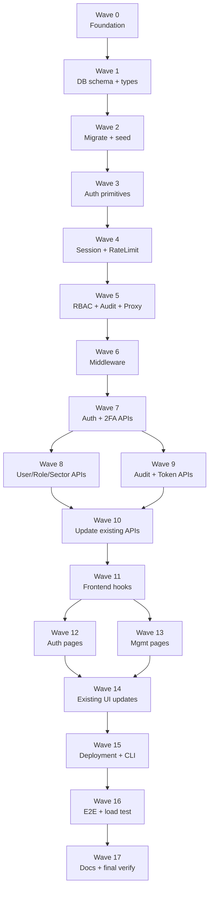

# Implementation Plan: Auth + RBAC System

## Overview

Implementasi tiga pilar baru SafeGuard APD Web Dashboard sesuai `design.md`: (1) **Database persisten** SQLite + Prisma menggantikan tiga file JSON (lihat `design.md §Architecture`, `§Data Models`, `§Migration Strategy`); (2) **Auth + RBAC** dengan 5 role default, 34 permission, isolasi data per sektor, dan service token untuk `ServiceAPDBackend.py` (lihat `§Authentication Flow`, `§Authorization Model`); (3) **Security hardening + deployment** Argon2id, Password Policy + HIBP, Rate Limiter, CSRF, 2FA TOTP, Audit Log, dan Cloudflare Tunnel (lihat `§Security Architecture`, `§Cloudflare Tunnel Deployment`). Implementasi memakai TypeScript, Next.js App Router, Prisma Client, fast-check + Vitest untuk property-based test atas 15 correctness properties di `design.md §Correctness Properties`.

## Tasks

- [x] 1. Foundation, dependencies, dan core types
  - [x] 1.1 Tambah dependencies dan script npm
    - Tambah `@prisma/client`, `prisma` (dev), `@node-rs/argon2`, `otpauth`, `lru-cache`, `qrcode` ke `package.json`
    - Tambah script: `migrate:json-to-db`, `prisma:generate`, `prisma:migrate`, `prisma:studio`, `seed`, `setup:env`, `update:hibp-list`
    - Pin versi exact (no caret) sesuai `design.md §Key Design Decisions` (Prisma ≥5.x, Argon2id via @node-rs/argon2)
    - Jalankan `npm install`, verifikasi tidak ada peer-dep warning fatal
    - _Requirements: 1.1, 9.1_

  - [x] 1.2 Buat core type contracts auth + RBAC
    - Buat `src/lib/auth/types.ts` dengan `UserStatus`, `AuthenticatedUser`, `SessionRow`, `RequestContext` (lihat `design.md §Core Type Contracts`)
    - Export juga `LoginRequest`, `LoginResponse`, `ChangePasswordRequest`, `TwoFactorSetupResponse`
    - _Requirements: 4.1, 4.2_

  - [x] 1.3 Buat permission ID enum + audit action union
    - Buat `src/lib/rbac/permission-types.ts` dengan union `PermissionId` 34 item sesuai `design.md §Permission Map Structure`
    - Buat `src/lib/audit/action-types.ts` dengan union `AuditAction` semua kategori action di `design.md §Audit Log Writer Contract`
    - Tambah const array `ALL_PERMISSIONS` dan `ALL_AUDIT_ACTIONS` untuk seed/test
    - _Requirements: 6.1, 13.1_

- [x] 2. Database layer (Prisma + SQLite + seed)
  - [x] 2.1 Definisikan Prisma schema 10 model
    - Buat `prisma/schema.prisma` dengan model: `User`, `Role`, `Permission`, `RolePermission`, `Session`, `Sector`, `SectorAssignment`, `Node`, `Violation`, `Setting`, `AuditLog`, `RecoveryCode` (12 model termasuk join tables) sesuai `design.md §Prisma Schema Snippet`
    - Pertahankan `Node.id Int` dan `camera/esp32/detection` sebagai `String?` JSON-serialized agar kompatibel dengan spec node-detail-tree-view dan `ServiceAPDBackend.py`
    - Tambah index: `Session.expiresAt`, `Violation(sektorId,timestamp)`, `AuditLog(userId,timestamp)`, dll. (lihat `design.md §Catatan Schema Penting`)
    - Set `datasource db.url = "file:../data/safeguard.db"` dan generator `prisma-client-js`
    - _Requirements: 1.1, 1.2_

  - [x] 2.2 Singleton Prisma Client + WAL pragmas
    - Buat `src/lib/prisma.ts` sesuai `design.md §SQLite Configuration`
    - Eksekusi sekali pragma `journal_mode=WAL`, `busy_timeout=5000`, `synchronous=NORMAL`
    - Set `globalThis.prisma` cache untuk mencegah multiple Prisma Client di dev hot-reload
    - _Requirements: 1.1_

  - [x] 2.3 Generate dan terapkan migrasi awal
    - Jalankan `npx prisma migrate dev --name init_auth_rbac` untuk membuat berkas SQL di `prisma/migrations/{ts}_init_auth_rbac/migration.sql`
    - Verifikasi `data/safeguard.db` terbuat dengan 12 tabel yang diharapkan
    - _Requirements: 1.3_

  - [x] 2.4 Buat permission_matrix default constant
    - Buat `src/lib/rbac/role-seed.ts` dengan map `DEFAULT_ROLE_PERMISSIONS: Record<DefaultRoleName, PermissionId[]>` untuk 5 role sesuai matrix di `design.md §Permission Matrix (Default)`
    - Export const `DEFAULT_ROLES: ['Super_Admin','Admin_K3','Supervisor','PIC_Sektor','Auditor']`
    - _Requirements: 6.1, 6.2_

  - [x] 2.5 Buat seed script idempotent
    - Buat `prisma/seed.ts` yang dijalankan via `npm run seed`:
      - Upsert 34 Permission record (id = `resource:action`)
      - Upsert 5 Role default + isi RolePermission sesuai `role-seed.ts`
      - Jika `User.count() === 0`, buat user `admin` Super_Admin dengan password acak 16 char yang lolos Password_Policy, `mustChangePassword=true`, log password ke stdout sekali
      - Bungkus dalam satu Prisma `$transaction`
    - Tambah `prisma.seed` config di `package.json` agar `prisma migrate dev` auto-run seed
    - _Requirements: 1.4, 5.7_

  - [x] 2.6 Tulis property test seed idempotency (Property 1 partial)
    - **Property: Seed idempotency — running seed N times produces identical Role/Permission state**
    - **Validates: Requirements 1.4**
    - Pakai fast-check generator untuk N (1–5), eksekusi seed N kali pada DB ephemeral (sqlite in `os.tmpdir()`), assert `count(Role)=5`, `count(Permission)=34`, `count(RolePermission)` sesuai matrix tetap konstan
    - File: `prisma/__tests__/seed.property.test.ts`
    - _Property: 1_

- [x] 3. JSON → DB migration script
  - [x] 3.1 Buat skrip `scripts/migrate-json-to-db.ts`
    - Sesuai sequence di `design.md §Migration Script Flow`:
      - Baca `data/db.json`, `data/violations.json`, `data/settings.json`
      - Buat `data/backup/{YYYYMMDD-HHmmss}/` dan copy 3 file JSON sebelum write DB
      - Validasi shape tiap file dengan zod (atau manual guard)
      - Bungkus seluruh upsert dalam satu `prisma.$transaction`
      - Untuk node: panggil `migrateNode()` dari spec node-detail-tree-view (`src/lib/node-migration.ts`) lalu `prisma.node.upsert({where:{id},...})`
      - Untuk violation: derive id dari field existing atau `sha1(timestamp+nodeId+imageRef).slice(0,32)`; upsert by id
      - Untuk setting: upsert by `key`
      - Untuk sector: collect distinct `sektorId` dari nodes, upsert `Sector{id,name=sektorName}`
    - _Requirements: 2.1, 2.2, 2.3, 2.4, 2.5, 2.6_

  - [x] 3.2 Tambah parity check + marker writer
    - Setelah commit transaksi, hitung `prisma.node.count()`, `violation.count()`, `setting.count()` dan bandingkan dengan input JSON
    - Jika mismatch, throw `Error("Parity check failed: ${key} JSON=${j} DB=${d}")` agar tx ter-rollback secara konseptual (catatan: rollback strict membutuhkan parity check di dalam tx)
    - Tulis `data/.migrated` berisi `{ completedAt, counts:{nodes,violations,settings}, backupDir }` (lihat `design.md §Verification`)
    - _Requirements: 2.7_

  - [x] 3.3 Tulis property test migration round-trip + idempotency
    - **Property 1: Migration round-trip + idempotency**
    - **Validates: Requirements 1.5, 2.1, 2.3, 2.4, 2.5**
    - File: `scripts/__tests__/migration.property.test.ts`
    - Generator fast-check menghasilkan input JSON valid (mix flat + extended node), jalankan migrasi N kali (1≤N≤5) di SQLite ephemeral, assert: `count(table)===input.length`, semua field flat preserved (`id,sektorId,sektorName,picName,picPhone,cameraSource,enabled`) dan nested (`camera,esp32,detection`)
    - _Property: 1_

  - [x] 3.4 Buat banner startup "migrasi belum jalan"
    - Tambah check di `src/instrumentation.ts` (Next.js): jika `data/db.json` exists DAN `data/.migrated` tidak ada → set global flag `MIGRATION_PENDING=true`
    - Middleware membaca flag dan menolak login + tampilkan banner di `/login` "Migrasi belum dijalankan. Eksekusi `npm run migrate:json-to-db`"
    - _Requirements: 2.7_

- [x] 4. Checkpoint 1 — DB layer + migration verified
  - Jalankan `npx prisma migrate dev`, `npm run seed`, `npm run migrate:json-to-db` pada fixture
  - Assert tabel `Node`, `Violation`, `Setting`, `Sector`, `Role`, `Permission`, `User` terisi
  - Assert `data/.migrated` ada dan counts match
  - Pastikan semua property test pada section 1–3 pass; ask user if questions arise.

- [x] 5. Core auth primitives
  - [x] 5.1 Argon2id wrapper + needsRehash
    - Buat `src/lib/auth/argon2.ts` sesuai `design.md §Argon2id Configuration & Rehash Policy`
    - Export `ARGON2_PARAMS`, `hashPassword()`, `verifyPassword()`, `needsRehash()`
    - Parameter: memoryCost 19456, timeCost 2, parallelism 1
    - _Requirements: 9.1, 9.2_

  - [x] 5.2 Tulis property test Argon2id rehash invariant
    - **Property 2: Argon2id rehash invariant**
    - **Validates: Requirements 9.1, 9.5**
    - File: `src/lib/auth/__tests__/argon2.property.test.ts`
    - Generator: passwordHash dengan params lebih lemah (m<19456 atau t<2) → assert `needsRehash()===true` dan setelah rehash, hash baru memenuhi parameter saat ini DAN `verifyPassword(newHash, plain)===true`
    - _Property: 2_

  - [x] 5.3 Bundle HIBP top-10k + loader
    - Tambah asset `src/lib/data/pwned-top-10k.txt` (SHA-1 hex, 10000 baris, ±400 KB)
    - Buat `src/lib/auth/hibp-list.ts` dengan `loadHibpList(text)` populating `Set<string>` global, `isPasswordPwned(plain)`
    - Load saat boot via `instrumentation.ts`
    - Tambah script `npm run update:hibp-list` (placeholder yang download dan validasi format SHA-1)
    - _Requirements: 9.3_

  - [x] 5.4 Password Policy validator
    - Buat `src/lib/auth/password-policy.ts` sesuai `design.md §Password Policy Validator + HIBP`
    - Export `validatePassword(plain): PasswordRule[]` dengan 7 rule token
    - _Requirements: 9.3, 9.4_

  - [x] 5.5 Tulis property test password policy soundness/completeness
    - **Property 3: Password policy validator soundness and completeness**
    - **Validates: Requirements 9.3, 9.4**
    - File: `src/lib/auth/__tests__/password-policy.property.test.ts`
    - Generator: random string panjang 0–300 dengan/ tanpa karakter kategori; assert `validatePassword(p).length===0` iff semua rule terpenuhi; rule yang dilanggar muncul dan rule yang dipenuhi tidak muncul
    - _Property: 3_

  - [x] 5.6 CSRF token generator
    - Buat `src/lib/auth/csrf.ts` dengan `generateCsrfToken(): string` (32-byte random base64url via `crypto.randomBytes(32).toString('base64url')`)
    - Export `verifyCsrfToken(provided, stored): boolean` (constant-time compare)
    - _Requirements: 11.2, 11.4_

  - [x] 5.7 Tulis property test CSRF token uniqueness
    - **Property 10: CSRF token uniqueness**
    - **Validates: Requirements 11.2**
    - File: `src/lib/auth/__tests__/csrf.property.test.ts`
    - Generator: N samples (100–10000 untuk speed) → assert `|set(samples)|===N`; tambahan: assert panjang base64url 43 char (= 32 byte)
    - _Property: 10_

  - [x] 5.8 AES-256-GCM encryption helper
    - Buat `src/lib/auth/encrypt.ts` sesuai `design.md §2FA: TOTP Secret Encryption`
    - Export `encryptionAvailable()`, `encryptSecret(plain)`, `decryptSecret(b64)`
    - Jika `APD_ENCRYPTION_KEY` < 32 byte, return null KEY (tidak crash)
    - _Requirements: 12.2, 12.7_

  - [x] 5.9 Tulis property test AES-GCM round-trip
    - **Property 11: AES-GCM TOTP secret round-trip**
    - **Validates: Requirements 12.2, 12.7**
    - File: `src/lib/auth/__tests__/encrypt.property.test.ts`
    - Generator: secret string UTF-8 panjang 1–256 → assert `decryptSecret(encryptSecret(s))===s`; dua call `encryptSecret(s)` menghasilkan ciphertext berbeda (IV unik)
    - _Property: 11_

  - [x] 5.10 TOTP wrapper berbasis otpauth
    - Buat `src/lib/auth/totp.ts` membungkus `otpauth.TOTP` (RFC 6238, period 30s, digit 6, SHA-1)
    - Export `generateTotpSecret()`, `verifyTotp(secret, code, window=1)`, `generateOtpauthUri(secret, label, issuer)`
    - _Requirements: 12.1, 12.2_

  - [x] 5.11 Recovery codes generator
    - Buat `src/lib/auth/recovery-codes.ts`
    - Export `generateRecoveryCodes(n=8)` returns `{plaintext: string[]; hashes: string[]}` (10 char alfanumerik per code, SHA-256 hash)
    - Export `redeemRecoveryCode(userId, code): Promise<boolean>` (atomic mark used)
    - _Requirements: 12.2, 12.4_

- [x] 6. Session, rate limit, lockout
  - [x] 6.1 Session create/verify/refresh module
    - Buat `src/lib/auth/session.ts` sesuai `design.md §Login Sequence` + `§Session Cleanup Background Job`
    - Export `createSession(userId, ip, ua)`, `verifySession(cookieValue)`, `shouldRefreshSession(session, now)`, `refreshSession(id)`, `deleteSession(id)`, `startCleanupJob()`
    - Sliding rule: refresh `expiresAt = now + 8h` jika `now - lastRefreshedAt > 30 min`
    - Cleanup job: `setTimeout(5min)` lalu `setInterval(60min)` delete session `expiresAt < now-24h`
    - _Requirements: 4.2, 4.6, 4.8_

  - [x] 6.2 Tulis property test session sliding expiration
    - **Property 8: Session sliding expiration**
    - **Validates: Requirements 4.6**
    - File: `src/lib/auth/__tests__/session.property.test.ts`
    - Generator: tuple `(lastRefreshedAt, expiresAt, now)`; assert `shouldRefreshSession()===true ⇔ now>expiresAt? false : (now-lastRefreshedAt > 30*60*1000)`; setelah refresh, `expiresAt===now+8h ∧ lastRefreshedAt===now`
    - _Property: 8_

  - [x] 6.3 Tulis property test logout idempotency
    - **Property 15: Logout idempotency**
    - **Validates: Requirements 4.4, 4.5**
    - File: `src/lib/auth/__tests__/session.property.test.ts` (test case berbeda)
    - Skenario: 4 state cookie (absent / id-not-found / expired / valid) → semua return 200 + `Set-Cookie apd_session=; Max-Age=0`; row dihapus jika ditemukan
    - _Property: 15_

  - [x] 6.4 Rate Limiter in-memory
    - Buat `src/lib/rate-limit/rate-limiter.ts` sesuai `design.md §Rate Limiter Implementation`
    - Export `isLoginAllowed(ip, username)`, `recordFailure(ip, username)`, `clearForUser(username)`
    - Konstanta: `WINDOW_MS=15min`, `MAX_FAILURES_IP_USER=5`, `MAX_FAILURES_USER=10`
    - Counter `MAX_FAILURES_USER` di-derive dari `prisma.auditLog.count` agar survive restart
    - _Requirements: 10.1, 10.2_

  - [x] 6.5 Account Lockout state machine
    - Buat `src/lib/rate-limit/lockout.ts` sesuai `design.md §Account Lockout State Machine`
    - Export `applyLockout(userId)` (set `status=locked`, `lockedUntil=now+30min`, audit `auth:account-lockout`)
    - Export `releaseLockoutIfExpired(user)` (jika `lockedUntil<=now` → `status=active`, `lockedUntil=null`)
    - Export `manualUnlock(userId, byUserId)` (audit `user:unlock`, panggil `clearForUser`)
    - _Requirements: 10.3, 10.4, 10.5, 10.6_

  - [x] 6.6 Tulis property test rate limiter + lockout
    - **Property 9: Rate limiter window and lockout state machine**
    - **Validates: Requirements 10.1, 10.2, 10.3, 10.4, 10.5, 10.6**
    - File: `src/lib/rate-limit/__tests__/rate-limiter.property.test.ts`
    - Generator: sequence event `{ts, type:'success'|'failure', ip, username}` → simulasikan state, assert (1) login ditolak iff failures(ip,user) ≥ 5 dalam 15min, (2) lockout iff failures(user) ≥ 10 dalam 15min, (3) setelah `lockedUntil<=now`, login sukses kembalikan `status=active`
    - _Property: 9_

- [x] 7. RBAC layer (permission map, cache, sector scope, audit)
  - [x] 7.1 Permission map registry
    - Buat `src/lib/rbac/permission-map.ts` sesuai `design.md §Permission Map Structure`
    - Daftarkan SEMUA endpoint baru + existing dengan format `{method,pathPattern,permission,sectorScoped?,serviceTokenAllowed?}`
    - Export `lookupPermission(method, pathname): PermissionMapEntry | null`
    - _Requirements: 7.1, 7.2, 7.5_

  - [x] 7.2 Tulis property test permission map coverage
    - **Property 4: Permission map coverage (deny-by-default)**
    - **Validates: Requirements 7.2, 7.5**
    - File: `src/lib/rbac/__tests__/permission-map.property.test.ts`
    - Test runtime baca semua `src/app/api/**/route.ts` lewat `fs`, ekstrak HTTP methods yang di-export, untuk setiap (method, normalized-path) cek `lookupPermission()` non-null kecuali whitelist (`/api/auth/login`, `/api/auth/csrf`, `/api/health`)
    - _Property: 4_

  - [x] 7.3 Permission cache LRU 60s
    - Buat `src/lib/rbac/permission-cache.ts` sesuai `design.md §Permission Cache Strategy`
    - Export `getUserPerms(userId)`, `invalidateUserPerms(userId)`
    - TTL 60s, cleanup interval 5 min
    - _Requirements: 6.5, 8.5_

  - [x] 7.4 Tulis property test permission cache eventual consistency
    - **Property 7: Permission/sector cache eventual consistency**
    - **Validates: Requirements 6.5, 8.5**
    - File: `src/lib/rbac/__tests__/permission-cache.property.test.ts`
    - Generator: sequence ops `[change-perm-at-t0, query-at-t1, query-at-t2,...]`; assert query dengan `t > t0+60s` mengembalikan state baru, queries dengan `t < t0+60s` boleh stale
    - _Property: 7_

  - [x] 7.5 Sector scope helper + Prisma `where` injector
    - Buat `src/lib/rbac/sector-scope.ts`
    - Export `applySectorScope<T extends {sektorId?: any}>(where: T, ctx: RequestContext): T` yang menambahkan `where.sektorId = { in: ctx.sectorIds }` jika `ctx.sectorIds !== null`
    - Export `assertSectorAccess(resourceSektorId, ctx): boolean` (untuk single-resource 404 vs 403)
    - _Requirements: 8.1, 8.2, 8.3_

  - [x] 7.6 Permission decision + RequestContext getter
    - Buat `src/lib/rbac/context.ts` dengan `getRequestContext(req): RequestContext` yang baca header `x-apd-context-*` yang diset middleware
    - Export `hasPermission(user, p)`, `hasAnyPermission(user, ps)`, `hasAllPermissions(user, ps)`
    - _Requirements: 7.1_

  - [x] 7.7 Tulis property test RBAC decision
    - **Property 5: RBAC permission decision**
    - **Validates: Requirements 6.2, 7.3**
    - File: `src/lib/rbac/__tests__/permission-decision.property.test.ts`
    - Generator: tuple `(user.permissions: PermissionId[], required: PermissionId)`; assert middleware decision `pass` iff `required ∈ user.permissions`, else 403 dengan body `{error:'permission_denied', required}` dan audit log entry `auth:permission-denied`
    - _Property: 5_

  - [x] 7.8 Tulis property test sector data isolation
    - **Property 6: Sector data isolation invariant**
    - **Validates: Requirements 7.4, 8.1, 8.2, 8.3**
    - File: `src/lib/rbac/__tests__/sector-scope.property.test.ts`
    - Generator: `(sectorIds, nodes/violations dengan sektorId arbitrer)`; assert (1) list filter `sektorId ∈ sectorIds`, (2) GET single resource luar scope → 404, (3) PUT/DELETE luar scope → 403/404 sebelum business logic dijalankan
    - _Property: 6_

  - [x] 7.9 Audit log writer
    - Buat `src/lib/audit/audit-log.ts` sesuai `design.md §Audit Log Writer Contract`
    - Export `appendAuditLog(entry: AuditEntry): Promise<void>` yang **swallow error** (try/catch + warn ke stderr) agar business logic tidak fail (Req 13.7)
    - Truncate `metadata` ke max 4 KB serialized
    - _Requirements: 13.1, 13.2, 13.7_

  - [x] 7.10 Tulis property test audit log append-only
    - **Property 12: Audit log append-only**
    - **Validates: Requirements 13.1, 13.3**
    - File: `src/lib/audit/__tests__/audit-append-only.property.test.ts`
    - Test runtime: scan semua `src/app/api/**/route.ts` lewat `fs`, regex search `prisma.auditLog.update|delete|deleteMany|executeRaw.*audit_log`; assert tidak ada match
    - _Property: 12_

- [x] 8. Trusted proxy + redirect-safety helpers
  - [x] 8.1 Cloudflare IP list + checks
    - Buat `src/lib/proxy/cloudflare-ips.ts` sesuai `design.md §Trusted Proxy IP Validation`
    - Export `CLOUDFLARE_IPV4_RANGES`, `CLOUDFLARE_IPV6_RANGES`, `isCloudflareIp(ip)`, `isLoopback(ip)`
    - Implementasi `ipv4InCidr` dan `ipv6InCidr` minimal tanpa library eksternal
    - _Requirements: 15.3_

  - [x] 8.2 Tulis property test trusted proxy validation
    - **Property 13: Trusted proxy validation**
    - **Validates: Requirements 10.7, 15.3, 15.5**
    - File: `src/lib/proxy/__tests__/cloudflare-ips.property.test.ts`
    - Generator: random IPv4/IPv6 string + remote = loopback/cf-ip/random; assert (1) `BEHIND_PROXY=cloudflare ∧ ¬loopback ∧ ¬cf` → 400 untrusted_proxy_origin, (2) loopback → ignore CF-Connecting-IP, clientIp=remote, (3) cf-ip → clientIp=CF-Connecting-IP
    - _Property: 13_

  - [x] 8.3 Redirect safety helper
    - Buat `src/lib/auth/redirect-safety.ts`
    - Export `isSafeRedirectTarget(value: string): boolean` (`startsWith('/') ∧ ¬startsWith('//') ∧ ¬matches /^https?:\/\// ∧ ¬contains [\r\n]`)
    - Export `safeRedirectOrDefault(value, defaultPath)`
    - _Requirements: 14.3_

  - [x] 8.4 Tulis property test redirect param safety
    - **Property 14: Redirect param safety**
    - **Validates: Requirements 14.3**
    - File: `src/app/login/__tests__/redirect-param.property.test.ts`
    - Generator: random string + skenario terkonstruksi (`/foo`, `//evil.com`, `http://evil`, `/path\rinjection`, dst); assert sesuai aturan
    - _Property: 14_

- [x] 9. Middleware (auth + CSRF + RBAC + security headers)
  - [x] 9.1 Implement `src/middleware.ts`
    - Implementasi flowchart `design.md §Middleware Decision Flow`:
      1. Resolve `clientIp` (loopback skip, BEHIND_PROXY=cloudflare validate)
      2. Whitelist path: `/api/auth/login`, `/api/auth/csrf`, `/api/health`, `/_next/*`, `/public/*`, `/login`, `/403`
      3. Service_Token flow (header `Authorization: Bearer`) + whitelist endpoint
      4. Session flow: read cookie `apd_session`, verify, sliding refresh
      5. `mustChangePassword` redirect ke `/change-password`
      6. CSRF check (POST/PUT/PATCH/DELETE)
      7. `lookupPermission` + 403 if missing
      8. Sector scope injection ke header `x-apd-context-*`
    - Tetapkan `matcher` di config supaya jalan di `/api/*` dan halaman terproteksi
    - _Requirements: 4.7, 7.1, 7.2, 7.3, 7.4, 11.4, 14.1_

  - [x] 9.2 Security headers + cache headers
    - Buat helper `src/lib/security/headers.ts` dengan const `SECURITY_HEADERS`, `SENSITIVE_CACHE_HEADERS` sesuai `design.md §Security Headers + CSP`
    - Apply ke setiap response middleware (dengan `NextResponse.next({headers})`)
    - _Requirements: 11.6, 11.7_

  - [x] 9.3 Cookie attribute resolver
    - Buat `src/lib/auth/cookie-attrs.ts` dengan `getSessionCookieAttrs(env: NodeJS.ProcessEnv): SerializeOptions`
    - Logic: dev (`NODE_ENV!==production`) → `Secure=false`; prod → `Secure=true`; `BEHIND_PROXY=cloudflare` → `Secure=true` no exception
    - HttpOnly=true, SameSite=Lax, Path=/
    - _Requirements: 11.1, 15.4_

  - [x] 9.4 Integration test middleware end-to-end
    - File: `src/__tests__/middleware.integration.test.ts`
    - Test: request tanpa cookie ke `/api/users` → 401 (path `/api/*`) atau 302 (path HTML); request dengan cookie valid + permission cocok → pass; CSRF mismatch → 403; service token whitelist endpoint → pass; service token endpoint luar whitelist → 403 service_token_scope_denied; BEHIND_PROXY=cloudflare + remote bukan CF/loopback → 400
    - _Requirements: 3.2, 3.3, 7.1, 11.4, 15.3_

- [x] 10. Auth API routes
  - [x] 10.1 POST `/api/auth/login`
    - Buat `src/app/api/auth/login/route.ts` sesuai `design.md §Login Sequence`
    - Step: rate-limit check → load user → verify Argon2 → 2FA branch (`needs2fa` jika `totpEnabled` dan totp tidak ada) → rehash if `needsRehash` → create session → set cookie via `getSessionCookieAttrs` → audit `auth:login:success` → return `{csrfToken, redirect}`
    - Pesan error generik "Username atau password salah" untuk semua skenario gagal (Req 4.3)
    - _Requirements: 4.1, 4.2, 4.3, 9.5, 10.2, 11.1, 11.2_

  - [x] 10.2 POST `/api/auth/logout`
    - Buat `src/app/api/auth/logout/route.ts` idempotent
    - Hapus session row jika ada, set `Set-Cookie apd_session=; Max-Age=0`, return 200
    - _Requirements: 4.4, 4.5_

  - [x] 10.3 GET `/api/auth/csrf` + GET `/api/auth/me`
    - Buat `src/app/api/auth/csrf/route.ts` (return `{csrfToken}` dari Session aktif)
    - Buat `src/app/api/auth/me/route.ts` (return `AuthenticatedUser` lewat `getRequestContext` + load full role permissions + sectorIds)
    - _Requirements: 11.5, 14.7_

  - [x] 10.4 POST `/api/auth/change-password`
    - Buat `src/app/api/auth/change-password/route.ts`
    - Validasi `oldPassword` dengan Argon2 verify, `newPassword` dengan `validatePassword`
    - Jika valid: hash + update User (set `mustChangePassword=false`, `passwordChangedAt=now`), delete semua Session lain user (rotate), audit `user:update`
    - _Requirements: 9.3, 9.4, 9.6_

- [x] 11. 2FA API routes
  - [x] 11.1 POST `/api/auth/2fa/setup`
    - Buat `src/app/api/auth/2fa/setup/route.ts`
    - Generate secret base32, return `{setupId, otpauthUri, secretBase32}`; simpan setupId+secret di Map memori dengan TTL 10 menit
    - Return 503 jika `encryptionAvailable()===false`
    - _Requirements: 12.1, 12.7_

  - [x] 11.2 POST `/api/auth/2fa/verify`
    - Buat `src/app/api/auth/2fa/verify/route.ts`
    - Verify TOTP code dengan window ±1 (±30s); jika valid: encrypt secret, set `User.totpSecretEnc`, `totpEnabled=true`, generate 8 recovery code, simpan hash di `RecoveryCode`, return `{recoveryCodes}`
    - Audit `auth:2fa:enabled`
    - _Requirements: 12.2_

  - [x] 11.3 POST `/api/auth/2fa/disable`
    - Buat `src/app/api/auth/2fa/disable/route.ts`
    - Wajibkan `password` (Argon2 verify) dan `totp` (verify last code); jika valid: set `totpEnabled=false`, `totpSecretEnc=null`, delete semua RecoveryCode user
    - Audit `auth:2fa:disabled`
    - _Requirements: 12.6_

  - [x] 11.4 Update login flow untuk recovery code
    - Update `/api/auth/login` route: jika `totp` tidak match TOTP, coba `redeemRecoveryCode(userId, totp)`; jika sukses, audit `auth:2fa:recovery-used` dan lanjut login
    - _Requirements: 12.3, 12.4_

- [x] 12. User management API
  - [x] 12.1 GET/POST `/api/users`
    - Buat `src/app/api/users/route.ts`
    - GET: list users dengan filter `?role=&status=&search=`
    - POST: validasi (username regex `^[a-zA-Z0-9._-]{3,32}$`, email RFC 5322, password policy); tolak jika role Supervisor/PIC tanpa sectorIds; bungkus dalam `$transaction` (User + SectorAssignment); audit `user:create`
    - _Requirements: 5.1, 5.2, 5.3, 1.5_

  - [x] 12.2 GET/PUT/DELETE `/api/users/[id]`
    - Buat `src/app/api/users/[id]/route.ts`
    - PUT: ubah field, jika `status` change active→disabled hapus semua Session user (Req 5.5); audit `user:update`
    - DELETE: tolak jika last Super_Admin atau diri sendiri (Req 5.6); audit `user:delete`
    - Invalidate permission cache untuk user
    - _Requirements: 5.5, 5.6, 6.5_

  - [x] 12.3 POST `/api/users/[id]/reset-password`
    - Buat `src/app/api/users/[id]/reset-password/route.ts`
    - Generate password sementara 12 char yang lolos `validatePassword`; set `passwordHash`, `mustChangePassword=true`, `passwordChangedAt=now`; return `{temporaryPassword}` (one-time display); audit `user:password-reset`
    - _Requirements: 5.4_

  - [x] 12.4 POST `/api/users/[id]/unlock`
    - Buat `src/app/api/users/[id]/unlock/route.ts`
    - Panggil `manualUnlock(userId, byUserId)` dari `src/lib/rate-limit/lockout.ts`
    - _Requirements: 10.6_

- [x] 13. Role management API
  - [x] 13.1 GET/POST `/api/roles`
    - Buat `src/app/api/roles/route.ts`
    - POST: validasi nama unique case-insensitive (Req 6.3); transaction Role + RolePermission; audit `role:create`
    - _Requirements: 6.3_

  - [x] 13.2 GET/PUT/DELETE `/api/roles/[id]`
    - Buat `src/app/api/roles/[id]/route.ts`
    - PUT: tolak rename jika `isDefault=true`; ubah RolePermission set; invalidate cache untuk semua user dengan role ini; audit `role:update`
    - DELETE: tolak 5 default role (`isDefault=true`, Req 6.4); tolak jika ada user assigned (Req 6.6, return jumlah); audit `role:delete`
    - _Requirements: 6.4, 6.5, 6.6_

- [x] 14. Sector management API
  - [x] 14.1 GET/POST `/api/sectors`
    - Buat `src/app/api/sectors/route.ts`
    - POST: validasi `id` regex `^S-\d{2,3}$`; audit not in AUDITED_ACTIONS (sector mutations not audited per design)
    - _Requirements: (sector CRUD permitted by sector:create)_

  - [x] 14.2 GET/PUT/DELETE `/api/sectors/[id]`
    - Buat `src/app/api/sectors/[id]/route.ts`
    - GET: include `nodes[]`, `assignedUsers[]`
    - DELETE: cascade SectorAssignment via Prisma onDelete

  - [x] 14.3 PUT `/api/sectors/[id]/users`
    - Buat `src/app/api/sectors/[id]/users/route.ts`
    - Replace full set of `SectorAssignment` for this sector via transaction
    - Invalidate permission cache untuk semua affected user (Req 8.5)
    - _Requirements: 8.5_

- [x] 15. Audit log API
  - [x] 15.1 GET `/api/audit-log` (list + pagination)
    - Buat `src/app/api/audit-log/route.ts`
    - Query: `?from=&to=&action=&userId=&resourceType=&page=&pageSize=` (default 50/page)
    - Return `{entries, pagination:{total,page,pageSize,totalPages}}`
    - _Requirements: 13.4_

  - [x] 15.2 GET `/api/audit-log/export` (CSV)
    - Buat `src/app/api/audit-log/export/route.ts`
    - Stream CSV (max 100,000 rows); append `audit-log:export` entry; set `Content-Type: text/csv`, `Content-Disposition: attachment`
    - _Requirements: 13.5_

- [x] 16. Service token rotate API
  - [x] 16.1 POST `/api/settings/integrations/service-token`
    - Buat `src/app/api/settings/integrations/service-token/route.ts`
    - Generate token 64 char hex (`crypto.randomBytes(32).toString('hex')`)
    - Atomic write `.env.local`: read existing, replace/append `APD_SERVICE_TOKEN=...`, `fs.writeFile` ke temp file lalu `fs.rename`
    - Return `{token}` (one-time display); audit `setting:update:system`
    - _Requirements: 3.6_

- [x] 17. Update existing API routes (apply middleware + sector scope + audit)
  - [x] 17.1 Update `/api/nodes` (GET/POST)
    - Update `src/app/api/nodes/route.ts`:
      - GET: panggil `applySectorScope(where, ctx)` jika ctx.sectorIds!==null
      - POST: audit `node:create`
    - _Requirements: 7.4, 8.1, 8.2_

  - [x] 17.2 Update `/api/nodes/[id]` (GET/PUT/DELETE)
    - Update `src/app/api/nodes/[id]/route.ts`:
      - GET: 404 jika resource luar scope (Req 8.3)
      - PUT: cek scope sebelum update; audit `node:update`
      - DELETE: cek scope; audit `node:delete`
    - _Requirements: 8.3, 13.1_

  - [x] 17.3 Update `/api/nodes/[id]/status` + `/api/nodes/test-connection`
    - Update `src/app/api/nodes/[id]/status/route.ts` + `test-connection/route.ts`:
      - Whitelist `serviceTokenAllowed: true` untuk status (heartbeat)
      - Cek scope untuk Supervisor/PIC
    - _Requirements: 3.2, 7.4_

  - [x] 17.4 Update `/api/violations`
    - Update `src/app/api/violations/route.ts` + `[id]/route.ts`:
      - GET: `applySectorScope`
      - POST (acknowledge): cek scope + audit `violation:acknowledge`
      - DELETE: cek scope + audit `violation:delete`
      - GET `/export`: audit `violation:export`
    - _Requirements: 8.1, 13.1_

  - [x] 17.5 Update `/api/settings`
    - Update `src/app/api/settings/route.ts`:
      - Split PATCH menjadi 3: `/branding`, `/notification`, `/system` masing-masing dengan permission berbeda
      - Audit `setting:update:branding|notification|system`
    - _Requirements: 13.1_

- [x] 18. Checkpoint 2 — Backend complete
  - Jalankan `npm run test`, assert semua property test (Property 1–15) pass
  - Jalankan `npx tsc --noEmit` clean
  - Smoke test `curl http://127.0.0.1:3000/api/health`, `curl /api/auth/login` dengan kredensial valid → cookie + csrfToken
  - Pastikan permission map property test (P4) pass — semua endpoint terdaftar
  - Ask the user if questions arise.

- [x] 19. Frontend hooks & context
  - [x] 19.1 `useCurrentUser` + AuthContext
    - Buat `src/hooks/use-current-user.tsx` dengan React Context provider
    - Fetch `/api/auth/me` saat mount, refresh on window focus, refresh on 401 response
    - _Requirements: 14.7_

  - [x] 19.2 `usePermission` + `useSectorScope`
    - Buat `src/hooks/use-permission.ts`
    - Buat `src/hooks/use-sector-scope.ts` (return `{sectorIds: string[] | null}`)
    - _Requirements: 6.5, 8.5_

  - [x] 19.3 `useCsrfToken`
    - Buat `src/hooks/use-csrf-token.ts`; auto-refresh dari `GET /api/auth/csrf` jika belum ada
    - Wrap `fetch` dalam helper `apiFetch(path, init)` yang otomatis attach `X-CSRF-Token`
    - _Requirements: 11.3, 11.5_

  - [x] 19.4 PermissionGate component
    - Buat `src/components/access/PermissionGate.tsx` sesuai `design.md §Frontend Components & Pages`
    - Props: `permission: PermissionId | PermissionId[]`, `mode?: 'all'|'any'`, `fallback?`, `children`
    - _Requirements: 14.4_

- [x] 20. Frontend auth pages
  - [x] 20.1 LoginForm component
    - Buat `src/components/auth/LoginForm.tsx`
    - State machine 2 step: (1) username+password (2) totp jika `needs2fa`
    - Submit ke `/api/auth/login`; handle 401, 429, 503; simpan `csrfToken` di context; redirect ke `redirect` param atau role-default
    - _Requirements: 4.1, 4.2, 14.3_

  - [x] 20.2 PasswordStrengthMeter component
    - Buat `src/components/auth/PasswordStrengthMeter.tsx`
    - Run `validatePassword()` per onChange; checklist 7 rule + bar warna merah/kuning/hijau
    - _Requirements: 9.3, 9.4_

  - [x] 20.3 TotpSetupDialog + RecoveryCodesView
    - Buat `src/components/auth/TotpSetupDialog.tsx` (QR via `qrcode.toDataURL`, secret base32 copyable, input 6 digit)
    - Buat `src/components/auth/RecoveryCodesView.tsx` (8 kode, tombol "Saya sudah simpan" + "Download .txt")
    - _Requirements: 12.1, 12.2_

  - [x] 20.4 Halaman `/login`, `/change-password`, `/403`, `/account/security`
    - Buat `src/app/login/page.tsx` (LoginForm + tema dashboard tanpa sidebar, banner if `MIGRATION_PENDING`)
    - Buat `src/app/change-password/page.tsx` (form old/new/confirm + PasswordStrengthMeter)
    - Buat `src/app/403/page.tsx` (pesan + tombol "Kembali ke Dashboard")
    - Buat `src/app/account/security/page.tsx` (TotpSetupDialog toggle + tombol Disable; banner if `!encryptionAvailable`)
    - _Requirements: 12.1, 12.7, 14.2, 14.5_

- [x] 21. Frontend management pages
  - [x] 21.1 `/users` page + UserTable + dialogs
    - Buat `src/app/users/page.tsx`
    - Buat `src/components/users/UserTable.tsx` (kolom: username, fullName, email, role, status, lastLoginAt + aksi PermissionGate-wrapped)
    - Buat `src/components/users/UserCreateDialog.tsx`, `UserEditDrawer.tsx` (include SectorAssignmentSelector if role=Supervisor/PIC)
    - _Requirements: 5.1, 5.2, 5.3_

  - [x] 21.2 `/roles` page + RoleEditor + PermissionTreePicker
    - Buat `src/app/roles/page.tsx`
    - Buat `src/components/roles/RoleEditor.tsx` (lock 5 default rename/delete dengan tooltip)
    - Buat `src/components/roles/PermissionTreePicker.tsx` (tree by resource, tri-state checkbox)
    - _Requirements: 6.3, 6.4_

  - [x] 21.3 `/sectors` page + SectorTable + SectorAssignmentSelector
    - Buat `src/app/sectors/page.tsx`
    - Buat `src/components/sectors/SectorTable.tsx`
    - Buat `src/components/sectors/SectorAssignmentSelector.tsx` (multi-select dropdown)
    - _Requirements: 5.3, 8.5_

  - [x] 21.4 `/audit-log` page + AuditLogTable + filters + export
    - Buat `src/app/audit-log/page.tsx`
    - Buat `src/components/audit-log/AuditLogTable.tsx` (50/page pagination, kolom + tooltip metadata)
    - Buat `src/components/audit-log/AuditLogFilters.tsx` (date range, action select, userId, resourceType)
    - Tombol Ekspor CSV → `GET /api/audit-log/export?...`
    - _Requirements: 13.4, 13.5_

  - [x] 21.5 `/settings/integrations` page + Service_Token rotate widget
    - Buat `src/app/settings/integrations/page.tsx`
    - Tampilkan placeholder masked token; tombol "Generate Token Baru" → POST `/api/settings/integrations/service-token` → tampilkan token sekali dengan copy + warning
    - _Requirements: 3.6_

- [x] 22. Update existing UI dengan PermissionGate dan UserMenuWidget
  - [x] 22.1 UserMenuWidget di header
    - Buat `src/components/shell/UserMenuWidget.tsx` (avatar initial + nama + role + dropdown: "Akun saya", "Audit Log" (gated), "Logout")
    - Wire ke layout root `src/app/layout.tsx` agar muncul di setiap halaman terproteksi
    - _Requirements: 14.7_

  - [x] 22.2 Sidebar dengan PermissionGate
    - Update `src/components/shell/Sidebar.tsx` (atau equivalent) untuk wrap setiap menu item dengan PermissionGate
    - Tambah menu baru: Kelola User (`user:read`), Kelola Role (`role:read`), Kelola Sektor (`sector:read`), Audit Log (`audit-log:read`), Integrasi (`setting:update:system`)
    - _Requirements: 14.4_

  - [x] 22.3 NodeRow + NodeWizard + ViolationsPage permission checks
    - Update `src/components/nodes/NodeRow.tsx`: tombol Edit (`node:update`), Delete (`node:delete`), Toggle (`node:toggle`) wrapped in PermissionGate
    - Update `src/components/wizard/NodeWizard.tsx`: tombol Simpan disabled jika tidak punya `node:create`/`node:update`
    - Update violations page: tombol Acknowledge (`violation:acknowledge`), Delete (`violation:delete`)
    - _Requirements: 14.4_

- [x] 23. Cloudflare Tunnel deployment artifacts
  - [x] 23.1 `cloudflared/config.yml` template
    - Buat `cloudflared/config.yml` sesuai `design.md §cloudflared/config.yml Sample`
    - Tambah komentar header dengan instruksi placeholder `<tunnel-uuid>` dan `<USER>`
    - _Requirements: 15.2_

  - [x] 23.2 Setup script `npm run setup:env`
    - Buat `scripts/setup-env.ts`
    - Generate `APD_SERVICE_TOKEN` (64 char hex), `APD_ENCRYPTION_KEY` (32 byte base64), default `BEHIND_PROXY` empty
    - Tulis ke `.env.local` (jangan overwrite jika sudah ada — prompt skip atau merge)
    - _Requirements: 3.4, 12.7_

  - [x] 23.3 WebSocket reconnect wrapper
    - Buat `src/lib/ws/reconnect-ws.ts` sesuai `design.md §WebSocket Reconnect Strategy`
    - Backoff `[1000,2000,4000,8000,30000]` ms, banner via callback `onStatusChange`
    - Update `src/components/nodes/LivePreviewPanel.tsx` untuk pakai wrapper ini
    - _Requirements: 15.6_

  - [x] 23.4 README deployment section
    - Update `README.md` tambah bagian "Deployment Cloudflare Tunnel" sesuai Req 15.8 (prasyarat, `cloudflared tunnel create`, contoh config, `cloudflared tunnel route dns`, `cloudflared service install`, langkah verifikasi WebSocket)
    - Tambah bagian "Pemulihan Akses" (run `scripts/reset-admin-password.ts`)
    - Tambah bagian "Mode Lokal vs Tunnel" (Req 15.7 — loopback tetap berfungsi saat tunnel offline)
    - _Requirements: 15.7, 15.8_

- [x] 24. CLI recovery scripts
  - [x] 24.1 `scripts/reset-admin-password.ts`
    - Argumen: `--username admin` (default)
    - Generate password 16 char yang lolos `validatePassword`, set `passwordHash`, `mustChangePassword=true`, log password sekali
    - _Requirements: (Risk R3 mitigasi)_

  - [x] 24.2 `scripts/purge-audit-log.ts`
    - Argumen: `--older-than-days 365`
    - Hapus AuditLog dengan `timestamp < now - days`; tulis entry baru `audit-log:purge` dengan metadata count
    - _Requirements: 13.6_

  - [x] 24.3 `scripts/restore-from-backup.ts`
    - Argumen: `--backup-dir data/backup/{ts}`
    - Restore 3 JSON file ke `data/`, hapus marker `.migrated`, hapus `safeguard.db*`
    - _Requirements: (Risk rollback section di design)_

- [x] 25. Testing — E2E + load test
  - [x] 25.1 Integration test: end-to-end login flow
    - File: `src/__tests__/login-flow.integration.test.ts`
    - Boot DB kosong → seed → login dengan password default → forced password change → akses `/` 200
    - _Requirements: 4.2, 5.7, 9.6_

  - [x] 25.2 Integration test: sector isolation E2E
    - File: `src/__tests__/sector-isolation.integration.test.ts`
    - 3 sektor, 6 node, Supervisor 1 sektor: GET `/api/nodes` returns 2; GET node lain → 404; PUT node lain → 403
    - _Requirements: 8.1, 8.2, 8.3_

  - [x] 25.3 Integration test: service token end-to-end
    - File: `src/__tests__/service-token.integration.test.ts`
    - POST `/api/violations` dengan Bearer service token → 200, audit log `userId="system:python-backend"`; POST `/api/users` dengan token → 403 service_token_scope_denied
    - _Requirements: 3.1, 3.2, 3.3, 3.5_

  - [x] 25.4 Integration test: cookie attribute by env
    - File: `src/__tests__/cookie-attrs.integration.test.ts`
    - Login dengan `BEHIND_PROXY=cloudflare` → response `Set-Cookie` mengandung `Secure`; dev tanpa env → tidak ada `Secure`
    - _Requirements: 11.1, 15.4_

  - [x] 25.5 Load test 50 concurrent r/w
    - Buat `scripts/loadtest-50-concurrent.ts`
    - 25 concurrent reads + 25 concurrent writes ke real SQLite, ukur p50/p95/p99, persentase `database is locked` (target 0%), runtime ≤5000ms
    - _Requirements: 1.1_

- [x] 26. Final checkpoint — Documentation & verification
  - [x] 26.1 Update CLAUDE.md / AGENTS.md
    - Tambah ringkasan auth+RBAC: alur login, permission map location, daftar endpoint baru, env yang diperlukan
    - Dokumentasikan cara menjalankan migration, seed, reset admin
    - Dokumentasikan cara menambah endpoint baru (wajib daftar di `permission-map.ts`)

  - [x] 26.2 Smoke test checklist
    - Pastikan: `npx prisma migrate deploy` clean; `npm run seed`; `npm run migrate:json-to-db`; `npm run dev` boot tanpa error; login dengan admin default; ganti password; akses `/users`, `/roles`, `/sectors`, `/audit-log`; aktifkan 2FA; logout; loopback test dengan service token; (optional) tunnel test dengan `cloudflared tunnel run`
    - _Requirements: 14.6, 15.7_

  - [x] 26.3 Final verification
    - `npx tsc --noEmit` clean
    - `npm test` semua property test (P1–P15) pass
    - `npm run lint` clean
    - Ask the user if questions arise.

## Notes

- Tasks marked with `*` are optional dan dapat dilewatkan untuk MVP cepat
- Setiap leaf task mereferensikan requirements/properties spesifik untuk traceability
- 15 correctness properties dari `design.md §Correctness Properties` masing-masing menjadi sub-task tersendiri (P1–P15) yang dapat dijalankan paralel setelah implementasinya selesai
- Backward compatibility dengan spec node-detail-tree-view dijaga: `Node` model tetap punya flat fields + nested objects, `migrateNode()` di-reuse oleh migration script
- Backward compatibility dengan `ServiceAPDBackend.py` dijaga: service token + endpoint whitelist tetap berfungsi, loopback origin (127.0.0.1) skip Trusted_Proxy_IPs check
- Deny-by-default ditegakkan oleh property test P4 yang scan semua `src/app/api/**/route.ts` dan assert tiap method ter-mapping di `permission-map.ts`
- Audit log append-only ditegakkan oleh property test P12 yang assert tidak ada handler API memanggil `prisma.auditLog.update/delete*`
- Cloudflare Tunnel deployment opsional — loopback `http://127.0.0.1:3000` tetap berfungsi penuh tanpa tunnel (Req 15.7)
- Single-laptop deployment friendly: SQLite + WAL, in-memory rate limiter, no Redis, no message queue

## Task Dependency Graph



```json
{
  "waves": [
    { "id": 0, "tasks": ["1.1", "1.2", "1.3"] },
    { "id": 1, "tasks": ["2.1", "2.2"] },
    { "id": 2, "tasks": ["2.3", "2.4"] },
    { "id": 3, "tasks": ["2.5", "3.1", "5.1", "5.3", "5.6", "5.8", "5.10", "8.1", "8.3"] },
    { "id": 4, "tasks": ["2.6", "3.2", "3.3", "3.4", "5.2", "5.4", "5.5", "5.7", "5.9", "5.11", "8.2", "8.4"] },
    { "id": 5, "tasks": ["6.1", "6.4", "6.5", "7.1", "7.3", "7.5", "7.6", "7.9"] },
    { "id": 6, "tasks": ["6.2", "6.3", "6.6", "7.2", "7.4", "7.7", "7.8", "7.10"] },
    { "id": 7, "tasks": ["9.1", "9.2", "9.3"] },
    { "id": 8, "tasks": ["9.4", "10.1", "10.2", "10.3", "10.4"] },
    { "id": 9, "tasks": ["11.1", "11.2", "11.3", "11.4"] },
    { "id": 10, "tasks": ["12.1", "12.2", "12.3", "12.4", "13.1", "13.2", "14.1", "14.2", "14.3", "15.1", "15.2", "16.1"] },
    { "id": 11, "tasks": ["17.1", "17.2", "17.3", "17.4", "17.5"] },
    { "id": 12, "tasks": ["19.1", "19.2", "19.3", "19.4"] },
    { "id": 13, "tasks": ["20.1", "20.2", "20.3"] },
    { "id": 14, "tasks": ["20.4", "21.1", "21.2", "21.3", "21.4", "21.5"] },
    { "id": 15, "tasks": ["22.1", "22.2", "22.3", "23.1", "23.2", "23.3", "23.4", "24.1", "24.2", "24.3"] },
    { "id": 16, "tasks": ["25.1", "25.2", "25.3", "25.4", "25.5"] },
    { "id": 17, "tasks": ["26.1", "26.2", "26.3"] }
  ]
}
```
