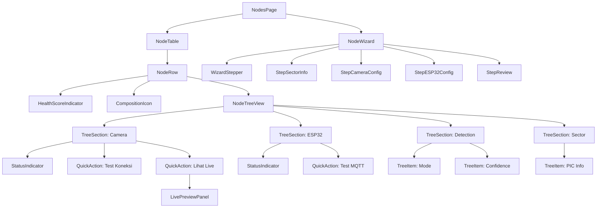
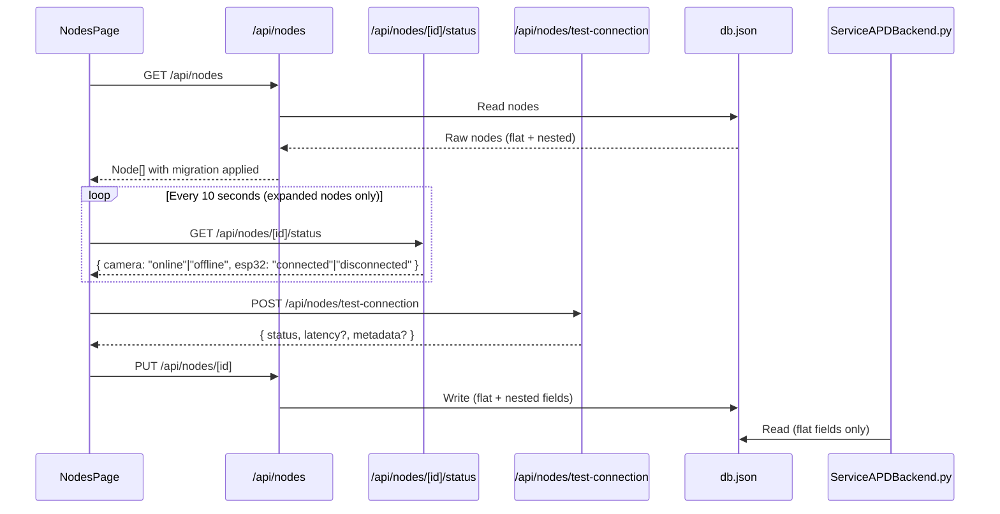

# Design Document: Node Detail Tree View

## Overview

Redesain halaman Kelola Node (`/nodes`) dari flat table + modal CRUD menjadi interactive tree view dengan health scoring, step-by-step wizard, quick actions, dan status indicators. Desain ini mempertahankan backward compatibility dengan `ServiceAPDBackend.py` yang membaca `db.json` secara langsung menggunakan flat fields (`cameraSource`, `sektorName`, dll).

### Design Goals

1. **Hierarchical Visibility** — Komponen node (kamera, ESP32, deteksi) ditampilkan dalam tree structure yang expandable
2. **Health-at-a-Glance** — Circular progress + color badge menunjukkan health score per node
3. **Guided Input** — Wizard 4-step menggantikan single modal untuk mengurangi cognitive load
4. **Real-time Status** — Color-coded indicators dengan polling untuk status komponen
5. **Backward Compatibility** — Flat fields tetap ada di db.json agar ServiceAPDBackend.py tidak perlu modifikasi

### Key Design Decisions

| Decision | Choice | Rationale |
|----------|--------|-----------|
| Animation library | CSS transitions + `@starting-style` | Project sudah punya pattern CSS animations; menambah Framer Motion (+30KB) tidak justified untuk expand/collapse |
| Status polling | Interval polling via `setInterval` (10s) | WebSocket sudah ada tapi hanya untuk video frames; status polling terpisah lebih sederhana |
| Data migration | Lazy migration on first load | Tidak perlu migration script; node lama di-migrasi saat tree view pertama kali dibuka |
| State management | React `useState` + `useReducer` | Tidak ada global state library; wizard state cukup di-manage lokal |
| Connection test | Server-side probe via API route | RTSP/MQTT probe tidak bisa dilakukan dari browser |

## Architecture

### Component Tree



### Data Flow



### File/Folder Structure

```
src/
├── app/
│   ├── nodes/
│   │   └── page.tsx                    # Main page (refactored)
│   └── api/
│       └── nodes/
│           ├── route.ts                # GET, POST (updated)
│           ├── bulk/
│           │   └── route.ts            # Existing bulk actions
│           └── [id]/
│               ├── route.ts            # PUT, DELETE (updated)
│               └── status/
│                   └── route.ts        # NEW: GET status
│       └── nodes/
│           └── test-connection/
│               └── route.ts            # NEW: POST test
├── components/
│   ├── nodes/
│   │   ├── NodeTable.tsx               # Table wrapper
│   │   ├── NodeRow.tsx                 # Single row + expand trigger
│   │   ├── NodeTreeView.tsx            # Tree view container
│   │   ├── TreeSection.tsx             # Collapsible section (Camera, ESP32, etc.)
│   │   ├── TreeItem.tsx                # Leaf item with label + value
│   │   ├── StatusIndicator.tsx         # Color dot + pulse animation
│   │   ├── HealthScoreIndicator.tsx    # Circular progress (SVG)
│   │   ├── CompositionIcon.tsx         # Camera/Chip/Both icons
│   │   ├── QuickActionButton.tsx       # Inline action button
│   │   └── LivePreviewPanel.tsx        # WebSocket frame viewer
│   └── wizard/
│       ├── NodeWizard.tsx              # Wizard container + navigation
│       ├── WizardStepper.tsx           # Progress stepper UI
│       ├── StepSectorInfo.tsx          # Step 1
│       ├── StepCameraConfig.tsx        # Step 2
│       ├── StepESP32Config.tsx         # Step 3
│       └── StepReview.tsx              # Step 4
├── lib/
│   ├── node-migration.ts              # Legacy → extended schema migration
│   ├── health-score.ts                # Health score calculation
│   └── node-types.ts                  # TypeScript interfaces
```

## Components and Interfaces

### Core TypeScript Interfaces

```typescript
// lib/node-types.ts

export interface CameraConfig {
  url: string;           // max 512 chars, e.g. "rtsp://192.168.1.10/live/ch00_1"
  resolution: string;    // format "WxH", e.g. "1280x720"
  protocol: 'rtsp' | 'http' | 'local';
}

export interface ESP32Config {
  mqttTopic: string;     // max 128 chars
  mqttBroker: string;    // max 256 chars
  enabled: boolean;
}

export interface DetectionConfig {
  mode: 'realtime' | 'scheduled' | 'disabled';
  confidenceThreshold: number;  // 0.1 - 1.0
}

export interface NodeData {
  // Flat fields (backward compat with ServiceAPDBackend.py)
  id: number;
  sektorId: string;
  sektorName: string;
  picName: string;
  picPhone: string;
  cameraSource: string;
  enabled: boolean;

  // Extended nested objects (nullable for composition flexibility)
  camera: CameraConfig | null;
  esp32: ESP32Config | null;
  detection: DetectionConfig | null;
}

export type NodeComposition = 'camera-only' | 'esp32-only' | 'camera-esp32';

export type ComponentStatus = 'online' | 'offline' | 'degraded' | 'unconfigured';

export interface NodeStatus {
  camera: ComponentStatus;
  esp32: ComponentStatus;
  lastUpdated: string;  // ISO timestamp
}

export interface HealthScore {
  score: number;         // 0-100
  label: 'Sehat' | 'Perlu Perhatian' | 'Kritis';
  color: 'green' | 'yellow' | 'red';
}

export interface ConnectionTestRequest {
  type: 'camera' | 'mqtt';
  // Camera fields
  url?: string;
  // MQTT fields
  broker?: string;
  port?: number;
  username?: string;
  password?: string;
}

export interface ConnectionTestResponse {
  status: 'reachable' | 'unreachable' | 'connected' | 'failed' | 'timeout';
  latency?: number;       // ms (MQTT only)
  metadata?: {
    resolution?: string;  // Camera only
  };
  error?: string;
}
```

### Component Props Interfaces

```typescript
// NodeTreeView
interface NodeTreeViewProps {
  node: NodeData;
  status: NodeStatus | null;
  onTestConnection: (type: 'camera' | 'mqtt') => Promise<ConnectionTestResponse>;
  onViewLive: (nodeId: number) => void;
}

// StatusIndicator
interface StatusIndicatorProps {
  status: ComponentStatus;
  lastUpdated?: string;  // ISO timestamp for tooltip
}

// HealthScoreIndicator
interface HealthScoreIndicatorProps {
  score: number;
  size?: number;  // default 36
}

// NodeWizard
interface NodeWizardProps {
  mode: 'add' | 'edit';
  initialData?: Partial<NodeData>;
  onSave: (data: Omit<NodeData, 'id'>) => Promise<void>;
  onClose: () => void;
}

// WizardStepper
interface WizardStepperProps {
  currentStep: number;  // 0-3
  completedSteps: Set<number>;
  skippedSteps: Set<number>;
}
```

### Key Component Behaviors

**NodeTreeView** — Renders tree structure with indentation lines using CSS `::before` pseudo-elements. Supports ARIA `role="tree"`, `role="treeitem"`, `aria-expanded`, `aria-level`, `aria-selected`. Keyboard navigation via `onKeyDown` handler.

**StatusIndicator** — SVG circle with CSS animation class toggled by status prop:
- `online`: `bg-[#22c55e] animate-pulse-online` (1.5s cycle)
- `offline`: `bg-[#ef4444]` (no animation)
- `degraded`: `bg-[#f59e0b] animate-pulse-degraded` (3s cycle)  
- `unconfigured`: `bg-[#9ca3af]` (no animation)

**HealthScoreIndicator** — SVG `<circle>` with `stroke-dasharray` and `stroke-dashoffset` for circular progress. Transition on offset change: `transition: stroke-dashoffset 0.6s ease`.

**NodeWizard** — Uses `useReducer` for multi-step state. On mobile (<768px), renders as full-screen modal. Validates per-step before navigation. Stores step data in reducer state even when navigating back.

**LivePreviewPanel** — Opens WebSocket connection to existing backend WS server. Displays latest frame as ``. Only one panel active at a time (singleton pattern via parent state).

## Data Models

### Extended db.json Schema

```json
{
  "nodes": [
    {
      "id": 1,
      "sektorId": "S-01",
      "sektorName": "Area Loading Dock (Node 1)",
      "picName": "Pak Budi",
      "picPhone": "6281234567890",
      "cameraSource": "0",
      "enabled": true,
      "camera": {
        "url": "0",
        "resolution": "640x480",
        "protocol": "local"
      },
      "esp32": null,
      "detection": {
        "mode": "realtime",
        "confidenceThreshold": 0.5
      }
    },
    {
      "id": 1779523136839,
      "sektorId": "S1",
      "sektorName": "Sek1",
      "picName": "s",
      "picPhone": "6287853462867",
      "cameraSource": "rtsp://192.168.88.10/live/ch00_1",
      "enabled": true,
      "camera": {
        "url": "rtsp://192.168.88.10/live/ch00_1",
        "resolution": "1280x720",
        "protocol": "rtsp"
      },
      "esp32": {
        "mqttTopic": "APD_Violation",
        "mqttBroker": "f559f825bedc477fa8b74e7375f66fd2.s1.eu.hivemq.cloud",
        "enabled": true
      },
      "detection": {
        "mode": "realtime",
        "confidenceThreshold": 0.5
      }
    }
  ]
}
```

### Migration Logic (Legacy → Extended)

```typescript
// lib/node-migration.ts

export function migrateNode(node: any): NodeData {
  // If already migrated, return as-is
  if (node.camera !== undefined || node.esp32 !== undefined || node.detection !== undefined) {
    return node as NodeData;
  }

  // Legacy node: only has cameraSource
  const cameraSource = node.cameraSource || '0';
  const isLocal = /^\d+$/.test(cameraSource);
  const isRtsp = cameraSource.startsWith('rtsp://');

  return {
    ...node,
    camera: {
      url: cameraSource,
      resolution: '640x480',
      protocol: isRtsp ? 'rtsp' : isLocal ? 'local' : 'http',
    },
    esp32: {
      mqttTopic: '',
      mqttBroker: '',
      enabled: false,
    },
    detection: {
      mode: 'realtime',
      confidenceThreshold: 0.5,
    },
  };
}
```

### Backward Compatibility Contract

`ServiceAPDBackend.py` reads these flat fields from db.json:
- `node.get("cameraSource")` — MUST remain at top level
- `node.get("sektorName")` — MUST remain at top level
- `node.get("picName")` — MUST remain at top level
- `node.get("picPhone")` — MUST remain at top level
- `node.get("sektorId")` — MUST remain at top level
- `node.get("enabled")` — MUST remain at top level

The PUT endpoint MUST sync flat fields when nested objects change:
- `camera.url` → `cameraSource` (always synced)
- When camera is null → `cameraSource` = `"0"` (fallback)

### Health Score Calculation

```typescript
// lib/health-score.ts

export function calculateHealthScore(
  node: NodeData,
  status: NodeStatus | null
): HealthScore {
  const hasCamera = node.camera !== null;
  const hasEsp32 = node.esp32 !== null && node.esp32.enabled;
  const hasValidDetection = node.detection !== null 
    && node.detection.mode !== 'disabled'
    && node.detection.confidenceThreshold >= 0.1;

  let score = 0;

  if (hasCamera && hasEsp32) {
    // Full node: camera 40%, esp32 30%, detection 30%
    const cameraUp = status?.camera === 'online' ? 1 : 0;
    const esp32Up = status?.esp32 === 'connected' ? 1 : 0;
    const detectionValid = hasValidDetection ? 1 : 0;
    score = (cameraUp * 40) + (esp32Up * 30) + (detectionValid * 30);
  } else if (hasCamera && !hasEsp32) {
    // Camera only: camera 60%, detection 40%
    const cameraUp = status?.camera === 'online' ? 1 : 0;
    const detectionValid = hasValidDetection ? 1 : 0;
    score = (cameraUp * 60) + (detectionValid * 40);
  } else if (!hasCamera && hasEsp32) {
    // ESP32 only: esp32 60%, detection 40%
    const esp32Up = status?.esp32 === 'connected' ? 1 : 0;
    const detectionValid = hasValidDetection ? 1 : 0;
    score = (esp32Up * 60) + (detectionValid * 40);
  }

  if (score >= 80) return { score, label: 'Sehat', color: 'green' };
  if (score >= 50) return { score, label: 'Perlu Perhatian', color: 'yellow' };
  return { score, label: 'Kritis', color: 'red' };
}
```

### API Endpoint Designs

#### GET /api/nodes/[id]/status

Checks reachability of node components.

```typescript
// Response
{
  camera: "online" | "offline" | "unconfigured",
  esp32: "connected" | "disconnected" | "unconfigured",
  lastUpdated: "2024-01-15T10:30:00.000Z"
}
```

Implementation:
- Camera: Attempt TCP connection to RTSP URL (port 554 default) with 3s timeout
- ESP32: Check if MQTT broker is reachable (TCP probe to broker host:port) with 3s timeout
- For `local` camera (index "0"), always return "online" if system has webcam access

#### POST /api/nodes/test-connection

```typescript
// Request
{
  type: "camera" | "mqtt",
  // camera
  url?: string,
  // mqtt
  broker?: string,
  port?: number,
  username?: string,
  password?: string
}

// Response
{
  status: "reachable" | "unreachable" | "connected" | "failed" | "timeout",
  latency?: number,
  metadata?: { resolution?: string },
  error?: string
}
```

Implementation:
- Camera: Use `child_process.exec` to run `ffprobe` or attempt TCP socket to RTSP host:port
- MQTT: Use `mqtt` npm package to attempt TLS connection with 10s timeout
- Both operations wrapped in Promise with AbortController for timeout

### Status Polling Mechanism

```typescript
// In NodesPage, for expanded nodes only
useEffect(() => {
  if (expandedNodeIds.size === 0) return;

  const fetchStatuses = async () => {
    const results = await Promise.allSettled(
      Array.from(expandedNodeIds).map(id =>
        fetch(`/api/nodes/${id}/status`).then(r => r.json())
      )
    );
    // Update status map
  };

  fetchStatuses(); // Initial fetch
  const interval = setInterval(fetchStatuses, 10_000);
  return () => clearInterval(interval);
}, [expandedNodeIds]);
```

### Animation Strategy

All animations use CSS transitions and keyframes (no external library):

```css
/* Tree expand/collapse */
.tree-view-enter {
  animation: tree-expand 200ms ease-out forwards;
  overflow: hidden;
}

.tree-view-exit {
  animation: tree-collapse 200ms ease-out forwards;
  overflow: hidden;
}

@keyframes tree-expand {
  from { opacity: 0; max-height: 0; transform: translateY(-4px); }
  to { opacity: 1; max-height: 600px; transform: translateY(0); }
}

@keyframes tree-collapse {
  from { opacity: 1; max-height: 600px; transform: translateY(0); }
  to { opacity: 0; max-height: 0; transform: translateY(-4px); }
}

/* Staggered items within tree */
.tree-item-stagger {
  opacity: 0;
  animation: slide-up-fade 200ms ease-out forwards;
}
.tree-item-stagger:nth-child(1) { animation-delay: 0ms; }
.tree-item-stagger:nth-child(2) { animation-delay: 50ms; }
/* ... up to 10 */
.tree-item-stagger:nth-child(n+11) { animation-delay: 0ms; opacity: 1; }

/* Status indicator pulse */
@keyframes pulse-online {
  0%, 100% { opacity: 1; transform: scale(1); }
  50% { opacity: 0.6; transform: scale(1.2); }
}

.animate-pulse-online {
  animation: pulse-online 1.5s ease-in-out infinite;
}

.animate-pulse-degraded {
  animation: pulse-online 3s ease-in-out infinite;
}

/* Reduced motion */
@media (prefers-reduced-motion: reduce) {
  .tree-view-enter,
  .tree-view-exit,
  .tree-item-stagger,
  .animate-pulse-online,
  .animate-pulse-degraded {
    animation: none !important;
    transition: none !important;
    opacity: 1 !important;
  }
}
```

### Tree View Visual Structure

```
┌─────────────────────────────────────────────────────────┐
│ [●] 85  S-01  Area Loading Dock  |  📷+🔌  |  Actions  │  ← NodeRow
├─────────────────────────────────────────────────────────┤
│   📷 Kamera                              [● Online]     │  ← TreeSection
│   ├─ URL: rtsp://192.168.88.10/live...                  │  ← TreeItem
│   ├─ Resolution: 1280x720                              │
│   ├─ Protocol: RTSP                                    │
│   └─ [Test Koneksi] [Lihat Live]         ← QuickAction │
│                                                         │
│   🔌 ESP32                               [● Connected] │
│   ├─ Broker: f559f825...hivemq.cloud                   │
│   ├─ Topic: APD_Violation                              │
│   └─ [Test MQTT]                                       │
│                                                         │
│   ⚙️ Deteksi                                            │
│   ├─ Mode: Realtime                                    │
│   └─ Confidence: 0.5                                   │
│                                                         │
│   📍 Sektor                                             │
│   ├─ ID: S-01                                          │
│   ├─ PIC: Pak Budi                                     │
│   └─ WA: 6281234567890                                 │
└─────────────────────────────────────────────────────────┘
```

### Mobile Responsive Approach

- **< 768px**: Tree view renders as full-width card below row, no horizontal scroll needed
- **< 768px**: Wizard renders as full-screen overlay with bottom navigation bar
- Touch targets: all buttons minimum 44×44px (already enforced in globals.css)
- Tree indentation reduced from 16px to 12px on mobile
- Quick action buttons stack vertically on narrow viewports
- Swipe gesture for wizard step navigation (optional enhancement)

### Accessibility

- `role="tree"` on NodeTreeView container
- `role="treeitem"` on each TreeSection and TreeItem
- `aria-expanded="true|false"` on expandable nodes
- `aria-level="1|2|3"` for hierarchy depth
- `aria-selected="true"` on focused item
- Focus management: when tree opens, focus moves to first treeitem; when closes, focus returns to trigger row
- Keyboard: Arrow Up/Down navigates siblings, Arrow Right expands/enters children, Arrow Left collapses/goes to parent, Enter/Space toggles expand
- Focus indicator: 2px outline using `outline: 2px solid var(--accent); outline-offset: 2px;`
- Color contrast: all status colors paired with sufficient text contrast (checked against WCAG 2.1 AA 4.5:1 text, 3:1 graphical)

## Correctness Properties

*A property is a characteristic or behavior that should hold true across all valid executions of a system—essentially, a formal statement about what the system should do. Properties serve as the bridge between human-readable specifications and machine-verifiable correctness guarantees.*

### Property 1: Composition derivation determines tree section visibility

*For any* node data with camera and esp32 fields being either null or populated objects, the derived composition type SHALL correctly be "camera-only" (camera≠null, esp32=null), "esp32-only" (camera=null, esp32≠null), or "camera-esp32" (both≠null), AND the tree view SHALL render exactly the sections corresponding to that composition (Camera+Detection for camera-only, ESP32 for esp32-only, all for camera-esp32, plus Sector always).

**Validates: Requirements 1.3, 1.4, 1.5, 7.1, 7.2, 7.3**

### Property 2: Status indicator color and animation mapping

*For any* component status value in {"online", "offline", "degraded", "unconfigured"}, the StatusIndicator component SHALL output the correct CSS color (#22c55e for online, #ef4444 for offline, #f59e0b for degraded, #9ca3af for unconfigured) and the correct animation class (pulse-1.5s for online, none for offline, pulse-3s for degraded, none for unconfigured).

**Validates: Requirements 2.1, 2.2, 2.3, 2.4**

### Property 3: Health score calculation and labeling

*For any* valid node composition (camera-only, esp32-only, or camera-esp32) and any combination of component statuses (camera online/offline, esp32 connected/disconnected) and detection validity (valid/invalid), the calculateHealthScore function SHALL produce a score between 0-100 following the weighted formula (full: 40/30/30, camera-only: 60/40, esp32-only: 60/40), AND the resulting label SHALL be "Sehat" for score≥80, "Perlu Perhatian" for 50≤score≤79, and "Kritis" for score<50.

**Validates: Requirements 3.1, 3.2, 3.3, 3.4, 3.6, 3.7, 3.8**

### Property 4: Wizard step validation rules

*For any* combination of form input values across all wizard steps and skip states, the validation function SHALL correctly accept or reject navigation to the next step according to: node name is 1-100 characters (step 1), sector is selected (step 1), RTSP URL starts with "rtsp://" (step 2 if not skipped), resolution is selected (step 2 if not skipped), confidence is 0.01-1.00 (step 2 if not skipped), detection mode is CPU or GPU (step 2 if not skipped), MQTT broker is non-empty (step 3 if not skipped), MQTT topic is non-empty (step 3 if not skipped), and at least one of step 2/3 is not skipped.

**Validates: Requirements 4.5, 4.6**

### Property 5: Wizard state persistence across navigation

*For any* sequence of forward and backward step navigations in the wizard, all previously entered form data SHALL be preserved exactly as entered when returning to any previously visited step.

**Validates: Requirements 4.8**

### Property 6: Quick action button conditional visibility

*For any* node data and component status combination, the "Test Koneksi" button SHALL be visible iff camera.url is a non-empty string, the "Lihat Live" button SHALL be visible iff camera status is "online", and the "Test MQTT" button SHALL be visible iff esp32.mqttBroker AND esp32.mqttTopic are both non-empty strings.

**Validates: Requirements 5.1, 5.3, 5.5**

### Property 7: Composition change preserves invariant (unused fields become null)

*For any* existing node with a known composition, when the composition changes (e.g., from "camera-esp32" to "camera-only"), all fields belonging to the removed component SHALL become null, while fields of retained components SHALL remain unchanged.

**Validates: Requirements 7.4, 7.7**

### Property 8: Node save round-trip preserves both flat and nested fields

*For any* valid node data object containing both flat fields (id, sektorId, sektorName, picName, picPhone, cameraSource, enabled) and nested objects (camera, esp32, detection), saving via PUT /api/nodes/[id] and reading back via GET /api/nodes SHALL return an object where all flat fields and nested objects are identical to the input, AND cameraSource is always synced with camera.url.

**Validates: Requirements 9.2**

### Property 9: Legacy node migration produces valid extended schema

*For any* legacy node object containing only flat fields (with cameraSource as string), the migration function SHALL produce a valid NodeData object where: camera.url equals the original cameraSource, camera.protocol is "rtsp" if url starts with "rtsp://", "local" if url is numeric, or "http" otherwise, camera.resolution defaults to "640x480", esp32 has empty strings and enabled=false, and detection has mode="realtime" and confidenceThreshold=0.5.

**Validates: Requirements 9.3**

### Property 10: Connection test API input validation

*For any* request body where type is not "camera" or "mqtt", OR where required fields for the given type are missing or invalid (e.g., missing url for camera, missing broker/port/username/password for mqtt), the POST /api/nodes/test-connection endpoint SHALL return an error response indicating which parameter is invalid or missing.

**Validates: Requirements 10.5**

### Property 11: Expand state persistence across sort and filter

*For any* set of currently expanded node IDs and any sort key/direction or filter query applied to the node table, all nodes that remain visible in the filtered/sorted result SHALL retain their expanded state.

**Validates: Requirements 1.7**

## Error Handling

| Scenario | Behavior |
|----------|----------|
| Tree view data load timeout (>5s) | Show inline error per failed section with retry button; other sections unaffected |
| Status polling failure (>10s) | Status indicator reverts to grey/unconfigured with tooltip "Koneksi ke sumber data status terputus" |
| db.json write failure | Toast notification for 5s; in-memory state unchanged; tree view remains open |
| Connection test timeout (>10s) | Return `{ status: "timeout", error: "Koneksi melebihi batas waktu 10 detik" }` |
| Connection test invalid params | Return 400 with `{ error: "Parameter [field] tidak valid atau tidak lengkap" }` |
| Wizard close with unsaved data | Confirmation dialog: "Tetap di sini" / "Keluar" |
| WebSocket disconnect during live preview | Show "Koneksi terputus" overlay with reconnect button |
| Node not found (404 on status/edit) | Toast "Node tidak ditemukan" + refresh node list |

## Testing Strategy

### Property-Based Tests (PBT)

Library: **fast-check** (TypeScript PBT library, well-maintained, works with Jest/Vitest)

Configuration: minimum 100 iterations per property test.

Each test tagged with: `// Feature: node-detail-tree-view, Property {N}: {title}`

Properties to implement as PBT:
1. Composition derivation → section visibility (pure function)
2. Status → color/animation mapping (pure function)
3. Health score calculation + labeling (pure function)
4. Wizard validation rules (pure function)
5. Wizard state persistence (state reducer)
6. Quick action visibility (pure function)
7. Composition change nullification (pure function)
8. Node save round-trip (API integration with mock fs)
9. Legacy migration (pure function)
10. Connection test input validation (API handler)
11. Expand state persistence across sort/filter (state logic)

### Unit Tests (Example-Based)

- Tree view renders correct sections for each composition type (3 examples)
- Wizard skip flow (skip camera, skip ESP32, skip both → error)
- Health score edge cases: all components offline = 0, all online = 100
- Status indicator tooltip shows relative time format
- Live preview panel opens/closes correctly
- Animation lock prevents double-click during expand
- Mobile layout renders full-width card
- ARIA attributes present on tree elements

### Integration Tests

- POST /api/nodes/test-connection with real-ish timeout behavior (mocked network)
- GET /api/nodes/[id]/status returns correct format
- PUT /api/nodes/[id] persists both flat and nested fields to db.json
- Status polling updates health score within interval
- WebSocket live preview frame rendering

### Accessibility Tests

- All interactive elements have visible focus indicators (2px outline)
- Keyboard navigation follows WAI-ARIA TreeView pattern
- Screen reader announces expanded/collapsed state
- Touch targets ≥ 44×44px verified at mobile viewport
- Color contrast ratios meet WCAG 2.1 AA (4.5:1 text, 3:1 graphical)

